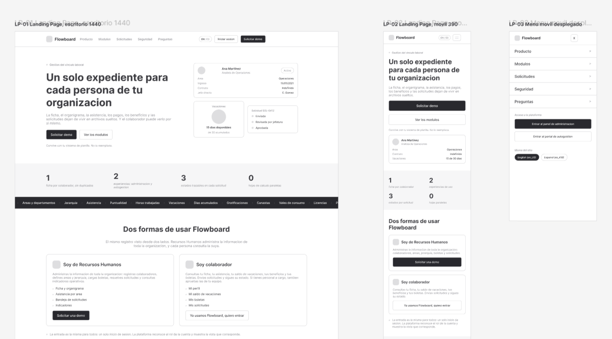
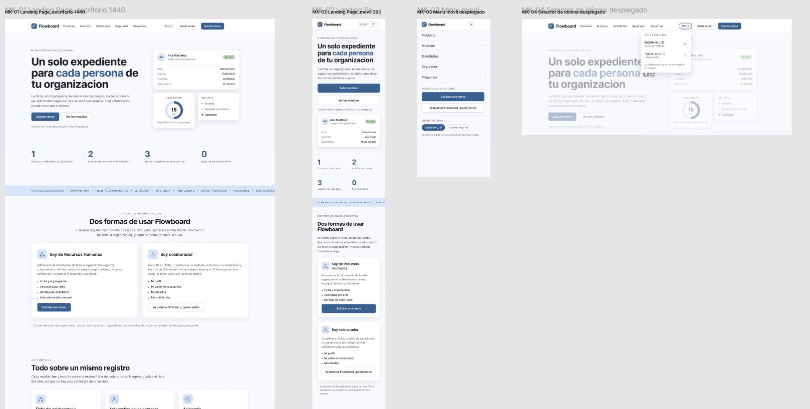
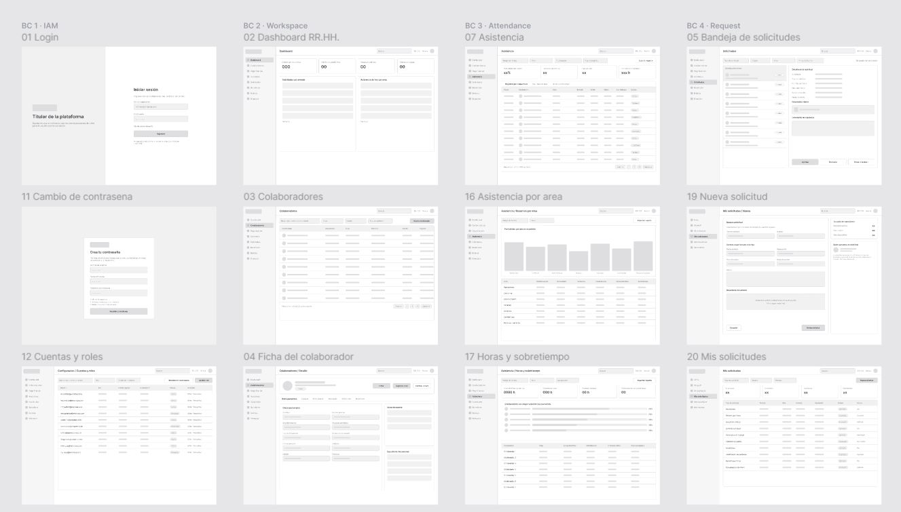
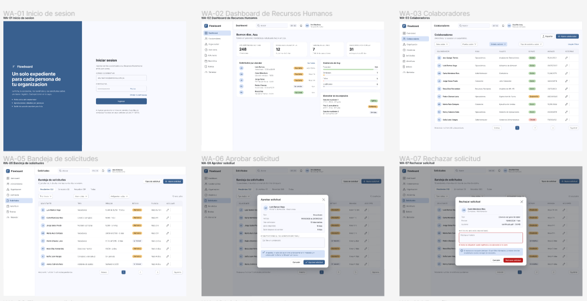

  

<h3 align="center">Universidad Peruana de Ciencias Aplicadas</h3>
<h4 align="center">Carrera de Ingeniería de Software</h4>

  <b>1ASI0729</b> 
  Desarrollo de Aplicaciones Open Source 
  <b>NRC</b> 7729

<h2 align="center">Informe del Trabajo Final</h2>

  <b>Docente</b> 
  Hugo Allan Mori Paiva

  <b>Equipo</b> 
  Performily

  <b>Proyecto</b> 
  Flowboard

<b>Integrantes</b>

<table align="center" style="display: table; width: auto; margin: 0 auto; border: none;">
  <tr>
    <td style="border: none; padding: 2px 16px;"><b>Código</b></td>
    <td style="border: none; padding: 2px 16px;"><b>Apellidos y Nombres</b></td>
  </tr>
  <tr>
    <td style="border: none; padding: 2px 16px;">u202412270</td>
    <td style="border: none; padding: 2px 16px;">Ávila De La Cruz, Darío Fabián</td>
  </tr>
  <tr>
    <td style="border: none; padding: 2px 16px;">u202412663</td>
    <td style="border: none; padding: 2px 16px;">Diaz Villalba, Diego Alonso</td>
  </tr>
  <tr>
    <td style="border: none; padding: 2px 16px;">u202419655</td>
    <td style="border: none; padding: 2px 16px;">Galvez Meza, Salym Pool</td>
  </tr>
    <tr>
    <td style="border: none; padding: 2px 16px;">u202415749</td>
    <td style="border: none; padding: 2px 16px;">Li Gayoso, Diana Carolina</td>
  </tr>
  <tr>
    <td style="border: none; padding: 2px 16px;">u202410478</td>
    <td style="border: none; padding: 2px 16px;">Vasquez Llave, Oscar Lizandro</td>
  </tr>
</table>

  Período 202620 
  Septiembre 2026

# Registro de Versiones del Informe

| Versión | Fecha | Autor | Descripción de modificación |
| ----- | ----- | ----- | ----- |
| v0.1 | 31/08/2026 | Vasquez Llave, Oscar Lizandro | Elaboración del Capítulo I. Startup Profile con la descripción de la startup y los perfiles del equipo (1.1, 1.1.1 y 1.1.2), y apertura del Solution Profile (1.2). |
| v0.2 | 01/09/2026 | Vasquez Llave, Oscar Lizandro | Redacción de Antecedentes y problemática con la técnica 5W2H, objetivos y restricciones (1.2.1), y del Lean UX Process completo: Problem Statements, Assumptions, Hypothesis Statements y Canvas (1.2.2 a 1.2.2.4). |
| v0.3 | 02/09/2026 | Vasquez Llave, Oscar Lizandro | Elaboración de Segmentos objetivo con datos de INEI y EY Perú (1.3), y del Capítulo II. Competidores con el Competitive Analysis Landscape y las estrategias y tácticas frente a competidores (2.1, 2.1.1 y 2.1.2). |
| v0.4 | 03/09/2026 | Diaz Villalba, Diego Alonso | Elaboración de Entrevistas y del Diseño de entrevistas, con los bloques demográfico, de contexto laboral, de personalidad y las preguntas principales por segmento (2.2 y 2.2.1). |
| v0.5 | 04/09/2026 | Ávila De La Cruz, Darío Fabián | Registro de las seis entrevistas, tres por segmento, y análisis con porcentajes de características objetivas y subjetivas (2.2.2 y 2.2.3). |
| v0.6 | 07/09/2026 | Ávila De La Cruz, Darío Fabián | Desarrollo del Needfinding: User Personas, User Task Matrix, User Journey Mapping y Empathy Mapping en UXPressia (2.3 a 2.3.4). |
| v0.7 | 08/09/2026 | Diaz Villalba, Diego Alonso | Construcción del Big Picture Event Storming en Miro, con eventos de dominio, comandos, actores, políticas y los siete bounded contexts (2.4). |
| v0.8 | 09/09/2026 | Galvez Meza, Salym Pool | Elaboración del Ubiquitous Language con los términos del dominio de negocio en inglés y su definición (2.5). |
| v0.9 | 10/09/2026 | Diaz Villalba, Diego Alonso | Redacción del Capítulo III. User Stories con los nueve epics y sus criterios de aceptación en estructura Gherkin, y Product Backlog priorizado con story points (3.1 y 3.3). |
| v0.10 | 11/09/2026 | Ávila De La Cruz, Darío Fabián | Elaboración del Impact Mapping a partir de los objetivos de negocio y los actores identificados en el Needfinding (3.2). |
| v0.11 | 14/09/2026 | Li Gayoso, Diana Carolina | Elaboración del Capítulo IV. Style Guidelines con branding, tipografía, colores, espaciado y tono de comunicación, y Web Style Guidelines con los componentes de Angular Material (4.1, 4.1.1 y 4.1.2). |
| v0.12 | 15/09/2026 | Li Gayoso, Diana Carolina | Elaboración de la Information Architecture completa: Organization Systems, Labeling Systems, SEO Tags and Meta Tags, Searching Systems y Navigation Systems (4.2 a 4.2.5). |
| v0.13 | 15/09/2026 | Vasquez Llave, Oscar Lizandro | Elaboración del Landing Page UI Design con wireframe y mock-up, apertura del Web Applications UX/UI Design, wireframes de la Web Application y prototipo navegable (4.3 a 4.4.1 y 4.5). |
| v0.14 | 16/09/2026 | Ávila De La Cruz, Darío Fabián | Elaboración de los Wireflow Diagrams y de los Mock-ups de la Web Application, de WA-01 a WA-65 (4.4.2 y 4.4.3). |
| v0.15 | 16/09/2026 | Galvez Meza, Salym Pool | Elaboración de los User Flow Diagrams de la Web Application para los dos segmentos objetivo, con su user goal y su trazabilidad al backlog (4.4.4). |
| v0.16 | 17/09/2026 | Diaz Villalba, Diego Alonso | Elaboración de la Domain-Driven Software Architecture con el Design-Level Event Storming y los diagramas C4 de contexto, contenedores y componentes, los Class Diagrams y el Database Design (4.6 a 4.8.1). |
| v0.17 | 17/09/2026 | Galvez Meza, Salym Pool | Elaboración del Capítulo V. Software Configuration Management y la implementación, validación y despliegue del Sprint 1 (5.1 a 5.2.1.8). |
| v1.0 | 18/09/2026 | Vasquez Llave, Oscar Lizandro | Integración y cierre del informe: portada, Registro de Versiones, Project Report Collaboration Insights, Student Outcome, tabla de Contenido, Conclusiones y Anexos. |

---

# Project Report Collaboration Insights

El informe del AV1 se redactó de forma colaborativa en un repositorio de la organización pública de GitHub del equipo, de modo que cada aporte quede registrado con su autor y su fecha. La organización del proyecto es la siguiente:

Organización en GitHub: https://github.com/Performily-OpenSource

Repositorio del informe: `![completar: URL del repositorio del informe dentro de la organización]`

Repositorio del Landing Page: https://github.com/Performily-OpenSource/flowboard-landing-page

El trabajo se distribuyó por secciones según el reparto declarado en el Registro de Versiones. Cada integrante trabajó su sección en una rama propia y la integró mediante Pull Request, de manera que el historial del repositorio permite verificar qué parte del informe elaboró cada persona y en qué momento del ciclo lo hizo.

![imagen]

*Figura A. Analíticos de colaboración del repositorio del informe. Captura de la pestaña Insights, vista Contributors.*

![imagen]

*Figura B. Commits por integrante en el repositorio del informe. Captura de la pestaña Insights, vista Commits.*

*Figura C. Analíticos de colaboración del repositorio del Landing Page durante el Sprint 1.*

---

# Student Outcome

El curso Desarrollo de Aplicaciones Open Source contribuye al logro del Student Outcome 3 del criterio ABET – EAC, que establece la capacidad de comunicarse efectivamente con un rango de audiencias. En esta sección cada integrante del equipo declara las acciones concretas que realizó durante la elaboración del AV1 para desarrollar ese resultado, junto con las conclusiones grupales del avance.

| Criterio específico | Acciones realizadas | Conclusiones |
| ----- | ----- | ----- |
| Comunica oralmente sus ideas con efectividad a diferentes rangos de audiencia. | **Ávila De La Cruz, Darío Fabián:** condujo tres de las seis entrevistas de investigación con representantes reales de los dos segmentos, adaptando el vocabulario del guion al perfil de cada entrevistado y evitando preguntas dirigidas. Expuso ante el equipo los hallazgos del Needfinding y sustentó la elección de los arquetipos.   **Diaz Villalba, Diego Alonso:** presentó al equipo el Big Picture Event Storming y explicó la división del dominio en siete bounded contexts, traduciendo vocabulario técnico de Domain-Driven Design a términos del negocio de recursos humanos.   **Galvez Meza, Salym Pool:** sustentó ante el equipo la propuesta de Ubiquitous Language y los criterios de traducción de los términos del dominio al inglés, y explicó el avance del Sprint 1 en la reunión de Sprint Review.   **Li Gayoso, Diana Carolina:** expuso la guía de estilo y la arquitectura de información, justificando las decisiones de color, tipografía y etiquetado ante un equipo con distinto nivel de formación en diseño.   **Vasquez Llave, Oscar Lizandro:** condujo las reuniones de planificación del equipo y presentó el Lean UX Canvas y los segmentos objetivo, ajustando el nivel de detalle según se tratara de una audiencia de diseño o de desarrollo. | El equipo comprobó que la comunicación oral efectiva depende de identificar primero el perfil de la audiencia. Las entrevistas mostraron que el vocabulario técnico del proyecto no es comprensible para el personal de Recursos Humanos, y que hay que traducirlo a los términos que esa persona usa en su trabajo diario. Las reuniones internas mostraron lo contrario: dentro del equipo, la precisión técnica evita retrabajo. Queda pendiente para la siguiente entrega la exposición formal ante el docente, que es la audiencia con mayor exigencia de rigor. |
| Comunica por escrito sus ideas con efectividad a diferentes rangos de audiencia. | **Ávila De La Cruz, Darío Fabián:** redactó el registro y el análisis de las entrevistas con porcentajes verificables, y documentó los User Personas, el User Task Matrix, los User Journey Maps y los Empathy Maps, además del Impact Mapping.   **Diaz Villalba, Diego Alonso:** redactó el diseño de entrevistas, las User Stories con criterios de aceptación en estructura Gherkin, el Product Backlog priorizado y toda la documentación de la arquitectura orientada al dominio, incluidos los diagramas C4, de clases y de base de datos.   **Galvez Meza, Salym Pool:** redactó el Ubiquitous Language, los User Flow Diagrams con su objetivo de usuario declarado y el Capítulo V completo de implementación, validación y despliegue.   **Li Gayoso, Diana Carolina:** redactó la guía de estilo general y web y la arquitectura de información completa, sustentando cada decisión con el criterio de accesibilidad WCAG 2.1 correspondiente.   **Vasquez Llave, Oscar Lizandro:** redactó el Capítulo I completo, el análisis competitivo y las estrategias frente a competidores, el diseño del Landing Page y de los wireframes de la Web Application, y realizó la integración y revisión de coherencia del informe. | El equipo verificó que el informe se dirige a dos audiencias con necesidades distintas. El docente evalúa rigor metodológico y trazabilidad entre capítulos, por lo que exige que cada afirmación tenga respaldo en una fuente citable o en un dato primario del levantamiento propio. El equipo de desarrollo, en cambio, necesita precisión operativa: códigos de pantalla, identificadores de historia y nombres de contexto que no cambien entre secciones. Mantener un solo vocabulario en los cinco capítulos resultó ser la decisión que más redujo ambigüedad. Queda pendiente reforzar la citación en formato APA de las fuentes que todavía no tienen entrada en la bibliografía. |

---

# Contenido

- [Registro de Versiones del Informe](#registro-de-versiones-del-informe)
- [Project Report Collaboration Insights](#project-report-collaboration-insights)
- [Student Outcome](#student-outcome)
- [Capítulo I: Introducción](#capítulo-i-introducción)
  - [1.1. Startup Profile](#11-startup-profile)
    - [1.1.1. Descripción de la Startup](#111-descripción-de-la-startup)
    - [1.1.2. Perfiles de integrantes del equipo](#112-perfiles-de-integrantes-del-equipo)
  - [1.2. Solution Profile](#12-solution-profile)
    - [1.2.1. Antecedentes y problemática](#121-antecedentes-y-problemática)
    - [1.2.2. Lean UX Process](#122-lean-ux-process)
      - [1.2.2.1. Lean UX Problem Statements](#1221-lean-ux-problem-statements)
      - [1.2.2.2. Lean UX Assumptions](#1222-lean-ux-assumptions)
      - [1.2.2.3. Lean UX Hypothesis Statements](#1223-lean-ux-hypothesis-statements)
      - [1.2.2.4. Lean UX Canvas](#1224-lean-ux-canvas)
  - [1.3. Segmentos objetivo](#13-segmentos-objetivo)
- [Capítulo II: Requirements Elicitation & Analysis](#capítulo-ii-requirements-elicitation-analysis)
  - [2.1. Competidores](#21-competidores)
    - [2.1.1. Análisis competitivo](#211-análisis-competitivo)
    - [2.1.2. Estrategias y tácticas frente a competidores](#212-estrategias-y-tácticas-frente-a-competidores)
  - [2.2. Entrevistas](#22-entrevistas)
    - [2.2.1. Diseño de entrevistas](#221-diseño-de-entrevistas)
    - [2.2.2. Registro de entrevistas](#222-registro-de-entrevistas)
    - [2.2.3. Análisis de entrevistas](#223-análisis-de-entrevistas)
  - [2.3. Needfinding](#23-needfinding)
    - [2.3.1. User Personas](#231-user-personas)
    - [2.3.2. User Task Matrix](#232-user-task-matrix)
    - [2.3.3. User Journey Mapping](#233-user-journey-mapping)
    - [2.3.4. Empathy Mapping](#234-empathy-mapping)
  - [2.4. Big Picture Event Storming](#24-big-picture-event-storming)
  - [2.5. Ubiquitous Language](#25-ubiquitous-language)
- [Capítulo III: Requirements Specification](#capítulo-iii-requirements-specification)
  - [3.1. User Stories](#31-user-stories)
  - [3.2. Impact Mapping](#32-impact-mapping)
  - [3.3. Product Backlog](#33-product-backlog)
- [Capítulo IV: Product Design](#capítulo-iv-product-design)
  - [4.1. Style Guidelines](#41-style-guidelines)
    - [4.1.1. General Style Guidelines](#411-general-style-guidelines)
    - [4.1.2. Web Style Guidelines](#412-web-style-guidelines)
  - [4.2. Information Architecture](#42-information-architecture)
    - [4.2.1. Organization Systems](#421-organization-systems)
    - [4.2.2. Labeling Systems](#422-labeling-systems)
    - [4.2.3. SEO Tags and Meta Tags](#423-seo-tags-and-meta-tags)
    - [4.2.4. Searching Systems](#424-searching-systems)
    - [4.2.5. Navigation Systems](#425-navigation-systems)
  - [4.3. Landing Page UI Design](#43-landing-page-ui-design)
    - [4.3.1. Landing Page Wireframe](#431-landing-page-wireframe)
    - [4.3.2. Landing Page Mock-up](#432-landing-page-mock-up)
  - [4.4. Web Applications UX/UI Design](#44-web-applications-uxui-design)
    - [4.4.1. Web Applications Wireframes](#441-web-applications-wireframes)
    - [4.4.2. Web Applications Wireflow Diagrams](#442-web-applications-wireflow-diagrams)
    - [4.4.3. Web Applications Mock-ups](#443-web-applications-mock-ups)
    - [4.4.4. Web Applications User Flow Diagrams](#444-web-applications-user-flow-diagrams)
  - [4.5. Web Applications Prototyping](#45-web-applications-prototyping)
  - [4.6. Domain-Driven Software Architecture](#46-domain-driven-software-architecture)
    - [4.6.1. Design-Level Event Storming](#461-design-level-event-storming)
    - [4.6.2. Software Architecture Context Diagram](#462-software-architecture-context-diagram)
    - [4.6.3. Software Architecture Container Diagrams](#463-software-architecture-container-diagrams)
    - [4.6.4. Software Architecture Components Diagrams](#464-software-architecture-components-diagrams)
  - [4.7. Software Object-Oriented Design](#47-software-object-oriented-design)
    - [4.7.1. Class Diagrams](#471-class-diagrams)
  - [4.8. Database Design](#48-database-design)
    - [4.8.1. Database Diagrams](#481-database-diagrams)
- [Capítulo V: Product Implementation, Validation & Deployment](#capítulo-v-product-implementation-validation-deployment)
  - [5.1. Software Configuration Management](#51-software-configuration-management)
    - [5.1.1. Software Development Environment Configuration](#511-software-development-environment-configuration)
    - [5.1.2. Source Code Management](#512-source-code-management)
    - [5.1.3. Source Code Style Guide & Conventions](#513-source-code-style-guide-conventions)
    - [5.1.4. Software Deployment Configuration](#514-software-deployment-configuration)
  - [5.2. Landing Page, Services & Applications Implementation](#52-landing-page-services-applications-implementation)
    - [5.2.1. Sprint 1](#521-sprint-1)
      - [5.2.1.1. Sprint Planning 1](#5211-sprint-planning-1)
      - [5.2.1.2. Aspect Leaders and Collaborators](#5212-aspect-leaders-and-collaborators)
      - [5.2.1.3. Sprint Backlog 1](#5213-sprint-backlog-1)
      - [5.2.1.4. Development Evidence for Sprint Review](#5214-development-evidence-for-sprint-review)
      - [5.2.1.5. Execution Evidence for Sprint Review](#5215-execution-evidence-for-sprint-review)
      - [5.2.1.6. Services Documentation Evidence for Sprint Review](#5216-services-documentation-evidence-for-sprint-review)
      - [5.2.1.7. Software Deployment Evidence for Sprint Review](#5217-software-deployment-evidence-for-sprint-review)
      - [5.2.1.8. Team Collaboration Insights during Sprint](#5218-team-collaboration-insights-during-sprint)
- [Conclusiones](#conclusiones)
- [Anexos](#anexos)
  - [Anexo A. Videos de Exposiciones](#anexo-a-videos-de-exposiciones)
  - [Anexo B. Enlaces a los artefactos del proyecto](#anexo-b-enlaces-a-los-artefactos-del-proyecto)
- [Bibliografía](#bibliografía)

# Capítulo I: Introducción

## 1.1. Startup Profile

### 1.1.1. Descripción de la Startup

> Somos Performily, una startup que está conformada por estudiantes de la Universidad Peruana de Ciencias Aplicadas (UPC). Esta iniciativa surge con el propósito de desarrollar soluciones tecnológicas orientadas en facilitar los procesos de los trabajadores empresariales.
>
> La razón de ser de nuestra startup radica en la necesidad de contar con herramientas que permitan a las personas gestionar de manera eficiente sus actividades y flujos de trabajo, lo cual favorece a la mejora del clima laboral e impulsa un entorno productivo dentro de la organización. Nuestra meta es brindar a los usuarios una herramienta que les permita tener control práctico y accesible de las gestiones de diferentes áreas empresariales mediante soluciones digitales intuitivas.
>
> **Misión:**  
> Crear soluciones tecnológicas innovadoras que faciliten la gestión de personas en las organizaciones y promuevan la eficiencia laboral y la sostenibilidad.
>
> **Visión:**
>
> Para este 2026, consolidarnos como una startup referente en soluciones tecnológicas para la gestión de colaboradores y el impulso de la eficiencia en los procesos internos para contribuir a una sociedad con entornos laborales más profesionales y organizados.

### 1.1.2. Perfiles de integrantes del equipo

| Darío Ávila De La Cruz (u202412270): Ingeniería de software |   |
| --- | --- |
|  | Mi nombre es Darío Ávila, soy estudiante universitario de la carrera de Ingeniería de Software, cursando el 6.º ciclo. Cuento con conocimientos en lenguajes de programación C++ y Python, lo que me permite desarrollar soluciones técnicas eficientes y adaptables. Practico la escucha activa para comprender a fondo las necesidades tanto del equipo como de los clientes, asegurando que los objetivos se alineen con las expectativas. Además, busco soluciones innovadoras que integren distintas perspectivas, fomentando la colaboración y la creatividad. Soy flexible ante cambios inesperados en los proyectos, adaptándome rápidamente a nuevas prioridades o requerimientos. |
| Diego Alonso Diaz Villalba (u202412663): Ingeniería de software |   |
|  | Cuento con formación en Psicología y actualmente curso la carrera de Ingeniería de Software, lo que me permite integrar habilidades humanas con conocimientos técnicos. Tengo experiencia en la conducción de entrevistas, la identificación de necesidades mediante observación y escucha activa, así como en la toma de decisiones fundamentadas. Me interesa especialmente el diseño de software, con énfasis en el análisis de requerimientos, la experiencia de usuario (UX), la interfaz de usuario (UI) y la usabilidad de las aplicaciones. Me motiva crear soluciones tecnológicas que no solo sean funcionales, sino también intuitivas y accesibles para los usuarios. |
| Salym Pool Galvez Meza (u202419655): Ingeniería de Software |   |
|  | Soy Salym Galvez, una persona con sólidas habilidades blandas como el pensamiento crítico y la escucha activa, lo que me permite analizar situaciones para encontrar soluciones efectivas y potenciar el trabajo en equipo. Me adapto con facilidad a distintos entornos, soy proactivo, responsable y orientado a resultados. En el aspecto técnico, cuento con conocimientos en C++ enfocados en la optimización de recursos, así como en el levantamiento de bases de datos y el desarrollo de sitios web utilizando JavaScript, HTML y CSS. Busco siempre aprender cosas nuevas para crecer profesionalmente y aportar valor práctico y técnico en cada proyecto en el que participo. |
| Diana Carolina Li Gayoso (u202415749): Ingeniería de Software |   |
|  | Soy Diana Li Gayoso, tengo 19 años, estudio Ingeniería de Software en la Universidad Peruana de Ciencias Aplicadas. Cuento con conocimientos en arquitectura de software y desarrollo backend, así como en SQL y C++. Me considero una persona responsable, disciplinada y perseverante, con capacidad para afrontar retos y adaptarme a diferentes situaciones. Me caracterizo por mi compromiso, resiliencia y puntualidad, además de mi constante interés por seguir aprendiendo y mejorar mis habilidades. |
| Oscar Lizandro Vasquez Llave (u202410478): Ingeniería de Software |   |
|  | Soy estudiante de Ingeniería de Software con formación en desarrollo de aplicaciones y gestión de proyectos tecnológicos. Cuento con conocimientos en C++, HTML, CSS, JavaScript, diseño de interfaces de usuario con Figma y uso de herramientas de control de versiones como Git. Me destaco por mi compromiso para aprender nuevas tecnologías, además de mis habilidades para trabajar en equipo y adaptarme a diferentes entornos. Tengo capacidad para analizar y resolver problemas técnicos de forma eficiente. Poseo iniciativa para proponer mejoras, disposición para colaborar en proyectos multidisciplinarios y motivación por adquirir nuevos conocimientos que fortalezcan mi desarrollo profesional. |

## 1.2. Solution Profile

### 1.2.1. Antecedentes y problemática

- **What (Qué):**

> La gestión del talento humano enfrenta una crisis de eficiencia caracterizada por una profunda carga burocrática y una dependencia crítica de procesos manuales. Esta problemática central se ve agravada por el uso de métodos empíricos y la preocupante ausencia de planificación estratégica en las organizaciones, lo que obliga a los gestores a operar basándose exclusivamente en la experiencia personal.
>
> Esta estructura burocrática y el uso de herramientas obsoletas desencadenan síntomas directos que afectan la salud organizacional. El síntoma más visible es el incremento de la presión sobre el personal, ya que la alta presión y el estrés perjudican drásticamente la productividad de los empleados, lo que dificulta su desarrollo. Al carecer de recursos adecuados para realizar tareas repetitivas, surge una alta incidencia de malas prácticas en las condiciones laborales, un fenómeno alarmante que afecta al 50% de las organizaciones en América Latina, según destacan Bautista et al. (2020) .
>
> La insatisfacción del trabajador aparece como una consecuencia inevitable de este sistema arcaico. Ortiz et al. (2024) advierten que cuando la alineación entre las metas estratégicas de la institución y las habilidades de los trabajadores es débil o inexistente, la evaluación del desempeño es percibida de manera negativa por el personal, reduciendo su productividad general. Esto erosiona el compromiso hacia la empresa y genera un clima organizacional donde la desmotivación puede conducir a resultados más negativos.
>
> En este contexto, la revisión sistemática de Tejada (2025) confirma que depender de procesos tradicionales hace imposible alcanzar los planes y metas trazadas por las entidades. Por lo tanto, para recuperar la celeridad operativa y eliminar la burocracia, resulta imperativo automatizar los procedimientos ligados a la gestión de los recursos humanos a través de herramientas tecnológicas adecuadas.

- **When (Cuándo):**

> La problemática se presenta de manera constante a lo largo de todo el ciclo de gestión del recurso humano en procesos como el registro y actualización de datos del personal, el control diario de asistencia y puntualidad, el procesamiento periódico de planillas y la gestión de beneficios laborales, sobre todo cuando el registro de estos datos es manual. Asimismo, se intensifica en situaciones que involucran la solicitud y aprobación de vacaciones, licencias o permisos, donde la dependencia de procesos manuales genera retrasos acumulativos. De igual forma, el problema se evidencia con mayor impacto en periodos de cierre de nómina o evaluaciones de desempeño, donde la carga operativa aumenta y los errores se vuelven más frecuentes.

- **Where (Dónde):**

> La problemática ocurre dentro de las organizaciones que carecen de sistemas digitales integrados para la gestión de recursos humanos, donde se emplean herramientas dispersas como hojas de cálculo, documentos físicos y sistemas aislados que no comparten información entre sí. En el Perú este escenario tiene respaldo estadístico. El estudio de madurez digital de EY Perú (2024) ubica apenas al 9% de las organizaciones peruanas en un estado avanzado, mientras que el 73% se encuentra en estado encaminado y el 17% permanece en estado incipiente, con un índice nacional de 61.46 puntos sobre 100. Dicho de otro modo, más de nueve de cada diez organizaciones del país todavía tienen procesos pendientes de digitalizar, y el área de Recursos Humanos suele estar entre las últimas de la fila porque no se percibe como un área crítica del negocio.

- **Who (Quién):**

> Los afectados directos son, en primer lugar, los trabajadores quienes experimentan desconfianza y frustración al no contar con acceso directo a su información, el estado de sus solicitudes o la claridad sobre sus beneficios, lo que deteriora su experiencia y compromiso laboral. En segundo lugar está el área de RRHH, la cual enfrenta una sobrecarga administrativa crítica al tener que resolver consultas repetitivas y gestionar procesos ineficientes que consumen tiempo valioso.

- **Why (Por qué):**

> La problemática persiste porque las organizaciones carecen de una transformación digital efectiva que integre sus procesos en una plataforma centralizada, lo que obliga a depender de sistemas fragmentados y métodos manuales que vulneran la integridad de los datos. Esta situación se agrava por una marcada resistencia al cambio y la carencia de competencias digitales en el personal, lo que impide que la información laboral fluya con transparencia y agilidad. Por lo tanto, se generan cuellos de botella en las aprobaciones, errores frecuentes en la gestión de beneficios y una incapacidad estructural para realizar análisis estratégicos o predictivos sobre el capital humano. Además, la ausencia de flujos automatizados y de una "fuente única de verdad" limita la capacidad de RRHH para dejar de ser un área meramente operativa y convertirse en un socio estratégico para la toma de decisiones

- **How (Cómo):**

> El problema se manifiesta mediante una gestión operativa basada en métodos convencionales y registros físicos que entorpecen la agilidad organizacional. Los procesos de asistencia, solicitudes de licencias y el cálculo de planillas dependen de la verificación manual y el reingreso constante de datos en archivos aislados. Al respecto, Feriandy (2025) explica que el uso de estas herramientas obsoletas limita la capacidad de análisis y retrasa la atención de requerimientos internos. Asimismo, Anggoro et al. (2026) sostienen que esta dinámica operativa incrementa la opacidad en la información y deriva en decisiones de promoción fundamentadas en la intuición en lugar de métricas objetivas.

- **How much (Cuánto):**

> El uso de métodos manuales en la gestión de recursos humanos impacta negativamente en la rentabilidad y el tiempo operativo de las empresas. Feriandy (2025) detalla que el procesamiento de asistencia y tareas administrativas requiere entre 3 y 5 días por ciclo bajo un esquema convencional. Bajo estas condiciones, la tasa de errores en el ingreso de datos alcanza niveles del 15% al 20% de las transacciones. En el área de compensaciones, los errores de cálculo salarial afectan del 10% al 15% de los pagos realizados. Desde la perspectiva del colaborador, el acceso a información personal demanda un promedio de 150 minutos por solicitud. La burocracia en los flujos de aprobación extiende la espera para licencias o vacaciones entre 48 y 72 horas. Anggoro et al. (2026) contrastan estos indicadores con los sistemas digitales, los cuales reducen los errores a menos del 2% y agilizan el acceso a la información a menos de 5 minutos.

A partir del análisis anterior, la solución propuesta debe resolver de forma prioritaria:

1.  **La fragmentación de la información laboral.** Consolidar en un único repositorio la ficha del colaborador, la estructura organizacional, la asistencia, los beneficios y las solicitudes, que hoy viven en hojas de cálculo, documentos físicos y sistemas que no se comunican entre sí.

2.  **La doble digitación.** Eliminar el reingreso del mismo dato del colaborador en planillas de asistencia, archivos de beneficios y registros de personal, que es donde se origina la mayoría de los errores de información reportados.

3.  **La asimetría de información hacia el colaborador.** Permitir que cada trabajador consulte por sí mismo su remuneración asignada, sus beneficios y su saldo de vacaciones, sin intermediación del área de Recursos Humanos.

4.  **La opacidad de los flujos de aprobación.** Dar estado visible y trazabilidad a las solicitudes de vacaciones, licencias y permisos, dirigiéndolas al responsable correcto según la jerarquía declarada en el sistema.

5.  **El descontrol de los saldos de vacaciones.** Mantener actualizados los días acumulados y usados por colaborador, que hoy se calculan de forma manual y son la principal fuente de disputa entre el trabajador y el área.

6.  **La ausencia de información para decidir.** Entregar al área de Recursos Humanos indicadores agregados que hoy no existen porque los datos están dispersos.

**Objetivos del proyecto**

**Objetivo general**

> Desarrollar y desplegar Flowboard, una solución web distribuida bajo arquitectura orientada a servicios, que consolide en una fuente única de verdad la información del vínculo laboral en organizaciones en crecimiento, y que reduzca de forma medible el tiempo de acceso a esa información y el tiempo de resolución de las solicitudes del personal.
>
> **Objetivos específicos**

1.  Implementar un Landing Page estático, responsive y accesible, con call to action diferenciados por segmento objetivo que redirijan a la vista correspondiente de la aplicación web.

2.  Implementar un RESTful API de elaboración interna con Spring Boot y Spring Data JPA, documentado bajo OpenAPI vía Swagger, organizado en los siete bounded contexts identificados en el dominio: identidad y acceso, colaborador y estructura organizacional, asistencia, solicitudes, beneficios, pagos y bienestar.

3.  Implementar una Web Application en Angular integrada con dicho API, con interfaz adaptable a las dimensiones del dispositivo cliente y con dos experiencias diferenciadas por rol: administración para Recursos Humanos y autogestión para el colaborador.

4.  Integrar al menos un servicio externo de terceros para el envío de notificaciones por correo a solicitantes y aprobadores, con un proveedor transaccional de correo ⟨el equipo elige: Brevo, Resend, SendGrid u otro⟩. Como integración adicional se evalúa una API pública de feriados nacionales para el cómputo de días hábiles en las solicitudes de vacaciones, verificando previamente que el proveedor cubra Perú.

5.  Habilitar internacionalización bajo i18n para English (en_US) y Latin American Spanish (es_419), y accesibilidad bajo a11y con atributos ARIA en el Landing Page y la Web Application.

6.  Validar las hipótesis del proceso Lean UX mediante entrevistas de investigación y de validación con representantes reales de ambos segmentos objetivo.

7.  Desplegar los tres productos digitales sobre plataformas server-side o cloud usando exclusivamente tecnologías open source.

> **Restricciones y delimitación del alcance**
>
> **Restricciones de tiempo y equipo**
>
> El ciclo de vida completo se ejecuta en 16 semanas académicas, organizadas en 4 sprints, con un equipo de 5 estudiantes de dedicación parcial.
>
> **Restricciones tecnológicas**
>
> El stack lo fija el curso: HTML5, CSS3 y JavaScript para el Landing Page; Angular con TypeScript y Angular Material para la Web Application; Java con Spring Boot y Spring Data JPA para los servicios; y GitHub con GitFlow, Conventional Commits y Semantic Versioning para el control de versiones. El lenguaje por defecto de la interfaz y de la documentación de todos los productos es inglés.
>
> **Restricciones de alcance funcional**
>
> El módulo de Pagos es de consulta, no de cálculo. No calcula remuneraciones, no aplica descuentos ni aportes, no emite boletas de pago ni archivos para entidades recaudadoras, y no reemplaza al sistema contable o de planilla que la organización ya utiliza.
>
> El módulo de Asistencia es de registro y consulta. Se registran faltas, puntualidad y horas trabajadas, y se derivan las horas efectivas y el sobretiempo respecto de la jornada esperada del puesto. La plataforma no deriva de forma automática descuentos, bonificaciones ni pagos a partir de esos registros.
>
> El módulo de Bienestar registra y clasifica lecturas ambientales de los espacios de trabajo. Flowboard no provee ni comercializa sensores: consume las lecturas que se registren en la plataforma y las traduce en indicadores según umbrales configurables por la organización. En esta versión las lecturas se generan como datos de prueba.
>
> No se implementa migración ni importación masiva de datos históricos desde Excel o CSV. La carga inicial de información se realiza de forma manual desde la propia plataforma. La migración asistida se considera parte del roadmap posterior al presente ciclo y se documenta como tal en la sección de Conclusiones y recomendaciones.
>
> Quedan también fuera del alcance la integración con hardware de marcación biométrica o relojes de asistencia físicos, ya que el registro es digital vía navegador; las aplicaciones móviles nativas, porque la experiencia móvil se resuelve con diseño responsive; la firma electrónica legalmente vinculante de documentos; los módulos de reclutamiento y selección, evaluación de desempeño por competencias y encuestas de clima organizacional; y las integraciones con ERP contables de terceros.
>
> **Restricciones legales y éticas**
>
> El tratamiento de datos personales de los colaboradores se sujeta a la Ley N.° 29733, Ley de Protección de Datos Personales, y su reglamento. Dado que la plataforma expone información remunerativa, el acceso debe restringirse estrictamente según el rol: el colaborador visualiza únicamente su propia información.
>
> Los términos y condiciones de servicio se exponen mediante enlace en el footer del Landing Page y de la aplicación, redactados conforme a los principios del código de ética de ACM/IEEE y del Colegio de Ingenieros del Perú.

### 1.2.2. Lean UX Process

#### 1.2.2.1. Lean UX Problem Statements

**Domain (Dominio):**

> El dominio de este proyecto se sitúa en la Gestión del Capital Humano (HCM) y la Transformación Digital de Recursos Humanos (HRIS) para organizaciones modernas. El enfoque principal aborda la transición necesaria de métodos manuales hacia sistemas de información integrados que aseguren la eficiencia operativa y el cumplimiento de las normativas laborales vigentes.

**Customer Segments (Segmentos de Clientes):**

> En primer lugar, los analistas de recursos humanos enfrentan una sobrecarga administrativa crítica al gestionar procesos ineficientes que consumen tiempo valioso, lo que los obliga a operar basándose en la experiencia personal ante la ausencia de planificación estratégica. Su principal dificultad radica en la verificación manual y el reingreso constante de datos en archivos aislados, lo que incrementa la incidencia de errores en la información del personal y dificulta la transparencia en la entrega de beneficios o bonificaciones pactadas. Esta problemática se intensifica debido a la carencia de un sistema centralizado, lo que fragmenta la información laboral en herramientas obsoletas y métodos convencionales que vulneran la integridad de los datos.
>
> En segundo lugar, los empleados generales experimentan desconfianza y frustración al no contar con acceso directo a su propia información laboral, como saldos de vacaciones o el estado de sus solicitudes. Esta asimetría informativa los obliga a depender de consultas repetitivas hacia el área de RR.HH., generando una espera de entre 48 y 72 horas para aprobaciones básicas, lo que deteriora su experiencia y compromiso con la empresa.
>
> **Pain Points (Puntos de Dolor):**
>
> La problemática actual genera costos específicos y estrés organizacional debido a una carga administrativa excesiva. Al respecto, Feriandy (2025) detalla que el procesamiento manual de asistencia y tareas operativas consume entre 3 y 5 días por ciclo. Esta ineficiencia se traduce en una tasa de errores en el ingreso de datos de entre el 15% y 20%, lo cual impacta incluso en el 10% al 15% de los cálculos salariales. Asimismo, la burocracia actual obliga al trabajador a invertir un promedio de 150 minutos solo para acceder a su información personal y esperar entre 48 y 72 horas para la aprobación de una licencia.
>
> **Gap (La Brecha):**
>
> Existe una brecha tecnológica entre la necesidad de agilidad de las empresas modernas y la persistencia de herramientas obsoletas como el papel o los archivos de Excel aislados. Según explican Anggoro et al. (2026), esta fragmentación de la información impide que las organizaciones optimicen sus funciones de recursos humanos mediante el uso efectivo de tecnología integrada. En el caso peruano, la brecha se sostiene sobre dos condiciones que las propias empresas reconocen: el 62% considera no contar con las competencias digitales necesarias, y las dos barreras que más declaran para su transformación digital son la resistencia al cambio, con 48%, y un déficit de personal capacitado, con 45% (EY Perú, 2024). Feriandy (2025) sostiene que esta disparidad genera una incapacidad estructural para realizar análisis estratégicos o predictivos sobre el capital humano, lo cual limita la competitividad en la era digital.
>
> Lo que los productos y servicios existentes no logran resolver es generar una fuente única de verdad sobre el vínculo laboral que sea accesible para ambas partes. Las plataformas del mercado se construyeron alrededor del motor de remuneraciones y de las necesidades del área administrativa, y dejan al colaborador como receptor pasivo de información que no puede consultar por sí mismo.
>
> **Vision/Strategy (Visión y Estrategia):**

- Para el 2030, ser una startup referente en soluciones tecnológicas para la gestión de colaboradores en el Perú y la región, reconocida por devolverle al trabajador la transparencia sobre su propia información laboral y por contribuir a entornos de trabajo más organizados y confiables.

> **Initial Segment (Segmento Inicial):**

- El enfoque inicial se dirigirá a organizaciones que enfrentan una crisis de eficiencia caracterizada por una profunda carga burocrática y una dependencia crítica de procesos manuales. Para ello, evaluaremos indicadores en las organizaciones como la tasa de error en transacciones, el tiempo de procesamiento por ciclo de asistencia y el tiempo de respuesta a solicitudes de información personal. El perfil ideal son entidades donde el crecimiento del personal ha vuelto imposible alcanzar las metas trazadas mediante métodos tradicionales, requiriendo una transformación hacia la toma de decisiones basada en datos. Esto significa que el segmento inicial se concentra en empresas cuyo aumento en la cantidad de colaboradores ha superado la capacidad de sus sistemas de control actuales (como hojas de cálculo o registros físicos).

> **Success Criteria (Criterios de éxito):**

- Los colaboradores generales consultan su saldo de vacaciones, sus beneficios, sus boletas y el estado de sus solicitudes directamente en la plataforma, en lugar de escribir o llamar al área de Recursos Humanos: al menos el 70% de las consultas de información laboral se resuelven en autoservicio al tercer mes de uso.

- Los analistas de Recursos Humanos dejan de mantener hojas de cálculo paralelas como respaldo de la información que ya vive en la plataforma.

- Los jefes de área resuelven las solicitudes que reciben en menos de 24 horas desde la notificación.

- El 100% de las solicitudes de vacaciones, licencias y permisos queda registrado con su estado y su responsable identificables, sin que ninguna circule por canales informales.

- El analista de Recursos Humanos responde las cinco preguntas operativas del protocolo de medición de HS-06 en menos de 2 minutos en total y sin abrir ningún archivo fuera de la plataforma.

> El estado actual de la gestión del capital humano en organizaciones en crecimiento se ha centrado principalmente en analistas de recursos humanos y colaboradores generales, que enfrentan sobrecarga administrativa, información dispersa en archivos aislados y ausencia de acceso autónomo a la información laboral, operando mediante flujos de registro de personal, control de asistencia y aprobación de solicitudes que se ejecutan de forma manual y se verifican uno por uno.
>
> Lo que los productos y servicios existentes no logran resolver es generar una fuente única de verdad sobre el vínculo laboral que sea accesible para ambas partes. Las plataformas del mercado se construyeron alrededor del motor de remuneraciones y de las necesidades del área administrativa, y dejan al colaborador como receptor pasivo de información que no puede consultar por sí mismo.
>
> Nuestro producto abordará esta brecha mediante una plataforma web centralizada que consolida en un solo registro la ficha del colaborador, la estructura organizacional, la asistencia, los beneficios, las boletas de pago y las solicitudes, y que expone esa información directamente al trabajador mediante un módulo de autogestión.
>
> Nuestro foco inicial será organizaciones de 50 a 500 colaboradores cuyo crecimiento ha superado la capacidad de sus sistemas de control actuales, y que aún gestionan recursos humanos con hojas de cálculo y registros físicos.
>
> Sabremos que hemos tenido éxito cuando observemos que los colaboradores consultan su saldo de vacaciones, su remuneración y sus beneficios directamente en la plataforma en lugar de escribir al área de Recursos Humanos; que los analistas dejan de mantener hojas de cálculo paralelas como respaldo; que los jefes de área resuelven las solicitudes desde la notificación recibida en menos de 24 horas; y que ninguna solicitud circula por canales informales sin dejar registro de su estado y su responsable.

#### 1.2.2.2. Lean UX Assumptions

> A partir de la sesión de trabajo del equipo sobre el dominio del problema, se enumeran a continuación las creencias que sostenemos y que aún no han sido validadas. Estas creencias constituyen la base de los Hypothesis Statements de la sección siguiente.
>
> **Business Assumptions**

- Creemos que existe un mercado suficientemente amplio de organizaciones de entre 50 y 500 colaboradores que gestionan recursos humanos con hojas de cálculo y documentos físicos, y que ese mercado está dispuesto a pagar por resolverlo.

- Creemos que ese segmento está desatendido, porque las plataformas consolidadas se orientan a corporaciones con presencia multinacional (Buk, Rex+) o a empresas ya digitalizadas (Factorial).

- Creemos que nuestra ventaja competitiva sostenible será la transparencia hacia el colaborador y la consolidación del vínculo laboral en una fuente única de verdad, y no la amplitud del catálogo de módulos ni la potencia del motor de remuneraciones, donde no podemos competir contra actores consolidados.

- Creemos que un modelo de suscripción mensual por colaborador activo, con planes escalables según funcionalidades, es viable y aceptado por este segmento.

- Creemos que una plataforma que muestra la remuneración y los beneficios sin calcularlos genera valor suficiente para este segmento, porque el dolor declarado es la inaccesibilidad y la dispersión de la información, no la exactitud del cálculo tributario.

- Creemos que Flowboard puede coexistir con el sistema contable o de planilla que la organización ya utiliza, y que esa coexistencia no será un obstáculo para la adopción.

- Creemos que el equipo cuenta con las capacidades técnicas y el tiempo para construir y desplegar la solución completa (Landing Page, Web Application y RESTful API) dentro del ciclo académico, usando exclusivamente tecnologías open source.

- Creemos que las alianzas con consultoras de transformación digital pueden reducir nuestro costo de adquisición de clientes frente a competidores con mayor presupuesto de marketing.

**Business Outcome Assumptions**

- Creemos que el tiempo que el área de Recursos Humanos dedica a responder consultas repetitivas de información laboral se reducirá en al menos 70%.

- Creemos que la tasa de error por información desactualizada o inconsistente en los registros de personal, asistencia y saldos de vacaciones bajará del rango de 15% a 20% reportado en la literatura hasta menos del 2%.

- Creemos que el tiempo promedio de aprobación de una solicitud de vacaciones, licencia o permiso bajará de 48 a 72 horas hasta menos de 24 horas.

- Creemos que el 100% de las solicitudes tendrá estado y responsable identificables, frente a los flujos informales actuales que no dejan registro.

- Creemos que el tiempo que le toma a un colaborador conocer su saldo de vacaciones o el detalle de sus beneficios bajará de 48 a 72 horas hasta menos de 5 minutos.

- Creemos que al menos el 70% de las consultas de información laboral que hoy llegan al área de Recursos Humanos se resolverán en autoservicio al tercer mes.

- Creemos que la retención mensual de organizaciones cliente superará el 90% después del primer trimestre de uso.

- Creemos que la puesta en marcha de una organización nueva, con la configuración de áreas, la jerarquía y el registro inicial de colaboradores, no superará los 5 días hábiles.

- Creemos que el analista de Recursos Humanos podrá responder las preguntas operativas habituales de la gerencia en menos de 2 minutos y sin abrir ningún archivo fuera de la plataforma, frente al tiempo que le toma hoy reunir esa información de varias fuentes, que se medirá como línea base en las entrevistas.

- Creemos que la centralización de las boletas de pago eliminará las solicitudes de reenvío de boletas al área, que hoy se atienden una por una.

**User Assumptions**

- Creemos que nuestro usuario principal es el analista o coordinador de Recursos Humanos: 25 a 55 años, en una organización de 50 a 500 colaboradores, con alta competencia en hojas de cálculo y baja o nula experiencia previa con software especializado de gestión de personas.

- Creemos que el analista de Recursos Humanos es nuestro usuario principal y la puerta de entrada a la organización: es quien siente el dolor con mayor intensidad, quien posee la información necesaria para poner la plataforma en marcha y quien da de alta al resto del personal, por lo que su adopción es condición necesaria para la de los demás.

- Creemos que nuestro segundo usuario es el empleado promedio, de entre 20 y 55 años. Su facilidad para usar la tecnología varía mucho de una persona a otra. No entra al sistema todos los días, pero sí de vez en cuando para trámites puntuales, y lo hace casi siempre desde su celular.

- Creemos que dentro del segmento de colaboradores existe un subperfil de interacción baja pero crítica, el jefe o gerente de área, que aprueba las solicitudes de su equipo según la jerarquía declarada en el sistema, y cuya adopción depende de que la fricción de la aprobación sea mínima.

- Creemos que el decisor de compra, la gerencia general o la administración, no es el mismo actor que el usuario principal, y que evalúa la solución por costo y por riesgo antes que por funcionalidades.

- Creemos que ambos segmentos acceden mediante navegador web y que no exigirán la instalación de una aplicación nativa como condición de uso.

- Creemos que la principal barrera de adopción no es técnica sino cultural: la resistencia a abandonar el archivo de Excel que el analista domina y controla.

- Creemos que exponer la remuneración dentro de la plataforma no generará resistencia por parte de la organización cliente, siempre que cada colaborador vea únicamente su propia información.

**User Outcome and Benefit Assumptions**

- Creemos que el analista de Recursos Humanos quiere dejar de reingresar los mismos datos del colaborador en distintos archivos, y que al lograrlo recuperará horas que puede destinar a tareas de análisis y retención de talento.

- Creemos que el analista quiere dejar de responder consultas repetitivas, y que al lograrlo reducirá la carga mental y las interrupciones de su jornada.

- Creemos que el analista quiere confiar en un único dato al momento de reportar el estado del personal, y que una fuente única de verdad le dará seguridad para sustentar sus cifras ante la gerencia.

- Creemos que el colaborador general quiere saber, en cualquier momento y sin pedírselo a nadie, cuántos días de vacaciones le quedan, qué beneficios le corresponden y en qué estado se encuentra su solicitud.

- Creemos que al obtener esa autonomía el colaborador percibirá mayor transparencia y trato justo de parte de la organización, lo que fortalecerá su confianza y su compromiso.

- Creemos que el jefe de área quiere resolver una aprobación en menos de un minuto, sin abandonar el contexto en el que se encuentra.

- Creemos que tanto el colaborador como el analista quieren evitar la disputa por los días de vacaciones, y que un saldo visible y compartido por ambas partes elimina esa fricción antes de que ocurra.

**Feature Assumptions**

- F1, ficha única del colaborador y estructura organizacional. Creemos que un registro único con datos personales, puesto, área, fecha de ingreso, tipo de contrato y estado (activo, cesado, suspendido), junto con la jerarquía entre jefe y colaborador, eliminará la necesidad de mantener archivos paralelos y permitirá dirigir correctamente las aprobaciones.

- F2, módulo de autogestión del colaborador. Creemos que un portal donde el colaborador consulte sus datos personales, su remuneración asignada, sus beneficios y su saldo de vacaciones eliminará la necesidad de consultar al área de Recursos Humanos.

- F3, registro digital de asistencia. Creemos que un registro digital de faltas, puntualidad y horas trabajadas, visible tanto para el área como para el propio colaborador, reemplazará las planillas de asistencia en papel y en hojas de cálculo, y eliminará las discrepancias sobre lo que quedó efectivamente registrado.

- F4, gestión de beneficios y control de saldo de vacaciones. Creemos que registrar gratificaciones, canastas, vales de consumo y licencias de descanso, junto con el control automático de días acumulados y usados, evitará las omisiones de entrega y las disputas sobre los días que corresponden.

- F5, workflow de solicitudes con estados y notificaciones. Creemos que un flujo con estados visibles (Pendiente, Aprobado, Rechazado), dirigido al jefe correspondiente según la jerarquía y con notificación automática, reducirá el tiempo de resolución de las solicitudes y dará trazabilidad completa.

- F6, repositorio de boletas y estado de pago. Creemos que centralizar las boletas que hoy se envían por correo o se entregan en papel, y registrar el estado del depósito de cada período, eliminará las solicitudes de reenvío y permitirá al área identificar los pagos pendientes sin revisar el sistema contable.

- F7, dashboard de indicadores en tiempo real. Creemos que un panel con indicadores agregados de personal, asistencia, solicitudes y beneficios permitirá al área de Recursos Humanos sustentar decisiones con datos en lugar de con la experiencia personal.

#### 1.2.2.3. Lean UX Hypothesis Statements

> Creemos que lograremos reducir a menos del 2% la tasa de error por información desactualizada o inconsistente en los registros de personal. Si los analistas de Recursos Humanos que hoy mantienen la información del colaborador repartida en varias hojas de cálculo y expedientes físicos alcanzan un registro único por colaborador que no requiere reingresar el mismo dato en distintos archivos. Con una ficha única que consolide datos personales, puesto, área, fecha de ingreso, tipo de contrato y estado, junto con la estructura organizacional y la relación entre jefe y colaborador.
>
> Creemos que lograremos que al menos el 70% de las consultas de información laboral se resuelvan en autoservicio al tercer mes, descargando al área de Recursos Humanos. Si los colaboradores generales que hoy dependen de consultas manuales a sus supervisores o a Recursos Humanos alcanzan autonomía y transparencia sobre su propia información laboral, con respuesta inmediata y sin intermediarios. Con un módulo de autogestión donde consulten sus datos personales, su remuneración asignada, sus beneficios vigentes y su saldo de vacaciones.
>
> Creemos que lograremos eliminar las discrepancias entre lo que registra el área y lo que percibe el colaborador sobre faltas, tardanzas y horas trabajadas. Si los analistas de Recursos Humanos y los colaboradores generales que hoy dependen de planillas de asistencia en papel u hojas de cálculo no compartidas alcanzan una única versión de la asistencia, visible y verificable por ambas partes en el momento en que ocurre. Con un registro digital de faltas, puntualidad y horas de trabajo consultable desde el módulo de autogestión y desde el panel del área.
>
> Creemos que lograremos reducir a cero las omisiones en la entrega de beneficios y las disputas por días de vacaciones, y bajar el tiempo que toma conocer el saldo disponible de 48 a 72 horas hasta menos de 5 minutos. Si los colaboradores generales y los analistas de Recursos Humanos que hoy calculan y verifican los días a mano alcanzan un saldo de vacaciones y un registro de beneficios actualizados y compartidos por ambas partes. Con un módulo que registre gratificaciones, canastas, vales de consumo y licencias, y que lleve el control automático de días acumulados y días usados por colaborador.
>
> Creemos que lograremos reducir el tiempo de aprobación de solicitudes de vacaciones, licencias y permisos de 48 a 72 horas hasta menos de 24 horas, con el 100% de las solicitudes trazables. Si los colaboradores generales y los jefes de área que hoy dependen de correos, mensajes y trámites presenciales que no dejan registro alcanzan visibilidad sobre el estado real de cada solicitud y la posibilidad de resolverla en el momento en que reciben la notificación. Con un workflow de solicitudes con estados definidos (Pendiente, Aprobado, Rechazado), ruteado al aprobador que corresponde según la jerarquía organizacional y con notificación automática.
>
> Creemos que lograremos eliminar las solicitudes de reenvío de boletas que hoy atiende el área una por una, y que el analista identifique los depósitos pendientes de un período sin consultar el sistema contable. Si los colaboradores generales que hoy reciben su boleta por correo o en papel y los analistas que responden esos pedidos de reenvío Alcanzan un repositorio consultable por período, donde cada colaborador accede a sus propias boletas y el área ve el estado del depósito de cada una. Con un módulo de pagos que almacene las boletas cargadas desde el sistema de planilla de la organización y registre su estado como pendiente, pagado u observado.
>
> Creemos que lograremos que el analista de Recursos Humanos responda las cinco preguntas operativas del protocolo de medición en menos de 2 minutos en total, y que las cinco se respondan sin abrir ningún archivo fuera de la plataforma. Si los analistas y las jefaturas de Recursos Humanos, que hoy tienen que cruzar varias hojas de cálculo y expedientes para responder una sola pregunta de la gerencia, alcanzan una lectura consolidada y actualizada del estado del personal, la asistencia, las solicitudes pendientes y los beneficios entregados. Con un dashboard de indicadores actualizado en tiempo real.

#### 1.2.2.4. Lean UX Canvas

El Lean UX Canvas recoge en un solo artefacto las ocho cajas del método y sirve de puente entre el problema de negocio declarado en 1.2.1 y las hipótesis que el equipo debe validar. Cada caja se completó a partir de las secciones anteriores de este capítulo, de modo que ninguna afirmación del canvas es nueva respecto de lo ya sustentado.

| Caja del Canvas | Contenido |
| ----- | ----- |
| 1. Business Problem | Las organizaciones peruanas de 50 a 500 colaboradores gestionan la información de su personal en hojas de cálculo aisladas, documentos físicos y sistemas que no se comunican entre sí. Eso obliga al área de Recursos Humanos a reingresar los mismos datos en varios archivos, produce información inconsistente y deja al colaborador sin ninguna vía para consultar por sí mismo su remuneración, sus beneficios o su saldo de vacaciones. Las plataformas existentes se construyeron alrededor del motor de remuneraciones y del área administrativa, y no resuelven la creación de una fuente única de verdad accesible para ambas partes. |
| 2. Business Outcomes | Reducción del 70% del tiempo que Recursos Humanos dedica a responder consultas de información laboral. Disminución de la tasa de error por información desactualizada o inconsistente en los registros de personal, asistencia y saldos de vacaciones, del rango de 15% a 20% hasta menos del 2%. Reducción del tiempo de aprobación de solicitudes de 48 a 72 horas hasta menos de 24 horas. Trazabilidad del 100% de las solicitudes, con estado y responsable identificables. Puesta en marcha de una organización nueva en no más de 5 días hábiles. |
| 3. Users | Usuario principal: analista o coordinador de Recursos Humanos, de 25 a 55 años, en una organización de 50 a 500 colaboradores. Usuario secundario: colaborador de la organización, de 20 a 55 años, con alfabetización digital heterogénea, que accede de forma esporádica y sobre todo desde el teléfono. Subperfil dentro del Segmento 2: jefe o gerente de área, colaborador que además aprueba las solicitudes de quienes le reportan, con interacción de baja frecuencia y alta criticidad. Decisor de compra: gerencia general o administración, que no es usuario de la plataforma y evalúa por costo y riesgo, no por funcionalidades. |
| 4. User Outcomes and Benefits | Para Recursos Humanos: eliminación de tareas mecánicas, reducción de la carga mental y evolución hacia un rol estratégico de retención de talento. Para los colaboradores: autonomía, reducción de la frustración por espera y mayor confianza en la empresa. |
| 5. Solutions | Plataforma web: sistema centralizado para la gestión integral del capital humano. Módulo de autogestión: portal donde el colaborador visualiza sus vacaciones, boletas y beneficios de forma directa. Control de asistencia digital: registro de faltas, puntualidad y horas trabajadas, consultable por el colaborador y por Recursos Humanos. Workflow de solicitudes: sistema de estados Pendiente, Aprobado y Rechazado para vacaciones y permisos, con notificaciones. Dashboard: panel de control con indicadores operativos en tiempo real sobre personal activo por área, solicitudes pendientes, asistencia del período y beneficios entregados. Ficha única del colaborador y estructura organizacional: datos personales, puesto, área, tipo de contrato, estado y jerarquía entre jefe y colaborador. |
| 6. Hypotheses | Las seis hipótesis del proyecto se enuncian con el template de Lean UX en la sección 1.2.2.3 y se resumen así: reducir a menos del 2% la tasa de error por información desactualizada mediante la ficha única del colaborador; resolver en autoservicio al menos el 70% de las consultas de información laboral mediante el módulo de autogestión; eliminar las discrepancias sobre faltas, tardanzas y horas trabajadas mediante un registro digital compartido; reducir a cero las omisiones en la entrega de beneficios y bajar a menos de 5 minutos el tiempo de consulta del saldo de vacaciones; reducir el tiempo de aprobación de solicitudes a menos de 24 horas con trazabilidad completa mediante el workflow ruteado por jerarquía; y permitir que el analista de Recursos Humanos responda las preguntas operativas de la gerencia en menos de 2 minutos sin abrir archivos fuera de la plataforma. |
| 7. What is the most important thing we need to learn first? | Si los analistas de Recursos Humanos están dispuestos a abandonar sus hojas de cálculo actuales por un sistema digital. En segundo lugar, qué tan dispuesto está el colaborador con personal a cargo a asumir el rol de aprobador dentro de la plataforma, siendo un usuario de frecuencia baja cuya adopción condiciona el funcionamiento del workflow de solicitudes. En tercer lugar, si el colaborador general valora la autogestión lo suficiente como para usar la plataforma con regularidad. |
| 8. What is the least amount of work we need to do to learn the next most important thing? | Desarrollar un prototipo de alta fidelidad del panel de Recursos Humanos y del módulo del colaborador para pruebas de usabilidad. Realizar una prueba de concepto con una organización en crecimiento del segmento inicial, configurando el módulo de vacaciones y solicitudes para un área piloto y midiendo el tiempo de aprobación antes y después. Aplicar encuestas de entrada y salida para medir el nivel de confianza y transparencia percibido antes y después de ver la solución. |

## 1.3. Segmentos objetivo

Se identificaron dos segmentos que conviven dentro de la misma organización cliente, con necesidades complementarias pero perfiles claramente diferenciados.

**Contexto del mercado objetivo**

Flowboard se dirige a organizaciones formales de entre 50 y 500 colaboradores ubicadas en Lima Metropolitana y Callao, pertenecientes sobre todo a los sectores de servicios profesionales, otros servicios y comercio, que no cuentan con un sistema de información de recursos humanos integrado.

**Tamaño del mercado**

Al 31 de diciembre de 2024, el Directorio Central de Empresas y Establecimientos registró 3,302,973 empresas en el Perú. De ese total, 21,468 unidades, el 0.6%, corresponden al segmento de mediana y gran empresa, definido por ventas anuales superiores a 1,700 UIT, y 99,231, el 3.0%, al de pequeña empresa, con ventas de entre 150 y 1,700 UIT (INEI, 2025). El mercado inmediato de Flowboard es el primero de esos dos grupos, donde el volumen de personal ya excede lo que una hoja de cálculo puede sostener, mientras que el segmento de pequeña empresa constituye el mercado de expansión.

Lima Metropolitana y Callao concentran 1,536,199 empresas, el 46.5% del total nacional, lo que sustenta el foco geográfico inicial. Dentro de esa concentración, las actividades con mayor presencia son el comercio, con 43.1%, otros servicios con 18.9%, los servicios profesionales con 10.5% y la manufactura con 8.7% (INEI, 2025).

**Nivel de digitalización de las organizaciones peruanas**

El estudio Nuevos horizontes de la madurez digital en el Perú 2024, quinta edición de la medición que EY realiza en el país, ubica solo al 9% de las organizaciones peruanas en un estado avanzado de madurez digital. El 73% se encuentra en estado encaminado y el 17% en estado incipiente, con un índice nacional de 61.46 puntos sobre 100 (EY Perú, 2024). Dicho de otro modo, más de nueve de cada diez organizaciones todavía tienen procesos pendientes de digitalizar, y el área de Recursos Humanos suele estar entre las últimas de la fila porque no se percibe como un área crítica del negocio.

El propio estudio reporta que el 62% de las empresas peruanas considera no contar con las competencias digitales necesarias, y que las dos barreras que más declaran para su transformación digital son la resistencia al cambio, con 48%, y la falta de personal capacitado, con 45% (EY Perú, 2024).

**Segmento 1: Personal de Recursos Humanos (RRHH)**

| Atributo                  | Descripción                                                                                                                            |
|---------------------------|----------------------------------------------------------------------------------------------------------------------------------------|
| Rango de edad             | 25 a 55 años                                                                                                                           |
| Nivel educativo           | Educación superior universitaria o técnica en Administración, Psicología Organizacional, Relaciones Industriales o afines              |
| Cargo                     | Analista, coordinador, asistente o jefe de Recursos Humanos                                                                            |
| Tamaño de la organización | 50 a 500 colaboradores                                                                                                                 |
| Alfabetización digital    | Medio-alta en herramientas ofimáticas, con dominio avanzado de hojas de cálculo; baja en software especializado de gestión de personas |
| Dispositivos de uso       | Computadora de escritorio o laptop corporativa durante la jornada laboral                                                              |
| Canales digitales         | Correo corporativo, mensajería instantánea, hojas de cálculo compartidas                                                               |

Este segmento agrupa a los profesionales responsables de la gestión operativa del talento humano: el registro y la actualización de la información del personal, el control de asistencia, la administración de beneficios y la gestión de solicitudes. Su problema central es la alta carga administrativa que proviene del uso de herramientas fragmentadas, que aumenta el riesgo de error y consume el tiempo que podrían destinar a tareas estratégicas.

Es también el segmento que habilita la adopción del otro: es quien registra al personal en la plataforma y quien genera, sin intervención adicional, las credenciales del resto de la organización. Por eso su adopción es condición necesaria para la del Segmento 2.

El contexto de este segmento se caracteriza por una brecha de competencias que las propias organizaciones reconocen, y que explica por qué una herramienta dirigida a él tiene que priorizar una curva de aprendizaje corta por encima de la amplitud funcional. Como referencia del costo del problema, Feriandy (2025) reporta que el procesamiento manual de asistencia y tareas administrativas demanda entre 3 y 5 días por ciclo, con una tasa de error en el ingreso de datos de entre 15% y 20%.

**Segmento 2: Colaboradores generales (empleados)**

| **Atributo**           | **Descripción**                                                                              |
|------------------------|----------------------------------------------------------------------------------------------|
| Rango de edad          | 20 a 55 años                                                                                 |
| Nivel educativo        | Heterogéneo: desde educación secundaria completa hasta educación superior                    |
| Cargo                  | Personal operativo, administrativo, comercial y técnico sin funciones de gestión de personal |
| Régimen laboral        | Trabajadores en planilla de organizaciones formales                                          |
| Alfabetización digital | Heterogénea, de básica a media                                                               |
| Dispositivos de uso    | Sobre todo teléfono móvil; computadora solo si el puesto la requiere                         |
| Canales digitales      | WhatsApp, correo, intranet                                                                   |

Este segmento agrupa a los trabajadores que necesitan acceder a su información laboral (datos personales, remuneración, beneficios, estado de solicitudes y registros de asistencia) y que hoy no tienen acceso directo, por lo que dependen de trámites burocráticos y consultas manuales a sus supervisores o al área de Recursos Humanos. Esto genera tiempos de espera prolongados, erosiona la confianza hacia la organización y empuja a los colaboradores a recurrir a canales informales para obtener información sobre vacaciones, licencias o pagos.

Ortiz et al. (2024) advierten que cuando la alineación entre las metas estratégicas de la organización y las capacidades de los trabajadores es débil, la percepción del personal sobre los procesos de gestión se deteriora y su productividad general se reduce.

**Subperfil: colaborador con personal a cargo**

Dentro de este segmento se distingue un subperfil que no constituye un segmento aparte, porque comparte el mismo rol en la plataforma y la misma vista de autogestión, pero que sí tiene una necesidad adicional. Se trata del jefe o gerente de área, un colaborador que además aprueba las solicitudes de quienes le reportan según la jerarquía declarada en la estructura organizacional.

Su interacción es de baja frecuencia y alta criticidad: entra pocas veces, pero de él depende que el flujo de solicitudes avance. Su condición de aprobador no se configura ni se otorga como permiso: se deriva automáticamente de tener subordinados asignados. Por eso el diseño prioriza que la aprobación se resuelva en el menor número de pasos posible desde la notificación recibida.

**Relación entre segmentos**

Los dos segmentos conviven en la misma organización y sus problemas se retroalimentan. La necesidad de acceso autónomo del colaborador se convierte en carga de consultas repetitivas para el área de Recursos Humanos, y la sobrecarga del área alarga los tiempos de respuesta que frustran al colaborador. Por eso la solución tiene que atender a ambos al mismo tiempo: resolver solo un lado no rompe el ciclo.

Esta división en dos segmentos se corresponde con la arquitectura de la solución. El modelo de identidad define dos roles, personal de Recursos Humanos y colaborador, y la aplicación expone dos experiencias diferenciadas: administración y autogestión. En consecuencia, la Landing Page presenta dos call to action, uno por segmento, que dirigen a la vista correspondiente de la aplicación web.

# Capítulo II: Requirements Elicitation & Analysis

## 2.1. Competidores

### 2.1.1. Análisis competitivo

| Competitive Analysis Landscape |   |   |   |   |   |
| --- | --- | --- | --- | --- | --- |
| ¿Por qué llevar a cabo este análisis? | Se está llevando a cabo este Competitive Analysis Landscape para entender el mercado al que nos enfrentaremos como también para definir una estrategia para diferenciarnos de la competencia. |   |   |   |   |
| Nombres de los competidores |   |  Flowboard |  Buk |  Factorial |  Rex+ |
| Perfil | Overview | Solución tecnológica centralizada, diseñada para organizaciones que migran de procesos manuales a un entorno digital. La plataforma consolida en un único registro la ficha del colaborador, la estructura organizacional, el control de asistencia, la remuneración asignada, los beneficios y las solicitudes de licencia y vacaciones, y expone esa información directamente al trabajador mediante un módulo de autogestión. Coexiste con el sistema contable o de planilla que la organización ya utiliza, sin exigir su reemplazo. | Software de gestión de personas diseñado para centralizar todas las necesidades de los colaboradores en una sola plataforma. Automatiza desde el cálculo y pago de planillas hasta el desarrollo profesional, encuestas de clima y selección de personal. Su objetivo es la creación de lugares de trabajo más felices mediante la reducción de la carga administrativa. | Plataforma orientada a la automatización de procesos de recursos humanos para pequeñas y medianas empresas. Su enfoque principal es la eliminación de hojas de cálculo a través de herramientas digitales para el control de asistencia, gestión de ausencias, firma electrónica de documentos y un portal de autogestión que facilita la comunicación directa entre la empresa y el empleado. | Sistema de gestión de recursos humanos especializado en la automatización de remuneraciones y el cumplimiento de las normativas laborales locales. Ofrece una solución robusta para el procesamiento masivo de planillas, gestión de contratos y administración de expedientes digitales. Esto permite que las organizaciones optimicen sus ciclos de pago y reduzcan la tasa de errores manuales en los registros del personal. |
| Perfil | Ventaja competitiva ¿Qué valor ofrece a los clientes? | Una fuente única de verdad sobre el vínculo laboral, con la ficha del colaborador, la jerarquía, la asistencia, los beneficios y las solicitudes en un solo registro, lo que elimina los archivos paralelos. Autogestión real para el colaborador, que consulta su remuneración, sus beneficios y su saldo de vacaciones sin intermediación del área de Recursos Humanos. Aprobaciones ruteadas según la estructura organizacional declarada en el sistema, con estado visible y trazable para quien solicita. Operación íntegramente vía navegador, sin reemplazar el sistema contable existente. | Ofrece una solución que abarca todo el ciclo de vida del colaborador. Proporciona herramientas integrales como encuestas de clima y evaluaciones de desempeño. Centraliza múltiples países en una sola plataforma, ideal para empresas con presencia en distintos puntos de la región | Ofrece una interfaz diseñada específicamente para facilitar la adopción tecnológica en pequeñas y medianas empresas. Incluye un sistema de firma electrónica legalmente vinculante que agiliza la gestión de contratos y documentos. Permite una administración de ausencias y turnos que facilita la planificación de equipos en tiempo real. | Ofrece un motor de cálculo de remuneraciones especializado en las normativas laborales y tributarias locales. Proporciona una infraestructura sólida para el procesamiento masivo de datos de nómina en empresas con estructuras complejas. Garantiza un alto nivel de seguridad en la administración de expedientes digitales y el resguardo de la información histórica del personal. |
| Perfil de Marketing | Mercado objetivo | Organizaciones en proceso de expansión y analistas de recursos humanos que enfrentan una saturación administrativa por el uso de métodos manuales, los cuales buscan migrar hacia una plataforma centralizada que facilite la autogestión de sus colaboradores | Grandes corporaciones y empresas multinacionales con presencia en Latinoamérica que buscan una solución de gestión humana de alto nivel. | Pequeñas y medianas empresas (pymes) modernas que desean la digitalización de sus departamentos de recursos humanos. | Empresas consolidadas con nóminas complejas y un alto volumen de transacciones que requieren un motor de cálculo robusto. |
| Perfil de Marketing | Estrategias de marketing | La difusión se realiza a través de su landing page con posicionamiento SEO, además de difusión en redes sociales con demostraciones interactivas y marketing educativo. | Difusión corporativa mediante eventos de liderazgo de capital humano (HR Summits), creación de contenido especializado y campañas de posicionamiento como el software líder para grandes empresas en la región. | Campañas de marketing digital enfocadas en la productividad, presencia activa en redes profesionales como LinkedIn y generación de guías descargables sobre digitalización y firma electrónica. | Alianzas con consultoras contables y de auditoría, participación en seminarios técnicos sobre normativas laborales y campañas dirigidas a tomadores de decisiones que priorizan el cumplimiento legal. |
| Perfil de producto | Productos & Servicios | Sistema centralizado accesible vía navegador que ofrece la consulta de remuneración y administración de beneficios, registro digital de asistencia, panel de control estratégico y un módulo de autogestión para el empleado diseñado para optimizar la eficiencia operativa desde cualquier dispositivo con conexión a internet. | Plataforma (web y app) que ofrece gestión de nóminas multinacional, evaluaciones de desempeño, encuestas de clima organizacional, reclutamiento y selección de personal. | Software de gestión (web y app) que ofrece control de asistencia, firma electrónica de documentos, gestión de turnos y un portal de beneficios flexible para los empleados. | Sistema especializado (web y app) que ofrece un motor de cálculo de remuneraciones masivo, gestión de expedientes digitales legales y administración de contratos bajo normativas tributarias. |
| Perfil de producto | Precios & Costos | Modelo de suscripción mensual basado en el número de colaboradores registrados, con un esquema escalable según las funcionalidades activas. El plan incluye un costo por colaborador para acceder a la consulta de remuneración y beneficios, los reportes operativos y el módulo de autogestión. | Modelo de suscripción mensual basado en el número de colaboradores activos, con planes escalables (Essential, Professional y Enterprise) según los módulos contratados y el nivel de soporte. | Estructura de precios por usuario al mes con diferentes niveles de servicio (Business y Enterprise). Ofrece una prueba gratuita limitada y planes ajustados a las funcionalidades específicas de talento y firma digital. | Costo de suscripción mensual calculado por el volumen de liquidaciones de sueldo procesadas. Incluye una inversión inicial de implementación técnica para la correcta configuración del motor de cálculo bajo normativas legales. |
| Perfil de producto | Canales de distribución (Web y/o Móvil) | Landing page oficial, posicionamiento en buscadores (SEO) y redes sociales. | Sitio web institucional, equipo de ventas directas (Inside Sales), redes profesionales y eventos corporativos de recursos humanos. | Landing page con prueba gratuita, tiendas de aplicaciones (Google Play/App Store), marketing de afiliación y alianzas con gestorías. | Plataforma web, red de partners tecnológicos autorizados, consultoría de preventa y canales de soporte técnico especializado. |
| Análisis SWOT | Fortalezas | Fuente única de verdad que elimina la dependencia de archivos aislados. Módulo de autogestión que reduce el tiempo de consulta de información laboral de días a minutos. Aprobaciones trazables, ruteadas de forma automática según la jerarquía organizacional. Arquitectura enteramente web, sin instalación ni hardware adicional. Enfoque específico en organizaciones que dan su primer paso hacia la digitalización de Recursos Humanos. | Diseño centrado en la experiencia del colaborador. Cubre todo el ciclo de vida del empleado. Presencia consolidada en múltiples países con soporte local. | Interfaz moderna y de fácil adopción para usuarios no técnicos. Sistema de firma electrónica integrado. Estructura de precios modular para PYMES. | Motor de cálculo de remuneraciones extremadamente preciso y potente. Actualización constante según la normativa legal y tributaria vigente. Funciones técnicas avanzadas para empresas con nóminas complejas y masivas. Posee una interfaz profesional con herramientas de auditoría y seguridad de datos. |
| Análisis SWOT | Debilidades | No cuenta con motor de cálculo de remuneraciones ni cumplimiento tributario, por lo que debe coexistir con el sistema contable de la organización. La carga inicial de información es manual: esta versión no ofrece importación masiva desde archivos existentes. No cuenta con motor de cálculo de remuneraciones ni cumplimiento tributario, por lo que debe coexistir con el sistema contable de la organización. La carga inicial de información es manual: esta versión no ofrece importación masiva desde archivos existentes. | Costos de implementación elevados para pequeñas empresas. Curva de aprendizaje moderada debido a la gran cantidad de módulos. Limitaciones en integraciones profundas con algunos ERPs contables antiguos. | No tiene un motor de planilla (nómina) nativo tan robusto en todos los países; a veces requiere integraciones externas. Personalización limitada en los reportes avanzados. Soporte al cliente percibido como lento en casos técnicos complejos. | Implementación compleja que requiere consultoría previa. Abrumadora para usuarios que buscan algo simple. |
| Análisis SWOT | Oportunidades | Creciente transición de organizaciones desde modelos de gestión tradicionales hacia modelos digitales. Mayor adopción de herramientas de Business Intelligence para optimizar flujos de trabajo y productividad. Disponibilidad de alianzas estratégicas con consultoras especializadas en transformación digital y gestión del cambio. | Creciente demanda de upskilling y capacitación online en el mercado laboral. Tendencia al alza en la implementación de beneficios flexibles y programas de bienestar financiero en las organizaciones. | Creciente digitalización de las PYMES que buscan reemplazar procesos en papel. Incremento en el uso de Inteligencia Artificial en procesos de selección de personal (ATS). | Existencia de empresas que aún utilizan software contable obsoleto y requieren migración a soluciones Cloud. Disponibilidad de alianzas estratégicas con firmas de auditoría y contabilidad. |
| Análisis SWOT | Amenazas | Ingreso al mercado de competidores con mayor respaldo de capital y funciones similares. Resistencia al cambio organizacional en empresas que priorizan métodos de gestión convencionales. | Competencia de software globales con mayores presupuestos de I+D. Saturación del mercado de grandes corporaciones en la región. | Startups locales que ofrecen cumplimiento legal más específico a menor costo. Cambios constantes en normativas laborales. | Nuevos competidores con interfaces más modernas que simplifiquen el cumplimiento legal. |

### 2.1.2. Estrategias y tácticas frente a competidores
Fortalezas y Oportunidades**

> Estrategia: posicionar a Flowboard como el primer paso de digitalización para empresas en crecimiento, apoyándose en dos cosas. La primera es la transparencia hacia el colaborador, un ángulo que los competidores no comunican porque están centrados en el motor de remuneraciones y en el área administrativa. La segunda es la ausencia de fricción de instalación, frente a soluciones que exigen consultoría previa.
>
> Táctica: promocionar la plataforma con demostraciones del módulo de autogestión y del flujo de solicitudes, mostrando el contraste medible entre el antes (48 a 72 horas de espera por una aprobación, consultas por WhatsApp que no dejan registro) y el después (estado visible, resolución en menos de 24 horas), en formato de caso real con una empresa piloto del segmento inicial.
>
> **Debilidades y Oportunidades**
>
> Estrategia: Reducir la percepción de complejidad y posicionar la marca mediante educación al cliente y generación de confianza en un mercado en crecimiento digital.
>
> Táctica: Desarrollar contenido educativo (tutoriales, webinars, demos guiadas) sobre digitalización de RR.HH., uso de BI y automatización, acompañado de campañas en redes que expliquen paso a paso cómo implementar el sistema sin dificultad.
>
> **Fortalezas y Amenazas**
>
> Estrategia: Establecer una diferenciación competitiva basada en la arquitectura web de la plataforma, la cual elimina la necesidad de instalaciones complejas o hardware adicional.
>
> Táctica: Difundir demostraciones funcionales del módulo de autogestión en canales digitales. Subrayar el acceso remoto a la información laboral sin requerir la descarga de aplicaciones nativas por parte del personal.
>
> **Debilidades y Amenazas**
>
> Estrategia: Minimizar el impacto de recursos limitados y complejidad del sistema frente a competidores consolidados, mejorando la experiencia inicial del usuario y el soporte.
>
> Táctica:Implementar un proceso de onboarding simplificado, asistencia personalizada durante la implementación y mejoras en el soporte técnico para poder priorizar tiempos de respuesta y resolución de problemas complejos.

## 2.2. Entrevistas

### 2.2.1. Diseño de entrevistas

**Datos Demográficos Básicos**

- ¿Cuál es tu nombre completo, edad y distrito de residencia?

<!-- -->

- ¿Cuál es tu estado civil y cómo está compuesta tu carga familiar (con quiénes vives, personas a cargo)?

<!-- -->

- ¿Cuál es tu nivel de estudios alcanzado y en qué especialidad o área te formaste?

**Ocupación y Contexto Laboral**

- ¿En qué empresa trabajas actualmente, a qué rubro se dedica y aproximadamente cuántas personas laboran en ella?

<!-- -->

- ¿Cuál es tu puesto de trabajo y cuánto tiempo llevas desempeñándolo?

<!-- -->

- ¿Cómo describirías la relación general entre los colaboradores y el área de Recursos Humanos?

**Personalidad y Estilo de Trabajo**

- ¿Qué parte de tu rutina diaria disfrutas más en tu trabajo y cuál evitarías o delegarías si pudieras?

<!-- -->

- Cuando surge un problema o imprevisto técnico/administrativo en tu día a día, ¿cómo sueles abordarlo?

<!-- -->

- En general, ¿prefieres resolver las tareas de forma autónoma o consultando y coordinando constantemente con otros?

**Preguntas Principales**

**Segmento 1: Personal de Recursos Humanos**

- ¿Cómo está organizada la empresa a nivel de áreas? ¿El organigrama está documentado y actualizado en alguna plataforma?

- ¿Con qué herramientas gestionan actualmente los legajos e información de los empleados (Excel, carpetas físicas, software especializado)? Si usan un sistema, ¿cuál es su nombre?

- Cuando un colaborador solicita vacaciones o un permiso, ¿cuál es el flujo paso a paso para aprobarlo? ¿Cómo validan quién es el jefe directo autorizador?

<!-- -->

- ¿Cómo llevan el control de los días de vacaciones acumulados, gozados y pendientes de cada trabajador?

- ¿Con qué frecuencia ocurren discrepancias con los empleados sobre sus días de vacaciones y cómo las resuelven?

- ¿Cómo registran y validan diariamente la asistencia, tardanzas o sobretiempos?

- ¿Cómo es el proceso actual para calcular la planilla y qué sistema utilizan para ello?

<!-- -->

- ¿Cómo registran y controlan la entrega de beneficios (canastas, vales, bonos, gratificaciones)? ¿Han ocurrido omisiones?

- ¿Qué tipo de información suele pedirte el personal con más frecuencia de forma presencial o por mensajería?

- ¿Qué tareas de tu rutina sientes que te generan mayor sobrecarga o son excesivamente repetitivas?

**Segmento 2: Colaboradores Generales**

- ¿Sabes exactamente cuántos días de vacaciones tienes disponibles en este momento? ¿Cómo lo averiguaste la última vez?

- ¿Sabes qué beneficios te corresponden además de tu sueldo base?

- ¿Qué información de tu remuneración o boleta de pago puedes revisar por ti mismo y cuál debes solicitar obligatoriamente a RRHH?

- Si necesitaras solicitar vacaciones o un permiso médico ahora mismo, ¿cómo lo harías paso a paso?

- ¿Alguna vez has enviado una solicitud y no supiste en qué estado quedó? ¿Qué hiciste al respecto?

- ¿Tienes forma de revisar el historial de tus faltas, tardanzas o permisos registrados? ¿Has tenido alguna discrepancia con lo que RRHH tiene registrado?

- ¿Alguna vez has tenido algún inconveniente o retraso con el área de Recursos Humanos respecto a tus pagos, vacaciones o documentos?

- ¿Qué es lo que más te resulta molesto o lento del procedimiento actual para pedir cualquier trámite laboral?

**Preguntas complementarias**

- ¿Desde qué dispositivo trabajas la mayor parte del día (laptop, computadora de escritorio o celular)?

- ¿Qué tareas del trabajo prefieres o necesitas hacer desde una computadora y cuáles te gustaría resolver directamente desde tu teléfono móvil?

- ¿Con qué frecuencia necesitas realizar consultas laborales o marcar asistencia estando fuera de tu escritorio o en ruta?

- ¿Qué sistema operativo utilizas en tu smartphone (Android / iOS) y qué navegador web usas en la computadora?

- En una escala del 1 al 5, ¿qué tan cómodo te sientes aprendiendo a usar aplicaciones digitales nuevas? ¿Por qué esa nota?

- ¿Qué programas o aplicaciones usas a diario para trabajar (Excel, WhatsApp, Slack, correo, etc.)?

- ¿Por qué canal (correo electrónico, mensaje de WhatsApp, notificación push de app móvil) prefieres enterarte si te aprueban una solicitud o si se emite una boleta de pago?

- Si pudieras marcar tu asistencia o pedir un permiso desde una app en tu celular, ¿en qué momentos o circunstancias te sería más útil?

- ¿Qué aplicación o software (de uso personal o laboral) consideras un modelo de sencillez y facilidad de uso? ¿Por qué te gusta?

- ¿Conoces o has usado alguna otra plataforma de gestión de RRHH? ¿Qué te pareció esa experiencia?

- ¿Te sentirías cómodo consultando tus boletas de pago y datos personales desde una web o una app móvil de la empresa? ¿Existe algo que te genere dudas o desconfianza?

- Describe cómo sería tu flujo ideal de trabajo si no tuvieras ninguna de las limitaciones administrativas actuales.

- Si tuvieras que definir en una sola frase lo que más urge cambiar en la forma en que se gestiona la información laboral en tu empresa, ¿cuál sería?

- ¿Hay algún punto relevante sobre tu experiencia en el trabajo que no hayamos tocado y te gustaría agregar?

### 2.2.2. Registro de entrevistas

**Segmento 1:** **Personal de Recursos Humanos**

**Entrevista 1: Carmen Julia Elena Kichi Zavala**

Nombre: Carmen Julia Elena Kichi Zavala

Edad: 22 años

Distrito: Surco

Link de la entrevista: [Entrevista 1 - RR.HH](https://upcedupe-my.sharepoint.com/:v:/g/personal/u202412270_upc_edu_pe/IQBkPHu6meBFQYFcocIk_Ab8AdtpleER_mRbeuuRNJbo1D8?e=J4518l&nav=eyJyZWZlcnJhbEluZm8iOnsicmVmZXJyYWxBcHAiOiJTdHJlYW1XZWJBcHAiLCJyZWZlcnJhbFZpZXciOiJTaGFyZURpYWxvZy1MaW5rIiwicmVmZXJyYWxBcHBQbGF0Zm9ybSI6IldlYiIsInJlZmVycmFsTW9kZSI6InZpZXcifSwicGxheWJhY2tPcHRpb25zIjp7fX0%3D)

Timing donde inicia la entrevista: 00:00

Duración completa de la entrevista: 4 minutos 54 segundos 

**Resumen de la entrevista:**

Carmen Julia Elena Kichi Zavala tiene 22 años, reside en el distrito de Surco, es soltera y vive con sus padres y su abuela. Es licenciada en Psicología Organizacional por la Universidad Norbert Wiener y se desempeña desde hace ocho meses como asistente de Reclutamiento y Selección en el área comercial de Grupo Carza (parte de Grupo Coril e Integra Retail), una empresa de retail de productos electrónicos, línea blanca, línea marrón y motos con cerca de 2,000 colaboradores a nivel nacional. Describe la relación con el personal como fluctuante y llena de imprevistos debido al volumen masivo de altas y bajas del sector comercial, lo que le exige operar con urgencia y generar cierta sobrecarga al coordinar entre 30 y 40 ingresos diarios. En su rutina disfruta gestionar la entrega de accesos y códigos de venta para nuevos colaboradores, pero le abruma la gestión de ceses por bajo rendimiento y el seguimiento manual e individualizado para la legalización notarial del formato Vida Ley.

En el aspecto tecnológico y operativo, Carmen utiliza mayoritariamente una laptop para el trabajo pesado y un celular corporativo para la comunicación fluida vía WhatsApp; navegadores como Microsoft Edge (aprovechando convenios con Copilot) y Chrome, e intercala herramientas como Excel, correo institucional y plataformas como Ecotech y Buk para la carga de legajos y datos de uniformes o tallas. Respecto a los procesos internos, la empresa cuenta con un organigrama documentado en el directorio de RR. HH. que no está a la vista directa del personal, mientras que las vacaciones se controlan de forma centralizada en Excel mediante fórmulas y se amortiguan con una cuponera de días libres administrada por Clima y Cultura. La asistencia se marca mediante huella digital en secretaría -aunque su contrato es no fiscalizable- y las notificaciones de convenios o beneficios se difunden por correo y grupos de WhatsApp.

**Entrevista 2: José Vladimir Muñoz Toledo**

Nombre: José Vladimir Muñoz Toledo

Edad: 25 años

Distrito: Pueblo Libre

Link de la entrevista: [Entrevista 2 - RR.HH](https://upcedupe-my.sharepoint.com/:v:/g/personal/u202412270_upc_edu_pe/IQBkPHu6meBFQYFcocIk_Ab8AdtpleER_mRbeuuRNJbo1D8?e=nd3duF&nav=eyJyZWZlcnJhbEluZm8iOnsicmVmZXJyYWxBcHAiOiJTdHJlYW1XZWJBcHAiLCJyZWZlcnJhbFZpZXciOiJTaGFyZURpYWxvZy1MaW5rIiwicmVmZXJyYWxBcHBQbGF0Zm9ybSI6IldlYiIsInJlZmVycmFsTW9kZSI6InZpZXcifSwicGxheWJhY2tPcHRpb25zIjp7InN0YXJ0VGltZUluU2Vjb25kcyI6Mjk0LjQ2fX0%3D)

Timing donde inicia la entrevista: 04:54

Duración completa de la entrevista: 4 minutos 49 segundos

**Resumen de la entrevista:**

José Vladimir Muñoz Toledo tiene 25 años, reside en el distrito de Pueblo Libre y es soltero. Vive con su hermano, depende aún de sus padres y no tiene personas a su cargo. Se encuentra cursando estudios universitarios en la carrera de Arquitectura y Urbanismo, y de forma paralela labora en una pequeña empresa familiar dedicada a la venta y distribución de productos para negocios, la cual cuenta con aproximadamente 25 colaboradores distribuidos en las áreas de administración, ventas, almacén y reparto. Describe una cultura de trabajo altamente familiar e informal, en la que las responsabilidades se asumen de manera dinámica y la jerarquía es vertical pero accesible, pues todos se conocen directamente. La relación de trabajo es cercana y no requiere de protocolos estructurados de comunicación corporativa, aunque carecen de un organigrama formal o actualizado en plataformas digitales.

En el plano operativo y tecnológico, la empresa no emplea softwares especializados de Gestión Humana ni sistemas automatizados para la validación de flujos. La administración de legajos e información de personal la realiza José junto a sus primos mediante hojas de cálculo en Excel, carpetas digitales compartidas y expedientes en físico archivados en fólderes manila por la gerencia. Las solicitudes de vacaciones o permisos no cuentan con una plataforma de autogestión: el colaborador lo conversa directamente con el jefe de área, quien coordina con la administración para verificar la disponibilidad de reemplazos antes de autorizarlo. El control de los días acumulados, gozados y pendientes se actualiza manualmente en fórmulas de Excel o anotaciones en papel, revisándose dicho archivo de forma previa a cualquier aprobación.

**Entrevista 3: Jimena Vázquez**

Nombre: Jimena Vázquez

Edad: 22 años

Distrito: Chorrillos

Link de la entrevista: [Entrevista 3 - RR.HH](https://upcedupe-my.sharepoint.com/:v:/g/personal/u202412270_upc_edu_pe/IQBkPHu6meBFQYFcocIk_Ab8AdtpleER_mRbeuuRNJbo1D8?e=Q5kQeG&nav=eyJyZWZlcnJhbEluZm8iOnsicmVmZXJyYWxBcHAiOiJTdHJlYW1XZWJBcHAiLCJyZWZlcnJhbFZpZXciOiJTaGFyZURpYWxvZy1MaW5rIiwicmVmZXJyYWxBcHBQbGF0Zm9ybSI6IldlYiIsInJlZmVycmFsTW9kZSI6InZpZXcifSwicGxheWJhY2tPcHRpb25zIjp7InN0YXJ0VGltZUluU2Vjb25kcyI6NTgzLjg2fX0%3D)

Timing donde inicia la entrevista: 09:43

Duración completa de la entrevista: 4 minutos 41 segundos

**Resumen de la entrevista:**

Jimena Vázquez tiene 22 años, vive en el distrito de Chorrillos, es soltera, habita con su familia y no posee personas a su cargo. Es bachiller en Psicología con especialización en el área organizacional y de recursos humanos, y labora desde hace cuatro meses como asistente de RR. HH. en Manpower, una multinacional de gestión del talento y tercerización de servicios (RPO) con una amplia nómina de colaboradores distribuidos en sectores como *retail* y alimentos. Describe la relación con el personal como cercana y orientada al bienestar y la salud mental a través del área de *People*. En su rutina disfruta el contacto directo con postulantes durante las entrevistas y la exposición de ofertas de empleo, pero desearía automatizar el registro manual y repetitivo de información y la mensajería masiva por correo y WhatsApp. Ante imprevistos opera de forma autónoma buscando soluciones antes de escalar con su equipo o coordinadora, gestionando sus procesos con dinamismo bajo una estructura organizada en equipos como "multicuentas".

En el ámbito tecnológico e infraestructura, Ximena trabaja exclusivamente desde una laptop corporativa con restricciones de seguridad que le impiden acceder a bases de datos desde su celular (Android), aunque desearía contar con mayor movilidad para consultas urgentes. Su entorno digital diario incluye Google Chrome, Microsoft Teams para reuniones internas, Google Meet para entrevistas, Pandap, Google Forms, correo institucional y WhatsApp, además de un intranet corporativo estructurado donde consulta asignaciones, capacitaciones y el organigrama. La gestión de legajos se apoya en bases de datos e intensivos archivos de Excel; las vacaciones se coordinan formalmente por correo, se agendan en el calendario y se notifican vía intranet; y el marcaje de asistencia se efectúa mediante huella digital o *photocheck* en accesos automatizados. El cálculo de planillas y la entrega de beneficios son derivados a áreas específicas mediante sistemas internos integrados.

**Segmento 2: Colaboradores generales**

**Entrevista 1: María Carmen Espichón Gaitán**

Nombre: María Carmen Espichón Gaitán

Edad: 25 años

Distrito: Lima

Link de la entrevista: [Entrevista 1 - Colaborador](https://upcedupe-my.sharepoint.com/:v:/g/personal/u202412270_upc_edu_pe/IQBkPHu6meBFQYFcocIk_Ab8AdtpleER_mRbeuuRNJbo1D8?e=vtcQ5a&nav=eyJyZWZlcnJhbEluZm8iOnsicmVmZXJyYWxBcHAiOiJTdHJlYW1XZWJBcHAiLCJyZWZlcnJhbFZpZXciOiJTaGFyZURpYWxvZy1MaW5rIiwicmVmZXJyYWxBcHBQbGF0Zm9ybSI6IldlYiIsInJlZmVycmFsTW9kZSI6InZpZXcifSwicGxheWJhY2tPcHRpb25zIjp7InN0YXJ0VGltZUluU2Vjb25kcyI6ODY0Ljc0fX0%3D)

Timing donde inicia la entrevista: 14:24

Duración completa de la entrevista: 5 minutos 43 segundos

**Resumen de la entrevista:**

María Carmen Espichón Gaitán tiene 25 años, reside en Lima y es bachiller en Derecho especializada en las áreas corporativa y laboral. Labora en Ranza Comercial, una empresa de logística integral, almacenamiento y transporte, desempeñándose en el área administrativa como personal de horario no fiscalizable. Define la relación con Recursos Humanos (Gestión de Personas) como distante e insuficiente hacia el personal operativo de campo debido al alto volumen de procesos y la constante rotación, percibiendo que el área no logra captar las necesidades reales de los trabajadores. En su día a día coordina con gestoras asignadas y se apoya en Teams y herramientas colaborativas; sin embargo, lamenta que para el personal operativo la atención continúe siendo mayoritariamente presencial y física, lo cual exige largos desplazamientos dentro de los predios logísticos. Su mayor molestia administrativa radica en el retraso de las aprobaciones, la falta de notificaciones integradas y la aplicación de descuentos o penalidades injustificadas en boleta sin previo aviso ni explicación del desglose.

En el aspecto tecnológico, María Carmen trabaja principalmente desde una laptop y utiliza diariamente Hotmail, Microsoft Teams, SharePoint y OneDrive, manifestando un nivel de comodidad de 4/5 para aprender nuevas aplicaciones, siempre que se eviten inducciones burocráticas y se opte por interfaces intuitivas. Respecto a las herramientas de Gestión Humana, señala que la empresa emplea la plataforma web *Tu Recibo* para consultar boletas y tramitar vacaciones o permisos; no obstante, critica su falta de integración con el correo institucional y los canales de comunicación diaria. Esta desconexión provoca que los trámites se traspapelen a menos que se notifique verbalmente al jefe directo. Para solucionar esto, sugiere implementar una aplicación móvil centralizada e intuitiva que simplifique las consultas de saldos, mejore la automatización de asistencias —actualmente fragmentada entre marcación manual y lectores de huella— y reduzca significativamente los tiempos de respuesta.

**Entrevista 2: María Alejandra**

Nombre: María Alejandra

Edad: 25

Distrito: Miraflores

Link de la entrevista: [Entrevista 2 - Colaborador](https://upcedupe-my.sharepoint.com/:v:/g/personal/u202412270_upc_edu_pe/IQBkPHu6meBFQYFcocIk_Ab8AdtpleER_mRbeuuRNJbo1D8?e=h8bfYk&nav=eyJyZWZlcnJhbEluZm8iOnsicmVmZXJyYWxBcHAiOiJTdHJlYW1XZWJBcHAiLCJyZWZlcnJhbFZpZXciOiJTaGFyZURpYWxvZy1MaW5rIiwicmVmZXJyYWxBcHBQbGF0Zm9ybSI6IldlYiIsInJlZmVycmFsTW9kZSI6InZpZXcifSwicGxheWJhY2tPcHRpb25zIjp7InN0YXJ0VGltZUluU2Vjb25kcyI6MTIwNy44M319)

Timing donde inicia la entrevista: 20:07

Duración completa de la entrevista: 5 minutos 2 segundos

**Resumen de la entrevista:**

María Alejandra tiene 25 años, reside en Miraflores, es soltera y actualmente vive sola, aunque inicialmente menciona haber compartido vivienda con roomies. Es profesional de Comunicación Social y Periodismo y trabaja desde hace aproximadamente cinco meses en una financiera de motos, desempeñándose como estratega y creadora de contenidos en el área de Marketing. La empresa cuenta con alrededor de 100 empleados y, según su percepción, existe una relación muy positiva entre los colaboradores y Recursos Humanos, destacando la atención constante, las actividades de integración y el interés del área por el bienestar de los trabajadores. En cuanto a su personalidad y estilo de trabajo, manifiesta sentirse cómoda trabajando de manera autónoma y disfruta especialmente la modalidad de trabajo desde casa debido a la comodidad, flexibilidad y ahorro que representa. Sin embargo, considera importante contar con un área de RRHH accesible y comunicativa para poder realizar consultas cuando sea necesario. Ante problemas o trámites administrativos, utiliza principalmente la plataforma Book, a través de la cual puede gestionar permisos, vacaciones y otras solicitudes, destacando la rapidez de respuesta tanto de la plataforma como del personal de RRHH. Respecto a su experiencia con la gestión laboral, María Alejandra muestra un alto nivel de satisfacción con las herramientas actuales. Utiliza Book para consultar sus días disponibles de vacaciones, revisar y firmar sus boletas de pago mensuales y consultar registros de inasistencias y otros permisos, sin haber experimentado discrepancias, retrasos o problemas con RRHH. Considera que la principal ventaja es encontrar toda la información laboral centralizada en una sola plataforma. Trabaja principalmente desde una computadora portátil y utiliza Android en su celular y Chrome como navegador; aunque actualmente prefiere realizar sus actividades laborales desde la computadora, considera útil contar con Book en el teléfono para realizar consultas rápidas cuando surja una necesidad. Se califica con un 5 de 5 en facilidad para aprender nuevas aplicaciones, especialmente porque recibe capacitaciones en su trabajo. Entre las herramientas que utiliza diariamente menciona Excel, WhatsApp, Outlook, Google Docs, Google Sheets, Canva, Cloud y ChatGPT, mientras que identifica a Notion como una aplicación sencilla y fácil de utilizar para organizar sus tareas. No ha utilizado anteriormente otra plataforma de RRHH similar a Book y valora especialmente su organización y facilidad para visualizar vacaciones, permisos, asistencia y pagos. En general, no identifica cambios urgentes en la gestión de información laboral, ya que considera que el sistema actual funciona correctamente.

**Entrevista 3: Jean Paul Vila Barja**

Nombre: Jean Paul Vila Barja

Edad: 19 años

Distrito: Cercado de Lima

Link de la entrevista: [Entrevista 3 - Colaborador](https://upcedupe-my.sharepoint.com/:v:/g/personal/u202412270_upc_edu_pe/IQBkPHu6meBFQYFcocIk_Ab8AdtpleER_mRbeuuRNJbo1D8?e=5L34vj&nav=eyJyZWZlcnJhbEluZm8iOnsicmVmZXJyYWxBcHAiOiJTdHJlYW1XZWJBcHAiLCJyZWZlcnJhbFZpZXciOiJTaGFyZURpYWxvZy1MaW5rIiwicmVmZXJyYWxBcHBQbGF0Zm9ybSI6IldlYiIsInJlZmVycmFsTW9kZSI6InZpZXcifSwicGxheWJhY2tPcHRpb25zIjp7InN0YXJ0VGltZUluU2Vjb25kcyI6MTUwOS4wNH19)

Timing donde inicia la entrevista: 25:09

Duración completa de la entrevista: 4 minutos 44 segundos

**Resumen de la entrevista:**

Jean Paul Vila Barja tiene 19 años, vive en el Cercado de Lima y es soltero. Habita junto a sus padres, su hermana, una tía y sus abuelos maternos. Se encuentra cursando estudios universitarios de pregrado en la carrera de Ingeniería Mecatrónica y realiza en paralelo una especialización con la empresa Fintech. Al recordar su experiencia laboral como colaborador general en su anterior empresa, describe que la relación con el área de Administración y Recursos Humanos se manejaba de forma indirecta y dependiente de sus superiores; solía consultarles de manera presencial o vía correo electrónico para enterarse sobre los beneficios de ley o aclarar conceptos específicos en sus boletas de pago de los cuales solo podía verificar el monto final depositado y la adición de bonos.

En el aspecto operativo y de trámites internos, Jean Paul señala que el control de sus días de vacaciones disponibles no era transparente ni autogestionable, sino que dependía de los recordatorios verbales de su propio jefe inmediato según las horas trabajadas. Para solicitar vacaciones o permisos médicos debía seguir un flujo manual de varias etapas: primero avisar a su jefe, acudir a administración a generar la solicitud con justificación formal y adjuntar certificados médicos en caso de salud. Asimismo, experimentó la falta de seguimiento en las plataformas de la empresa al enviar una solicitud que no recibió respuesta oportuna de Recursos Humanos, viéndose obligado a recurrir directamente a su jefe directo para que intercediera ante el área administrativa y procediera con el trámite.

### 2.2.3. Análisis de entrevistas

**Segmento 1:** **Personal de Recursos Humanos**

- **Características objetivas**

  - El 100% corresponde a adultos jóvenes de entre 22 y 25 años, un promedio exacto de 23 años. Todos son de estado civil soltero, conviven con algún familiar directo y el 100% carece de hijos o dependientes a su cargo.

  - El 66.7% cuenta con grado universitario completo en Psicología , habiéndose especializado en el área Organizacional y de Recursos Humanos. El 33.3% restante se encuentra en etapa de formación universitaria de pregrado en Arquitectura y Urbanismo mientras ejerce labores administrativas de Gestión Humana.

  - El 66.7% se desempeña en medianas a grandes corporaciones multinacionales (retail, masivo y servicios de RPO) gestionando nóminas de cientos a miles de trabajadores. El 33.3% restante labora en una PYME del sector comercio y distribución de productos comercializados por una estructura familiar de 25 colaboradores.

  - El 100% utiliza la laptop como su herramienta principal de trabajo diario. Adicionalmente, el 66.7% complementa sus funciones operativas con smartphones corporativos o personales con sistema operativo Android para la gestión inmediata de mensajes.

  - El 100% depende de manera crítica y continua de hojas de cálculo en Excel para llevar el control de legajos, datos de tallas, contrataciones y saldos vacacionales. Mientras el 66.7% cuenta con software o plataformas complementarias (Buk, Ecotech, intranets, Teams), el 33.3% opera sin software especializado, usando únicamente carpetas compartidas y archivos físicos en fólderes manila.

  - El 100% gestiona y valida las vacaciones de los empleados de forma manual mediante fórmulas de Excel, correos o coordinaciones directas con los jefes de área. Por su parte, el 66.7% registra la asistencia en sedes usando biometría (huella digital) o marcación por photocheck, aunque esta información permanece centralizada sin acceso directo para el trabajador.

  - El 100% emplea WhatsApp y el correo electrónico corporativo como los canales indispensables para la interacción diaria, el envío de documentación de ingreso y la difusión de novedades o beneficios.

- **Características subjetivas**

  - El 66.7% percibe la relación con el personal como altamente fluctuante, dinámica e impregnada de urgencias debido a la masividad en la rotación del sector comercial. El 33.3% restante la define como una relación cercana, informal e impregnada por la confianza de un entorno familiar.

  - El 100% expresa insatisfacción y cansancio por la ejecución de tareas mecánicas y repetitivas, destacando la carga manual de bases de datos en Excel, el envío uno a uno de mensajes por WhatsApp para solicitar documentos de ingreso y la persecución individualizada para la firma de formatos notariales como Vida Ley.

  - El 100% evidencia un estilo de trabajo proactivo y autónomo, abordando y resolviendo de manera independiente los imprevistos técnicos o administrativos del día a día antes de solicitar apoyo o escalar el inconveniente con los responsables de área.

  - El 100% posee una actitud positiva frente al aprendizaje de herramientas digitales, evaluándose con calificaciones de 4 y 5 sobre 5, manifestando un deseo explícito por automatizar los flujos repetitivos para optimizar el tiempo de respuesta y erradicar los registros manuales.

**Segmento 2: Colaboradores generales**

- **Características objetivas**

  - El 100% corresponde a jóvenes adultos de entre 19 y 25 años, un promedio exacto de 23 años. Todos son de estado civil soltero, conviven con algún familiar directo o de forma independiente y el 100% carece de hijos o dependientes a su cargo.

  - El 66.7% cuenta con grado profesional superior universitario en Derecho y Comunicación Social, habiéndose especializado en sus respectivas áreas. El 33.3% restante se encuentra en etapa de formación universitaria de pregrado en Ingeniería Mecatrónica mientras realiza capacitaciones técnicas complementarias.

  - El 100% labora o se ha desempeñado en empresas medianas y grandes de sectores diversos como logística integral y almacenamiento (Ranza Comercial), servicios financieros e industrias de consumo/servicios generales con nóminas que van desde los 100 hasta miles de colaboradores.

  - El 100% utiliza la laptop o computadora de escritorio como su dispositivo de trabajo principal. Adicionalmente, el 100% utiliza smartphones con sistema operativo Android y navegadores web como Google Chrome para complementar consultas cotidianas.

  - El 66.7% utiliza plataformas de gestión laboral de forma regular (Buk o Tu Recibo) para revisar boletas de pago o generar solicitudes, mientras que el 33.3% carece de herramientas de autogestión y depende del correo electrónico, hojas en Excel y archivos físicos administrados por jefaturas.

  - El 66.7% realiza la solicitud de vacaciones o permisos mediante flujos que requieren aprobación manual previa o validación verbal de sus jefes inmediatos, requiriendo en algunos casos la entrega física de justificantes. En contraste, el 33.3% realiza todo el proceso de autogestión de permisos y marcas desde una sola plataforma digital (Buk).

  - El 100% emplea el correo electrónico (Outlook/Hotmail) y WhatsApp como canales indispensables para coordinaciones diarias, seguimiento de solicitudes y consultas sobre pagos o beneficios con el área de Gestión Humana.

- **Características subjetivas**

  - El 66.7% percibe la relación con Recursos Humanos como distante, poco accesible o dependiente de la intermediación de sus jefes directos debido a la burocracia de los trámites. El 33.3% la define como una relación cercana, positiva y orientada a la integración y el bienestar del trabajador.

  - El 66.7% manifiesta insatisfacción por la falta de transparencia en los saldos de vacaciones, la demora en las aprobaciones y la falta de explicaciones claras sobre los conceptos o descuentos aplicados en la boleta de pago. El 33.3% no reporta molestias gracias a la centralización de datos en una plataforma fluida.

  - El 100% evidencia un estilo de trabajo autónomo, prefiriendo revisar y gestionar su propia información laboral por cuenta propia antes de requerir atención presencial o solicitar apoyo directo del personal administrativo.

  - El 100% posee una actitud sumamente positiva frente al aprendizaje de herramientas digitales, evaluándose con calificaciones de 4 y 5 sobre 5, manifestando preferencia por aplicaciones móviles intuitivas que centralizan su información y evitan desplazamientos físicos innecesarios.

## 2.3. Needfinding

### 2.3.1. User Personas

A partir del análisis de las entrevistas realizadas a los segmentos objetivo y de las características identificadas en el análisis de la competencia, se elaboraron los User Persona que representan a los principales perfiles de usuarios de la solución propuesta. Estos arquetipos permiten sintetizar las características objetivas y subjetivas más representativas de cada segmento.

Para la construcción de los perfiles se priorizaron los hallazgos con mayor recurrencia en las entrevistas. En el caso del personal de Recursos Humanos, se consideraron la responsabilidad sobre múltiples procesos de gestión, el uso diverso de herramientas digitales sin solución integrada, la carga asociada a procesos manuales, necesidad de contar con información actualizada y el interés por automatizar actividades repetitivas. Asimismo, se tomaron en cuenta los aspectos identificados en el análisis de la competencia para orientar las necesidades y expectativas que los usuarios podrían tener frente a una plataforma de gestión de recursos humanos.

**Segmento 1: Personal de Recursos Humanos:**

[<u>https://drive.google.com/file/d/1AZk-z3Rep5obGpThNj6-C-Yr0lF1zQRa/view?usp=sharing</u>](https://drive.google.com/file/d/1AZk-z3Rep5obGpThNj6-C-Yr0lF1zQRa/view?usp=sharing)

**Segmento 2: Colaboradores generales:**

[<u>https://drive.google.com/file/d/1H24zhUS9lUOTpHQOfmZr5WsJ-GQakHfv/view?usp=sharing</u>](https://drive.google.com/file/d/1H24zhUS9lUOTpHQOfmZr5WsJ-GQakHfv/view?usp=sharing)

### 2.3.2. User Task Matrix

El User Task Matrix permite identificar y comparar las principales tareas que realizan los User Persona de los dos segmentos objetivo: Personal de Recursos Humanos y Colaboradores generales. Estas tareas son a partir de las entrevistas y del análisis de las necesidades y dificultades de ambos segmentos. Para cada tarea se establece su frecuencia e importancia, lo que se considera la recurrencia con la que forma parte de las actividades habituales del usuario y el impacto que tiene en el cumplimiento de sus objetivos.

Las tareas que se consideran corresponden a actividades que los usuarios realizan independientemente de la existencia de Flowboard. De esta forma, esta matriz permite reconocer aquellas actividades que requieren mayor atención durante el diseño de la solución, como aquellas que combinan una alta frecuencia con una alta importancia.

|   | Carlos (Personal de Recursos Humanos) |   | Maria (Colaboradores generales) |   |
| --- | --- | --- | --- | --- |
| Descripción | Importancia | Frecuencia | Importancia | Frecuencia |
| Gestionar información de los colaboradores | Alta | Alta | Baja | Media |
| Gestionar solicitudes de vacaciones y permisos | Alta | Alta | Media | Alta |
| Verificar saldos de vacaciones | Alta | Alta | Media | Alta |
| Revisar registros de asistencia, faltas y tardanzas | Alta | Alta | Media | Alta |
| Gestionar información de remuneraciones y pagos | Alta | Alta | Media | Alta |
| Gestionar y verificar beneficios laborales | Media | Alta | Media | Alta |
| Atender consultas sobre información laboral | Alta | Alta | Alta | Alta |
| Realizar seguimiento de solicitudes laborales | Alta | Alta | Media | Alta |

La matriz muestra que las tareas de mayor frecuencia e importancia para el personal de Recursos Humanos están relacionadas con la gestión de información de los colaboradores, vacaciones y permisos, asistencia, remuneraciones, beneficios y atención de consultas. Esto coincide con las entrevistas, donde los procesos manuales y la atención constante de requerimientos representan una carga administrativa importante.

Para los colaboradores generales, las tareas más importantes se concentran en consultar información laboral propia, solicitar vacaciones y permisos, revisar remuneraciones y beneficios, así como el seguimiento de solicitudes. Ambos segmentos coinciden en la necesidad de acceder a información laboral actualizada, aunque RR. HH. la gestiona y válida para múltiples trabajadores, mientras que el colaborador principalmente la consulta y realiza solicitudes sobre su propia información.

### 2.3.3. User Journey Mapping

En esta sección se presentan los User Journey Maps correspondientes a los segmentos objetivo de Personal de Recursos Humanos y Colaboradores generales. Los mapas representan el recorrido end-to-end que realizan los usuarios para gestionar y consultar información relacionada con su experiencia laboral, considerando sus objetivos, procesos actuales, problemas y oportunidades de mejora. Para este análisis se elaboran las versiones As-Is, por lo que se describe la situación actual de los usuarios sin considerar la existencia de Flowboard como solución. Cada User Journey Map se encuentra vinculado con el User Persona correspondiente, permitiendo representar de manera contextualizada las actividades y dificultades que caracterizan a cada segmento.

User Person: Carlos (Personal de Recursos Humanos)

[<u>https://drive.google.com/file/d/1JgFk_QPVh6p1qQPIUVuZJsgqWHTbM8a3/view?usp=drive_link</u>](https://drive.google.com/file/d/1JgFk_QPVh6p1qQPIUVuZJsgqWHTbM8a3/view?usp=drive_link)

User Person: Maria (Colaboradores generales)

[<u>https://drive.google.com/file/d/1VpsNEBJ86U4SX1-fq1JKZ4VM0u86ITS1/view?usp=sharing</u>](https://drive.google.com/file/d/1VpsNEBJ86U4SX1-fq1JKZ4VM0u86ITS1/view?usp=sharing)

### 2.3.4. Empathy Mapping

Empathy Mapping: Carlos (Personal de Recursos Humanos)

[<u>https://drive.google.com/file/d/1OZfx7c3dSI2i6q8S7OBEE9TNnxt2ZZy1/view?usp=sharing</u>](https://drive.google.com/file/d/1OZfx7c3dSI2i6q8S7OBEE9TNnxt2ZZy1/view?usp=sharing)

Empathy Mapping: Maria (Colaboradores generales)

[<u>https://drive.google.com/file/d/1skXF0GSe6V8XzgoDBz6cGJOsX_2forBP/view?usp=sharing</u>](https://drive.google.com/file/d/1skXF0GSe6V8XzgoDBz6cGJOsX_2forBP/view?usp=sharing)

## 2.4. Big Picture Event Storming

El Big Picture Event Storming es la técnica de modelado colaborativo propuesta por Alberto Brandolini que el equipo utilizó para construir una comprensión compartida del dominio antes de definir la arquitectura. Su premisa es que el conocimiento del negocio está repartido entre varias personas y que ninguna lo posee completo, por lo que el modelo se levanta en una sesión conjunta sobre un lienzo común en lugar de derivarse de una especificación escrita.

La sesión se ejecutó en Miro siguiendo los pasos habituales de la técnica, de manera acumulativa: cada paso agrega una capa de información sin borrar la anterior.

1. Identificación de los eventos de dominio, redactados en pasado y en inglés, que es el idioma del Ubiquitous Language del proyecto. Se levantaron cuarenta eventos, entre ellos EmployeeRegistered, RequestSubmitted, RequestApproved, VacationDaysDebited, AbsenceDetected y PayslipPublished.
2. Ordenamiento de esos eventos en una línea de tiempo, de izquierda a derecha, según la secuencia real en que ocurren dentro de la organización.
3. Marcado de los pivotal events, es decir, los eventos que dividen el flujo en etapas claramente distintas, y que después sirvieron de indicio para trazar las fronteras entre contextos.
4. Registro de los hotspots, los puntos donde el equipo detectó un desacuerdo, un supuesto sin confirmar o una regla que las entrevistas no resolvieron. Los hotspots no se discuten durante la sesión: se dejan marcados para tratarlos después.
5. Incorporación de los comandos que producen cada evento y de los actores que ejecutan esos comandos, lo que permitió distinguir las acciones del personal de Recursos Humanos de las del colaborador y de las de su subperfil de aprobador.
6. Incorporación de las políticas, esto es, las reacciones automáticas del sistema con la forma "cada vez que ocurre este evento, entonces se dispara este comando". Las políticas son las que cruzan fronteras entre contextos y las que, más adelante, definen las relaciones del Context Map.
7. Incorporación de los modelos de lectura, que son las vistas de información que el actor necesita consultar antes de emitir un comando.
8. Identificación de los sistemas externos con los que el dominio se comunica, entre ellos el proveedor transaccional de correo y el servicio de feriados nacionales.
9. Agrupación de los eventos en agregados y trazado de las fronteras de los bounded contexts.

El resultado de esa agrupación es la división del dominio en siete bounded contexts: IAM, Workspace, Attendance, Request, Benefits, Payroll y Wellbeing. Workspace concentra la identidad del colaborador y la jerarquía organizacional, por lo que actúa como contexto upstream de todos los demás: es la jerarquía declarada allí la que permite rutear una solicitud al aprobador correcto y construir los reportes por área. Este resultado es el que se profundiza en el Design-Level Event Storming de la sección 4.6.1 y el que sustenta el modelo de clases de la sección 4.7.

A continuación se presenta el tablero resultante.

*Figura 2.4.a. Vista general del tablero de Big Picture Event Storming. Elaboración propia.*

*Figura 2.4.b. Eventos de dominio ordenados en la línea de tiempo, con los pivotal events marcados. Elaboración propia.*

*Figura 2.4.c. Comandos que producen cada evento y actores que los ejecutan. Elaboración propia.*

*Figura 2.4.d. Políticas, modelos de lectura y sistemas externos. Elaboración propia.*

*Figura 2.4.e. Agregados y fronteras de los siete bounded contexts. Elaboración propia.*

Elaborado en Miro: https://miro.com/app/board/uXjVHoF1UYQ=/?share_link_id=314492633919

## 2.5. Ubiquitous Language

El Ubiquitous Language, o lenguaje ubicuo, tiene como objetivo establecer un vocabulario común, claro y consistente entre todas las personas involucradas en el proyecto, como los usuarios, responsables de recursos humanos, desarrolladores y contribuidores.

Este lenguaje permite que los conceptos relacionados con la gestión de recursos humanos y el funcionamiento de la aplicación tengan el mismo significado para todos los contribuidores. De esta manera, se evitan ambigüedades y se facilita la comunicación durante el análisis, desarrollo, documentación y mantenimiento del sistema.

| Término                                             | Definición                                                                                                                                |
|-----------------------------------------------------|-------------------------------------------------------------------------------------------------------------------------------------------|
| Organization (Organización)                         | Empresa o institución que utiliza la plataforma para gestionar a sus colaboradores.                                                       |
| Employee (Colaborador)                              | Persona que forma parte de la organización y cuya información laboral es gestionada en la plataforma.                                     |
| Employee Profile (Perfil del colaborador)           | Conjunto de datos personales, laborales y organizacionales asociados a un colaborador.                                                    |
| Position (Puesto)                                   | Cargo que ocupa un colaborador dentro de la organización, con funciones y condiciones definidas.                                          |
| Area (Área)                                         | Unidad organizativa que agrupa a un conjunto de colaboradores bajo una misma función o departamento.                                      |
| Organizational Hierarchy (Jerarquía organizacional) | Empresa o institución que utiliza la aplicación para gestionar a sus colaboradores.                                                       |
| Position (Puesto)                                   | Cargo que ocupa un colaborador dentro de la organización, con funciones y condiciones definidas.                                          |
| Area (Área)                                         | Unidad organizativa que agrupa a un conjunto de colaboradores bajo una misma función o departamento.                                      |
| Organizational Hierarchy (Jerarquía organizacional) | Relación de dependencia entre áreas y entre colaboradores, que determina quién supervisa a quién y quién autoriza sus solicitudes.        |
| Manager (Jefe directo)                              | Colaborador responsable de supervisar a uno o más colaboradores y de aprobar o rechazar sus solicitudes.                                  |
| HR Officer (Responsable de Recursos Humanos)        | Persona encargada de administrar la información laboral y los procesos relacionados con los colaboradores de la organización.             |
| Employment Contract (Contrato laboral)              | Registro que establece las condiciones y la duración de la relación laboral entre el colaborador y la organización.                       |
| Contract Type (Tipo de contrato)                    | Modalidad bajo la cual se establece la relación laboral, por ejemplo plazo indeterminado, plazo fijo o locación de servicios.             |
| Hire Date (Fecha de ingreso)                        | Fecha en que inicia formalmente la relación laboral y a partir de la cual se computan la antigüedad y los derechos del colaborador.       |
| Employment Status (Estado del colaborador)          | Situación vigente del vínculo laboral: activo, cesado o suspendido.                                                                       |
| Attendance (Asistencia)                             | Registro de la presencia del colaborador durante las jornadas laborales programadas.                                                      |
| Work Schedule (Jornada laboral)                     | Tiempo establecido durante el cual el colaborador debe realizar sus actividades.                                                          |
| Worked Hours (Horas de trabajo)                     | Cantidad de horas efectivamente registradas para un colaborador en un período determinado.                                                |
| Late Arrival (Tardanza)                             | Ingreso del colaborador después del horario establecido por la organización.                                                              |
| Absence (Falta)                                     | Inasistencia del colaborador durante una jornada laboral programada.                                                                      |
| Attendance Record (Registro de asistencia)          | Anotación individual de asistencia, tardanza o falta correspondiente a una fecha específica.                                              |
| Assigned Salary (Sueldo asignado)                   | Remuneración establecida para un colaborador según su puesto y su contrato, que la plataforma registra y muestra sin calcularla.          |
| Position Minimum Wage (Sueldo mínimo por puesto)    | Remuneración mínima de referencia definida por la organización para un puesto determinado.                                                |
| Benefit (Beneficio)                                 | Compensación adicional a la remuneración que la organización otorga al colaborador.                                                       |
| Statutory Bonus (Gratificación)                     | Beneficio de periodicidad establecida que la organización entrega al colaborador.                                                         |
| Food Basket (Canasta)                               | Beneficio en especie que la organización entrega al colaborador en fechas determinadas.                                                   |
| Vacation (Vacaciones)                               | Período de descanso remunerado al que tiene derecho un colaborador.                                                                       |
| Vacation Balance (Saldo de vacaciones)              | Días de vacaciones disponibles para un colaborador en un momento dado, resultado de los días acumulados menos los días usados.            |
| Accrued Days (Días acumulados)                      | Días de vacaciones generados por el colaborador según su antigüedad y su régimen laboral.                                                 |
| Used Days (Días usados)                             | Días de vacaciones que el colaborador ya ha gozado.                                                                                       |
| Request (Solicitud)                                 | Petición formal que un colaborador dirige a la organización para obtener una autorización relacionada con su vínculo laboral.             |
| Vacation Request (Solicitud de vacaciones)          | Petición del colaborador para gozar una cantidad determinada de días de su saldo de vacaciones.                                           |
| Leave Request (Solicitud de licencia)               | Petición del colaborador para ausentarse durante un período por una causa contemplada por la organización.                                |
| Time-Off Request (Solicitud de permiso)             | Petición del colaborador para ausentarse durante una fracción de la jornada o por un período breve.                                       |
| Request Status (Estado de la solicitud)             | Situación en la que se encuentra una solicitud dentro de su flujo: pendiente, aprobada o rechazada.                                       |
| Approver (Aprobador)                                | Colaborador que, según la jerarquía organizacional, tiene la facultad de aprobar o rechazar una solicitud determinada.                    |
| Approval Workflow (Flujo de aprobación)             | Secuencia mediante la cual una solicitud es dirigida a su aprobador, revisada y resuelta, dejando registro de quién la resolvió y cuándo. |
| Notification (Notificación)                         | Aviso que la organización dirige al colaborador o al aprobador para informar sobre el estado de una solicitud.                            |

# Capítulo III: Requirements Specification

## 3.1. User Stories

En esta sección se presentan las user stories que definen lo que Flowboard debe permitir hacer a cada tipo de usuario. Están agrupadas en épicas según los procesos que identificamos en las entrevistas y en el Event Storming, incluyen la gestión de colaboradores, la asistencia, las solicitudes, los beneficios, las boletas y el bienestar. Cada user story sigue la estructura "Como, quiero, para" y tiene sus criterios de aceptación en formato Gherkin usando Given, When, Then, lo que permite saber de forma clara cuándo una funcionalidad está terminada. También se incluyen user stories con rol Developer para el RESTful API, que no tiene interacción directa con el usuario final, y technical stories para aspectos como el despliegue y la seguridad.

| Epic / Story ID | Título | Descripción | Criterios de Aceptación | Relacionado con (Epic ID) |
| --- | --- | --- | --- | --- |
| EP01 | Identidad y control de acceso | Como organización que expone información laboral sensible, queremos un mecanismo de identidad y control de acceso por rol, para garantizar que cada persona vea únicamente la información que le corresponde. |   |   |
| US01 | Generación automática de credenciales | Como personal de RRHH, quiero que el sistema genere las credenciales de acceso al registrar un colaborador, para que pueda ingresar sin un trámite adicional. | Escenario 1: Generación exitosa. Given se registra con éxito a un colaborador con correo válido y sin cuenta asociada When el sistema procesa la creación de la cuenta Then se genera un nombre de usuario único And se genera una contraseña temporal almacenada como hash And la cuenta queda marcada con cambio de contraseña obligatorio. Escenario 2: Nombre de usuario duplicado. Given ya existe una cuenta con el mismo nombre de usuario When el sistema intenta crear la cuenta Then la operación es rechazada And se indica que el nombre de usuario ya está en uso. Escenario 3: Colaborador con cuenta previa. Given el colaborador ya tiene una cuenta activa When el sistema procesa nuevamente la creación Then la operación no genera credenciales nuevas And las credenciales existentes se conservan. | EP01 |
| US02 | Inicio de sesión | Como usuario del sistema, quiero autenticarme con mis credenciales, para acceder a los módulos que corresponden a mi rol. | Escenario 1: Autenticación exitosa. Given existe un usuario con credenciales válidas y cuenta activa When envía sus credenciales Then el sistema lo autentica And retorna un token de acceso con su rol. Escenario 2: Credenciales inválidas. Given un usuario envía una contraseña incorrecta When el sistema verifica las credenciales Then el acceso es denegado And el mensaje de error no revela si el error está en el usuario o en la contraseña. Escenario 3: Cuenta de colaborador cesado. Given un usuario cuyo colaborador asociado tiene estado cesado When envía credenciales correctas Then el acceso es denegado And se indica que la cuenta se encuentra inhabilitada. | EP01 |
| US03 | Cambio obligatorio de contraseña temporal | Como colaborador que ingresa por primera vez, quiero definir mi propia contraseña, para que nadie más conozca mi clave de acceso. | Escenario 1: Redirección forzada. Given existe una cuenta marcada con cambio de contraseña obligatorio When el usuario se autentica correctamente Then el sistema restringe el acceso a cualquier recurso distinto del cambio de contraseña. Escenario 2: Cambio exitoso de contraseña. Given un usuario està en el proceso de cambio obligatorio de contraseña When define una contraseña que cumple con los requisitos mìnimos de seguridad Then la contraseña se actualiza And la marca de cambio obligatorio de contraseña se elimina. Escenario 3: Contraseña que no cumple los requisitos mínimos de seguridad. Given un usuario está en el proceso de cambio obligatorio When define una contraseña que no cumple la longitud o complejidad mínima Then la operación es rechazada And se indican los requisitos incumplidos. | EP01 |
| US04 | Cierre de sesión | Como usuario del sistema, quiero cerrar mi sesión, para evitar que otra persona acceda a mi información desde el mismo equipo. | Escenario 1: Cierre exitoso. Given hay un usuario con sesión activa When solicita cerrar la sesión Then el token de acceso queda invalidado. Escenario 2: Uso de token invalidado. Given existe un token que ya fue invalidado When se utiliza para consultar un recurso protegido Then el sistema deniega la petición debido a que el usuario no cuenta con la autorización requerida. | EP01 |
| US05 | Asignación y cambio de rol | Como personal de RRHH, quiero modificar el rol de una cuenta, para otorgar o retirar privilegios administrativos. | Escenario 1: Cambio exitoso. Given existe una cuenta y un rol válido When se procesa el cambio de rol Then los permisos de la cuenta se actualizan. Escenario 2: Rol inexistente. Given un rol no definido en el sistema When se intenta asignarlo Then la operación es rechazada And se indica que el rol no es válido. Escenario 3: Última cuenta administrativa. Given existe una única cuenta activa con rol de RRHH When se intenta cambiar su rol a colaborador Then la operación es rechazada And se indica que debe existir al menos una cuenta con rol de RRHH. | EP01 |
| US06 | Restablecimiento de contraseña | Como personal de RRHH, quiero restablecer la contraseña de un colaborador, para devolverle el acceso cuando la ha olvidado. | Escenario 1: Restablecimiento exitoso. Given existe una cuenta activa When se solicita el restablecimiento de contraseña Then se genera una contraseña temporal And la cuenta queda marcada con cambio de contraseña obligatorio. Escenario 2: Cuenta inhabilitada. Given existe una cuenta asociada a un colaborador cesado When se solicita el restablecimiento de contraseña Then la operación es rechazada. | EP01 |
| US07 | Restricción de acceso por rol | Como organización sujeta a la Ley de Protección de Datos Personales, queremos que cada consulta se restrinja según el rol del solicitante, para impedir que un colaborador acceda a información de terceros. | Escenario 1: Acceso a información propia. Given un colaborador está autenticado When consulta su propia información Then el sistema retorna los datos solicitados. Escenario 2: Acceso a información de terceros. Given un colaborador autenticado con rol estándar está usando la aplicación When consulta información asociada a otro colaborador Then el sistema deniega la petición debido a que el usuario no cuenta con la autorización requerida. Escenario 3: Acceso administrativo. Given un usuario con rol de RRHH está usando la aplicación When consulta información de cualquier colaborador Then el sistema retorna los datos solicitados. | EP01 |
| EP02 | Gestión del colaborador y estructura organizacional | Como área de Recursos Humanos, queremos administrar el ciclo de vida del colaborador y la estructura de la organización en un único registro, para eliminar los archivos paralelos y disponer de una fuente única de verdad. |   |   |
| US08 | Registro de un nuevo colaborador | Como personal de RRHH, quiero registrar el perfil completo de un colaborador, para iniciar su ciclo de vida en la organización. | Escenario 1: Registro exitoso. Given se tiene los datos personales válidos con documento de identidad único del colaborador When se procesa el registro Then el colaborador es creado con estado activo And se emite el evento que da origen a sus credenciales de acceso. Escenario 2: Campos obligatorios incompletos. Given se tiene un registro con campos obligatorios vacíos When el sistema valida la solicitud Then la operación es rechazada And se detallan los campos faltantes. Escenario 3: Documento de identidad duplicado. Given se ingresa al formulario un documento de identidad que ya pertenece a un colaborador activo When se intenta registrar el nuevo perfil Then la operación es rechazada And se indica la duplicidad. | EP02 |
| US09 | Gestión del catálogo de áreas | Como personal de RRHH, quiero crear y actualizar las áreas de la organización, para reflejar su estructura sin depender de cambios en el sistema. | Escenario 1: Creación exitosa. Given un nombre de área que no existe When se registra el área Then el área creada queda disponible para asignación del personal. Escenario 2: Nombre duplicado. Given se ingresa un nombre de área ya registrado When se intenta crear el área Then la operación es rechazada. Escenario 3: Área con colaboradores asignados. Given existe un área con al menos un colaborador activo When se intenta desactivarla Then la operación es rechazada And se indica que primero deben reasignarse los colaboradores que la integran. | EP02 |
| US10 | Asignación de área y posición | Como personal de RRHH, quiero asignar o actualizar el área y la posición de un colaborador, para reflejar sus responsabilidades dentro de la organización. | Escenario 1: Asignación exitosa. Given un colaborador existente ya posee una combinación válida de área y posición When se ejecuta la nueva asignación Then el perfil laboral queda actualizado. Escenario 2: Área o posición inexistente. Given se proporciona un identificador de área o posición no registrado When se intenta la asignación Then la operación es rechazada. Escenario 3: Trazabilidad del cambio. Given un colaborador ya tenía una posición asignada When se le asigna una nueva Then se registra el cambio con su fecha para conservar la trazabilidad. | EP02 |
| US11 | Asignación del jefe directo | Como personal de RRHH, quiero asignar un jefe directo a cada colaborador, para definir las líneas de reporte y habilitar el ruteo de aprobaciones. | Escenario 1: Asignación válida. Given dos colaboradores están activos en el sistema y son distintos When se establece la línea de reporte Then el perfil del colaborador queda referenciando a su jefe. Escenario 2: Autojefatura. Given existe un colaborador con status activo en el sistema When se intenta asignarlo como su propio jefe Then la operación es rechazada. Escenario 3: Ciclo en la jerarquía. Given un colaborador que ya figura como jefe directo o indirecto del designado When se intenta establecer la relación inversa Then la operación es rechazada And se indica que generaría un ciclo. | EP02 |
| US12 | Consulta del organigrama general | Como usuario del sistema, quiero visualizar el organigrama completo de la organización, para entender su estructura jerárquica. | Escenario 1: Construcción del árbol. Given existen colaboradores activos con sus líneas de reporte definidas When se solicita el organigrama general Then se retorna una estructura jerárquica que parte de los colaboradores sin jefe directo. Escenario 2: Colaborador sin jefe asignado. Given un colaborador activo cuyo jefe fue cesado When se construye el organigrama Then el colaborador aparece bajo un nodo de pendiente de reasignación. Escenario 3: Organización sin jerarquía definida. Given ningún colaborador tiene jefe directo asignado When se solicita el organigrama Then se retorna una estructura plana con todos los colaboradores en el primer nivel. | EP02 |
| US13 | Consulta del organigrama por área | Como usuario del sistema, quiero visualizar el organigrama de un área específica, para entender cómo se organiza esa unidad. | Escenario 1: Rama del área. Given existe un área con colaboradores y jerarquía definida When se solicita su organigrama Then se retorna únicamente la rama correspondiente a esa área. Escenario 2: Área sin colaboradores. Given existe un área sin colaboradores asignados When se solicita su organigrama Then se retorna una estructura vacía sin generar error. | EP02 |
| US14 | Actualización de datos del colaborador | Como personal de RRHH, quiero actualizar la información personal y de contacto de un colaborador, para mantener el registro al día. | Escenario 1: Actualización exitosa. Given un colaborador existe y tiene todos sus datos válidos When se procesa la actualización con la nueva información Then los datos quedan modificados And se registra la fecha de la modificación. Escenario 2: Formato de dato inválido. Given se ingresa una fecha de nacimiento posterior a la fecha actual o un correo con formato incorrecto When se validan los datos Then la operación es rechazada And se indican los errores de validación. Escenario 3: Colaborador inexistente. Given se intenta registrar una actualización de datos con un identificador no registrado When se intenta la actualización Then la operación es rechazada. | EP02 |
| US15 | Cese de un colaborador | Como personal de RRHH, quiero registrar el cese de un colaborador con su motivo, para que su estado refleje su situación real. | Escenario 1: Cese exitoso. Given existe un colaborador activo sin subordinados asignados When se registra el cese con motivo y fecha Then el estado cambia a cesado And se emite el evento que inhabilita su cuenta de acceso. Escenario 2: Jefe con subordinados. Given un colaborador que figura como jefe directo de otros When se intenta registrar su cese Then la operación es rechazada And se indica que debe reasignarse a sus subordinados. Escenario 3: Colaborador ya cesado. Given un colaborador con estado cesado When se intenta registrar nuevamente su cese Then la operación es rechazada. | EP02 |
| US16 | Reincorporación de un colaborador | Como personal de RRHH, quiero reincorporar a un colaborador cesado, para gestionar su retorno a la organización. | Escenario 1: Reincorporación exitosa. Given se tiene un colaborador con estado cesado When se registra la reincorporación con su nueva asignación de área y posición Then el estado cambia a activo And se registra la fecha de reingreso. Escenario 2: Estado no elegible. Given un colaborador tiene como estado activo o suspendido When se intenta la reincorporación Then la operación es rechazada. | EP02 |
| US17 | Carga de documentos del expediente | Como personal de RRHH, quiero adjuntar documentos al expediente de un colaborador, para mantener su legajo digital completo. | Escenario 1: Carga exitosa. Given un archivo válido con un tipo de documento del catálogo permitido When se asocia al colaborador Then el documento queda registrado y disponible para consulta. Escenario 2: Tipo de documento no permitido. Given un tipo de documento fuera del catálogo When se intenta la carga Then la operación es rechazada. Escenario 3: Archivo que excede el tamaño permitido. Given un archivo mayor al límite establecido When se intenta la carga Then la operación es rechazada And se indica el límite vigente. | EP02 |
| US18 | Consulta del expediente documental | Como colaborador, quiero consultar y descargar los documentos de mi expediente, para disponer de mis contratos y constancias sin solicitarlos | Escenario 1: Consulta propia. Given un colaborador autenticado con documentos registrados When consulta su expediente Then se retorna la lista de sus documentos con su tipo y fecha de carga. Escenario 2: Expediente de terceros. Given un colaborador con rol estándar When intenta consultar el expediente de otro colaborador Then el sistema deniega la petición debido a que el usuario no cuenta con la autorización requerida. | EP02 |
| US19 | Consulta del perfil laboral propio | Como colaborador, quiero visualizar mi información personal, laboral y de jerarquía, para verificar que mis datos estén correctos. | Escenario 1: Lectura exitosa. Given un colaborador autenticado When solicita su perfil Then se retornan sus datos personales, su área, su posición y el nombre de su jefe directo. Escenario 2: Colaborador sin jefe asignado. Given un colaborador sin línea de reporte definida When solicita su perfil Then se retorna el perfil And el campo de jefe directo se presenta como no asignado. | EP02 |
| US20 | Búsqueda y filtrado de colaboradores | Como personal de RRHH, quiero buscar colaboradores por distintos criterios, para localizar perfiles con rapidez. | Escenario 1: Búsqueda por texto. Given un texto de búsqueda When se aplica el filtro Then se retornan los colaboradores cuyo nombre, apellido o documento coincidan con el filtro aplicado. Escenario 2: Filtrado combinado. Given se selecciona un área y un estado laboral When se aplica el filtro Then se retornan únicamente los colaboradores que cumplen ambos criterios. Escenario 3: Sin coincidencias. Given se ingresan criterios que ningún registro cumple When se procesa la consulta Then se retorna un conjunto vacío sin generar error. | EP02 |
| EP03 | Control de asistencia | Como área de Recursos Humanos, queremos convertir las marcaciones en registros de asistencia interpretados, para disponer de información confiable sobre puntualidad, horas trabajadas y sobretiempo. |   |   |
| US21 | Procesamiento de marcaciones | Como personal de RRHH, quiero que el sistema convierta las marcaciones en registros de asistencia, para disponer de información interpretada sin cálculo manual. | Escenario 1: Jornada completa. Given se registran una marcación de entrada y una de salida para un colaborador en una misma fecha When el sistema procesa las marcaciones Then se genera un registro con horas efectivas calculadas And se clasifica como puntual o tardanza según el horario de la posición. Escenario 2: Marcación de salida ausente. Given se registra una marcación de entrada sin su salida correspondiente When el sistema procesa la fecha Then el registro se clasifica como incompleto And las horas efectivas quedan sin calcular. Escenario 3: Ausencia total. Given es una fecha laborable sin marcaciones para un colaborador activo When el sistema procesa la fecha Then se genera un registro clasificado como inasistencia. | EP03 |
| US22 | Consulta del historial de asistencia propio | Como colaborador, quiero revisar mi historial de asistencia, para verificar mis marcaciones y detectar discrepancias | Escenario 1: Consulta con datos. Given un colaborador autenticado con registros en el período consultado When solicita su historial Then se retornan sus registros con fecha, hora de entrada, hora de salida y clasificación. Escenario 2: Período sin registros. Given un período sin registros para el colaborador When solicita su historial Then se retorna un conjunto vacío. Escenario 3: Historial de terceros. Given un colaborador con rol estándar When intenta consultar el historial de otro colaborador Then la petición es rechazada. | EP03 |
| US23 | Consulta de asistencia por colaborador | Como personal de RRHH, quiero consultar la asistencia de un colaborador en un rango de fechas, para revisar casos específicos. | Escenario 1: Consulta exitosa. Given se ingresa al filtro un colaborador y un rango de fechas válido When se procesa la consulta Then se retornan sus registros del período con su clasificación. Escenario 2: Rango de fechas inválido. Given se ingresa una fecha de inicio posterior a la fecha de fin When se valida la consulta Then la operación es rechazada. | EP03 |
| US24 | Reporte de asistencia por área | Como personal de RRHH, quiero consultar la asistencia agregada por área, para identificar dónde se concentran las tardanzas e inasistencias. | Escenario 1: Reporte con datos. Given un área y un período con registros When se genera el reporte Then se retorna el total de puntualidad, tardanzas e inasistencias del área. Escenario 2: Área sin registros. Given un área sin colaboradores con registros en el período When se genera el reporte Then se retornan totales en cero sin generar error. | EP03 |
| US25 | Reporte de horas trabajadas y sobretiempo | Como personal de RRHH, quiero consultar las horas trabajadas y el sobretiempo por colaborador y por área, para sustentar decisiones sobre carga de trabajo. | Escenario 1: Cálculo por colaborador. Given un colaborador con registros completos en un período When se genera el reporte Then se retornan sus horas efectivas de trabajo y sus horas de sobretiempo acumuladas. Escenario 2: Cálculo por área. Given un área con varios colaboradores When se genera el reporte del período Then se retorna el total de horas y de sobretiempo del área. | EP03 |
| EP04 | Gestión de solicitudes | Como organización, queremos un flujo de solicitudes con estados visibles y ruteo automático al aprobador, para reducir el tiempo de resolución y dar trazabilidad completa a cada trámite. |   |   |
| US26 | Catálogo de tipos de solicitud | Como personal de RRHH, quiero definir los tipos de solicitud y los campos que cada uno exige, para adaptar el sistema a los trámites de la organización. | Escenario 1: Creación exitosa. Given se tiene un nombre de tipo no registrado When se crea el tipo con sus campos requeridos y su indicador de adjunto obligatorio Then el tipo queda disponible para su uso. Escenario 2: Tipo duplicado. Given un nombre de tipo ya registrado When se intenta crearlo Then la operación es rechazada. Escenario 3: Tipo en uso. Given existe un tipo de solicitud con solicitudes asociadas When se intenta eliminar Then la operación es rechazada And se ofrece desactivarlo en su lugar. | EP04 |
| US27 | Creación de una solicitud | Como colaborador, quiero enviar una solicitud seleccionando su tipo, para tramitar vacaciones, licencias o permisos sin recurrir a canales informales. | Escenario 1: Creación exitosa. Given un tipo de solicitud es seleccionado y todos sus campos requeridos están completos When se envía la solicitud Then queda registrada en estado en proceso And se asigna al aprobador correspondiente. Escenario 2: Campos requeridos incompletos. Given un tipo de solicitud con campos obligatorios tiene algunos campos sin completar When se intenta enviar Then la operación es rechazada And se detallan los campos faltantes. Escenario 3: Adjunto obligatorio ausente. Given un tipo de solicitud exige documento de sustento When se envía sin archivo adjunto Then la operación es rechazada. | EP04 |
| US28 | Validación de saldo al solicitar vacaciones | Como personal de RRHH, quiero que las solicitudes que descuentan un saldo lo validen antes de registrarse, para impedir que se aprueben días que el colaborador no tiene. | Escenario 1: Saldo suficiente. Given un colaborador tiene saldo de vacaciones disponible mayor o igual a los días solicitados When se envía la solicitud Then la solicitud queda registrada. Escenario 2: Saldo insuficiente. Given un colaborador tiene saldo menor a los días solicitados When se intenta enviar la solicitud Then la operación es rechazada And se informa el saldo disponible. | EP04 |
| US29 | Ruteo de la solicitud al aprobador | Como personal de RRHH, quiero que cada solicitud se dirija automáticamente a quien corresponda, para que ninguna quede sin responsable asignado. | Escenario 1: Ruteo al jefe directo. Given un colaborador tiene un jefe directo asignado When se crea su solicitud Then la solicitud queda asignada a ese jefe. Escenario 2: Colaborador sin jefe asignado. Given un colaborador no tiene línea de reporte definida When se crea su solicitud Then la solicitud queda asignada al área de Recursos Humanos. | EP04 |
| US30 | Seguimiento de solicitudes propias | Como colaborador, quiero consultar el estado de mis solicitudes, para saber en qué punto se encuentran sin preguntar a nadie. | Escenario 1: Consulta con resultados. Given un colaborador tiene solicitudes registradas When consulta su listado Then se retornan sus solicitudes con tipo, fecha, estado y aprobador asignado. Escenario 2: Filtrado por estado. Given se selecciona un estado de el filtro por estado When se aplica el filtro Then se retornan únicamente las solicitudes en ese estado. Escenario 3: Sin solicitudes. Given un colaborador no tiene solicitudes registradas When consulta su listado Then se retorna un conjunto vacío. | EP04 |
| US31 | Cancelación de una solicitud propia | Como colaborador, quiero cancelar una solicitud que aún no ha sido resuelta, para corregir un envío equivocado. | Escenario 1: Cancelación exitosa. Given el colaborador tiene una solicitud propia en estado en proceso When se solicita su cancelación Then la solicitud cambia su estado a cancelada And el movimiento queda registrado en su historial. Escenario 2: Solicitud ya resuelta. Given una solicitud es aprobada o rechazada When se intenta cancelar Then la operación es rechazada. | EP04 |
| US32 | Bandeja de solicitudes por atender | Como encargado de aprobar determinadas solicitudes, quiero consultar las solicitudes que me corresponde resolver, para priorizar mi atención. | Escenario 1: Listado con filtros. Given un aprobador tiene solicitudes asignadas When consulta su bandeja filtrando por tipo o por antigüedad Then se retornan las solicitudes pendientes que cumplen los criterios. Escenario 2: Bandeja vacía. Given un aprobador sin solicitudes pendientes When consulta su bandeja Then se retorna un conjunto vacío. | EP04 |
| US33 | Aprobación de una solicitud | Como encargado de aprobar determinadas solicitudes, quiero aprobar una solicitud, para autorizar el trámite del colaborador. | Escenario 1: Aprobación exitosa. Given una solicitud asignada al aprobador en estado en proceso When se registra la aprobación Then el estado cambia a aprobado And el movimiento queda registrado con su autor y su fecha. Escenario 2: Solicitud ya resuelta. Given una solicitud ya está en estado aprobado o rechazado When se intenta aprobar Then la operación es rechazada. Escenario 3: Aprobador no autorizado. Given una solicitud es asignada a otro aprobador When se intenta resolver Then la petición es rechazada por falta de autorización. | EP04 |
| US34 | Rechazo con motivo obligatorio | Como encargado de aprobar determinadas solicitudes, quiero rechazar una solicitud indicando el motivo, para que el colaborador entienda la decisión. | Escenario 1: Rechazo exitoso. Given una solicitud tiene como estado en proceso y un motivo de rechazo When se registra el rechazo Then el estado cambia a rechazado And el motivo queda almacenado y visible para el solicitante. Escenario 2: Rechazo sin motivo. Given una solicitud en estado en proceso When se intenta rechazar sin indicar motivo Then la operación es rechazada And se indica que el motivo es obligatorio. | EP04 |
| US35 | Devolución a revisión | Como aprobador, quiero devolver una solicitud al colaborador pidiéndole información adicional, para poder resolverla con sustento suficiente. | Escenario 1: Devolución exitosa. Given una solicitud se encuentra en estado en proceso And tiene un comentario del aprobador When se registra la devolución Then el estado cambia a en revisión And el comentario queda visible para el solicitante. Escenario 2: Reenvío por el colaborador. Given una solicitud tiene el estado en revisión When el solicitante adjunta la información pedida y reenvía Then el estado vuelve a en proceso And la solicitud regresa a la bandeja del aprobador. | EP04 |
| US36 | Notificación de cambio de estado | Como colaborador, quiero recibir un aviso cuando cambia el estado de mi solicitud, para enterarme sin tener que revisar la plataforma. | Escenario 1: Notificación al resolver. Given una solicitud que cambia su estado a aprobado, rechazado o en revisión When se registra el cambio de estado Then el sistema emite una notificación dirigida al solicitante con el nuevo estado. Escenario 2: Notificación al aprobador. Given una solicitud es enviada por un colaborador When se asigna a su aprobador Then el sistema emite una notificación dirigida a ese aprobador. | EP04 |
| EP05 | Beneficios y saldo de vacaciones | Como organización, queremos que cada colaborador vea los beneficios que le corresponden y su saldo de vacaciones actualizado, para eliminar las omisiones de entrega y las disputas por días. |   |   |
| US37 | Catálogo de beneficios | Como personal de RRHH, quiero definir los tipos de beneficio que otorga la organización, para administrarlos de forma uniforme. | Escenario 1: Creación exitosa. Given un nombre de beneficio no registrado When se crea el tipo indicando si maneja saldo y en qué unidad se mide Then el tipo queda disponible para asignación. Escenario 2: Nombre duplicado. Given un nombre de beneficio ya registrado When se intenta crear Then la operación es rechazada. | EP05 |
| US38 | Asignación de beneficios | Como personal de RRHH, quiero asignar beneficios a un colaborador o a un área completa, para registrar a quién le corresponde cada incentivo. | Escenario 1: Asignación individual. Given hay un colaborador activo y un tipo de beneficio vigente When se registra la asignación con su período Then el beneficio queda asociado al colaborador. Escenario 2: Asignación por área. Given un área tiene colaboradores activos When se registra la asignación del beneficio al área Then el beneficio queda asociado a todos sus colaboradores activos. Escenario 3: Asignación duplicada en el mismo período. Given un colaborador ya tiene ese beneficio asignado en el período When se intenta asignar nuevamente Then la operación es rechazada. | EP05 |
| US39 | Registro de entrega de beneficio | Como personal de RRHH, quiero registrar la entrega efectiva de un beneficio, para llevar control de lo que ya se otorgó. | Escenario 1: Registro exitoso. Given hay un beneficio asignado y aún no entregado When se registra la entrega con su fecha Then el beneficio queda marcado como entregado. Escenario 2: Beneficio ya entregado. Given un beneficio con entrega registrada When se intenta registrar nuevamente Then la operación es rechazada. | EP05 |
| US40 | Consulta de beneficios propios | Como colaborador, quiero ver en un solo lugar los beneficios que me corresponden, para saber a qué tengo derecho sin preguntar. | Escenario 1: Consulta con beneficios. Given un colaborador tiene beneficios asignados When consulta su panel Then se retornan sus beneficios vigentes y los ya entregados, con su período. Escenario 2: Sin beneficios asignados. Given un colaborador aparece sin beneficios registrados When consulta su panel Then se retorna un conjunto vacío. | EP05 |
| US41 | Cálculo del saldo de vacaciones | Como personal de RRHH, quiero mantener actualizado el saldo de vacaciones de cada colaborador, para eliminar el cálculo manual y las discrepancias. | Escenario 1: Consulta del saldo. Given un colaborador activo tiene antigüedad registrada When se consulta su saldo de vacaciones Then se retornan sus días acumulados, sus días usados y sus días disponibles. Escenario 2: Descuento por aprobación. Given una solicitud de vacaciones cambia a estado aprobado When se procesa el cambio Then los días de la solicitud se suman a los días usados del colaborador. Escenario 3: Reversión por cancelación. Given una solicitud de vacaciones aprobada que posteriormente se anula When se procesa la anulación Then los días se descuentan de los días usados. | EP05 |
| US42 | Ajuste manual del saldo de vacaciones | Como personal de RRHH, quiero ajustar el saldo de vacaciones de un colaborador registrando el motivo, para corregir casos que el cálculo automático no contempla | Escenario 1: Ajuste exitoso. Given un colaborador con saldo registrado de vacaciones y un motivo de ajuste When se registra el ajuste Then el saldo se modifica And el movimiento queda en el historial con su autor y su motivo de cambio. Escenario 2: Ajuste sin motivo. Given un ajuste sin motivo indicado When se intenta registrar Then la operación es rechazada. | EP05 |
| EP06 | Boletas de pago y estado de pagos | Como organización, queremos centralizar las boletas de pago y el estado de los depósitos, para que el colaborador acceda a sus comprobantes y Recursos Humanos controle qué pagos siguen pendientes. |   |   |
| US43 | Carga de boletas de pago | Como personal de RRHH, quiero cargar las boletas de pago de un período, para ponerlas a disposición de los colaboradores. | Escenario 1: Carga y revisión exitosa . Given el área de planillas ha enviado un archivo válido de boletas para un período When el personal de RRHH procesa la carga y validación Then las boletas quedan registradas en estado "En revisión" y listas para ser publicadas. Escenario 2: Publicación de boletas a los colaboradores. Given un lote de boletas previamente cargadas y en estado "En revisión" When el personal de RRHH autoriza la publicación masiva o individual Then la vista del sistema se actualiza y las boletas quedan disponibles para que los colaboradores puedan consultarlas y descargarlas. Escenario 3: Formato de archivo no permitido. Given un archivo enviado por planillas con un formato distinto al permitido When el personal de RRHH intenta procesarlo en el sistema Then la operación es rechazada y se muestra un mensaje de error con el formato correcto. Escenario 4: Boleta duplicada. Given ya existe una boleta registrada para un colaborador en el mismo período When se intenta cargar una nueva versión para el mismo período Then la operación advierte la duplicidad, es rechazada temporalmente And el sistema ofrece la opción de reemplazar la existente o cancelar la acción. | EP06 |
| US44 | Consulta de boletas propias | Como colaborador, quiero consultar y descargar mis boletas de pago filtrando por período, para disponer de mis comprobantes cuando los necesito. | Escenario 1: Consulta con resultados. Given un colaborador tiene boletas registradas When consulta filtrando por período Then se retornan sus boletas con su fecha de emisión. Escenario 2: Descarga de boleta propia. Given una boleta perteneciente al colaborador autenticado When solicita su descarga Then el sistema entrega el archivo. | EP06 |
| US45 | Control del estado de pago | Como personal de RRHH, quiero registrar y actualizar el estado de pago de cada boleta, para saber qué depósitos siguen pendientes. | Escenario 1: Actualización exitosa. Given una boleta tiene estado pendiente When se registra el pago con su fecha Then el estado cambia a pagado. Escenario 2: Estado observado. Given una boleta tiene una incidencia en el depósito When se registra el estado observado con su motivo Then el motivo queda almacenado y visible para Recursos Humanos. | EP06 |
| US46 | Reporte de pagos por área y período | Como personal de RRHH, quiero consultar el estado de los pagos filtrando por área y período, para identificar rápidamente los depósitos pendientes. | Escenario 1: Consulta con filtros. Given un área y un período son seleccionados When se genera el reporte Then se retornan las boletas del período con su estado de pago. Escenario 2: Filtrado por estado pendiente. Given el estado pendiente es seleccionado como filtro When se genera el reporte Then se retornan únicamente las boletas cuyo depósito no se ha registrado. | EP06 |
| EP07 | Bienestar laboral | Como organización, queremos interpretar las condiciones ambientales de nuestros espacios de trabajo, para identificar y corregir situaciones que afecten la salud ocupacional. |   |   |
| US47 | Registro de espacios de trabajo | Como personal de RRHH, quiero registrar los espacios y oficinas de la organización, para asociar sus mediciones ambientales. | Escenario 1: Registro exitoso. Given se ingresa un nombre de espacio no registrado y su ubicación When se crea el espacio Then queda disponible para registrar dispositivos para la medición de su ambiente. Escenario 2: Nombre duplicado. Given un nombre de espacio ya está registrado When se intenta crear Then la operación es rechazada. | EP07 |
| US48 | Registro y asociación de dispositivos ambientales | Como personal de RRHH, quiero registrar y asociar dispositivos de medición a un espacio de trabajo, para comenzar a capturar los datos ambientales de la oficina. | Escenario 1: Asociación exitosa de dispositivos. Given un espacio de trabajo previamente registrado y un dispositivo con código/identificador válido y sin asignar When se vinculan ambos en el sistema Then el dispositivo queda asociado al espacio y habilitado para enviar lecturas. Escenario 2: Dispositivo ya registrado o en uso. Given un dispositivo que ya se encuentra vinculado a otro espacio de la organización When se intenta registrar o asignar nuevamente Then la operación es rechazada y se muestra un mensaje de advertencia. Escenario 3: Dispositivo inexistente o inválido. Given un código de dispositivo que no existe en el inventario del sistema When se intenta asociar al espacio Then la operación es rechazada. | EP07 |
| US49 | Definición de umbrales por métrica | Como personal de RRHH, quiero definir los rangos de cada métrica ambiental, para que el sistema clasifique las lecturas según criterios propios de la organización. | Escenario 1: Definición exitosa. Given que el usuario selecciona una métrica ambiental y define rangos numéricos continuos sin vacíos ni superposiciones para cada nivel de indicador (por ejemplo: óptimo, moderado, crítico) When se confirma el registro de los umbrales Then el sistema almacena la configuración y quedan vigentes de manera inmediata para clasificar las lecturas entrantes. Escenario 2: Rangos solapados o superpuestos. Given que al definir los niveles de una métrica se ingresan valores numéricos que se superponen entre dos categorías (por ejemplo, Nivel A de 0 a 20 y Nivel B de 15 a 30) When el sistema ejecuta la validación de los rangos Then la operación es rechazada y se muestra una alerta indicando el conflicto de solapamiento. Escenario 3: Vacíos o discontinuidad entre rangos. Given que al establecer los umbrales de una métrica quedan espacios numéricos sin cubrir entre un nivel y otro When se intenta guardar la configuración Then la operación es rechazada y se solicita completar los intervalos faltantes. | EP07 |
| US50 | Consulta de indicadores ambientales | Como personal de RRHH, quiero consultar el estado ambiental de un espacio, para detectar condiciones que afecten a los colaboradores. | Escenario 1: Consulta con lecturas vigentes. Given un espacio con lecturas recientes de temperatura, iluminación y calidad del aire When se consulta su estado Then se retorna un indicador de salud por cada métrica según los umbrales definidos. Escenario 2: Espacio sin lecturas recientes. Given un espacio cuya última lectura excede el período de vigencia When se consulta su estado Then se informa que la información no está actualizada And no se emite un indicador. Escenario 3: Condición crítica. Given una lectura que cae en el rango de peligro When se consulta el estado del espacio Then el indicador correspondiente se retorna en nivel de peligro. | EP07 |
| US51 | Histórico y tendencia por métrica | Como personal de RRHH, quiero revisar la evolución de una métrica ambiental en el tiempo, para distinguir un episodio puntual de un problema persistente. | Escenario 1: Consulta exitosa de datos históricos. Given que se selecciona un espacio de trabajo específico, una métrica ambiental y un rango de fechas que contiene registros almacenados When el usuario solicita el reporte histórico Then el sistema procesa la consulta y retorna la serie cronológica completa de lecturas correspondientes a dicho período. Escenario 2: Período sin lecturas registradas. Given un espacio y una métrica donde el rango de fechas consultado no posee datos guardados When se solicita la consulta histórica Then el sistema retorna una serie vacía acompañada de un aviso indicando la ausencia de registros en el intervalo seleccionado. Escenario 3: Rango de fechas inválido o futuras. Given que se ingresa un rango de fechas con una fecha de inicio posterior a la fecha final o que abarca un período futuro When se intenta consultar el histórico Then la operación es rechazada y se muestra un mensaje de error solicitando corregir los límites del intervalo. | EP07 |
| EP08 | Landing Page | Como startup, queremos un sitio público que comunique la propuesta de valor por segmento, para convertir visitantes en usuarios de la plataforma. |   |   |
| US52 | Sección principal con propuesta de valor | Como visitante, quiero entender en pocos segundos qué resuelve Flowboard, para decidir si me interesa seguir leyendo. | Escenario 1: Carga de la sección principal. Given un visitante que accede al sitio When se carga la página Then se presenta el nombre del producto, su propuesta de valor y una acción principal visible sin desplazamiento. Escenario 2: Visualización en dispositivo móvil. Given un visitante que accede desde un viewport menor a 600 píxeles When se carga la página Then el contenido se presenta en una sola columna sin desplazamiento horizontal. | EP08 |
| US53 | Llamados a la acción por segmento | Como visitante, quiero acceder directamente a la vista que corresponde a mi perfil, para no perder tiempo navegando. | Escenario 1: Acceso del segmento de Recursos Humanos. Given un visitante en la sección dirigida a Recursos Humanos When activa su llamado a la acción Then el sistema lo dirige a la vista de acceso del panel de administración. Escenario 2: Acceso del segmento de colaboradores. Given un visitante en la sección dirigida a colaboradores When activa su llamado a la acción Then el sistema lo dirige a la vista de acceso del portal de autogestión. | EP08 |
| US54 | Presentación de funcionalidades | Como visitante, quiero conocer qué hace la plataforma, para evaluar si cubre lo que mi organización necesita. | Escenario 1: Listado de funcionalidades. Given un visitante que recorre el sitio When llega a la sección de funcionalidades Then se presentan los módulos de la plataforma con una descripción breve de cada uno. Escenario 2: Coherencia con el alcance. Given la sección de funcionalidades When se revisa su contenido Then ninguna funcionalidad descrita excede el alcance declarado del producto. | EP08 |
| US55 | Cambio de idioma del sitio | Como visitante, quiero leer el sitio en mi idioma, para comprender la propuesta sin barreras. | Escenario 1: Cambio a español. Given el sitio presentado en inglés When el visitante selecciona el español latinoamericano Then todo el contenido textual se presenta en ese idioma. Escenario 2: Persistencia de la preferencia. Given un visitante que seleccionó un idioma When navega a otra página del sitio Then el idioma seleccionado se conserva | EP08 |
| US56 | Acceso a términos y política de privacidad | Como visitante, quiero consultar los términos del servicio y la política de privacidad, para conocer cómo se tratarán los datos de mi organización. | Escenario 1: Acceso desde el pie de página. Given un visitante en cualquier página del sitio When activa el enlace correspondiente en el pie de página Then se presenta el documento solicitado. Escenario 2: Contenido del tratamiento de datos. Given la política de privacidad When se consulta su contenido Then incluye la referencia al marco legal de protección de datos personales aplicable. | EP08 |
| US57 | Navegación accesible del sitio | Como visitante que usa lector de pantalla o navega con teclado, quiero recorrer el sitio sin obstáculos, para acceder a la misma información que el resto. | Escenario 1: Navegación por teclado. Given un visitante que navega usando el teclado When recorre los elementos interactivos Then cada uno recibe un foco visible en un orden lógico. Escenario 2: Estructura semántica. Given el sitio cargado When se inspecciona su estructura Then las regiones principales están identificadas con atributos ARIA And las imágenes informativas cuentan con texto alternativo. | EP08 |
| EP09 | Servicios y despliegue | Como equipo de desarrollo, queremos un RESTful API documentado, seguro y desplegado, para sostener la experiencia web sobre una arquitectura orientada a servicios. |   |   |
| TS01 | Documentación del API con OpenAPI | Como Developer, quiero que el API exponga su documentación bajo OpenAPI, para que el equipo de frontend conozca los contratos sin consultar el código. | Escenario 1: Documentación disponible. Given el API está en ejecución When se solicita el recurso de documentación Then la respuesta retorna la especificación OpenAPI con todos los endpoints publicados. Escenario 2: Contrato de un endpoint. Given la especificación publicada When se consulta un endpoint específico Then se describen sus parámetros, su cuerpo de petición, sus códigos de respuesta y sus esquemas. | EP09 |
| TS02 | Autenticación y autorización del API | Como Developer, quiero proteger los endpoints mediante token, para impedir el acceso no autorizado a los recursos. | Escenario 1: Petición autenticada. Given una petición con un token válido en la cabecera de autorización When se invoca un endpoint protegido Then la respuesta retorna el código 200 con el recurso solicitado. Escenario 2: Petición sin token. Given una petición sin cabecera de autorización When se invoca un endpoint protegido Then la respuesta retorna el código 401. Escenario 3: Rol sin privilegios. Given una petición con token de rol colaborador When se invoca un endpoint restringido a Recursos Humanos Then la respuesta retorna el código 403. | EP09 |
| TS03 | Respuesta de error estandarizada | Como Developer, quiero que todos los errores del API tengan la misma estructura, para manejarlos de forma uniforme desde el frontend. | Escenario 1: Error de validación. Given una petición con datos que no cumplen las reglas de validación When el API la procesa Then la respuesta retorna el código 400 con un cuerpo que incluye marca de tiempo, código, mensaje y la lista de campos con error. Escenario 2: Recurso inexistente. Given una petición sobre un identificador no registrado When el API la procesa Then la respuesta retorna el código 404 con la misma estructura de error. | EP09 |
| TS04 | Paginación, filtrado y ordenamiento | Como Developer, quiero que los endpoints de listado admitan paginación, filtros y ordenamiento, para evitar respuestas de gran volumen y sostener el rendimiento. | Escenario 1: Paginación. Given una petición de listado con parámetros de página y tamaño When el API la procesa Then la respuesta retorna el subconjunto solicitado junto con el total de elementos y de páginas. Escenario 2: Parámetro inválido. Given una petición con un tamaño de página negativo When el API la valida Then la respuesta retorna el código 400. Escenario 3: Ordenamiento. Given una petición que indica un campo de ordenamiento y su dirección When el API la procesa Then los elementos se retornan en el orden solicitado. | EP09 |
| TS05 | Internacionalización de los mensajes del API | Como Developer, quiero que los mensajes del API respeten el idioma solicitado, para que la interfaz los presente en el idioma del usuario. | Escenario 1: Idioma inglés. Given una petición con la cabecera de idioma en en_US When el API retorna un mensaje de error Then el mensaje se entrega en inglés. Escenario 2: Idioma español. Given una petición con la cabecera de idioma en es_419 When el API retorna un mensaje de error Then el mensaje se entrega en español. Escenario 3: Idioma no soportado. Given una petición con un idioma no contemplado When el API retorna un mensaje Then se entrega en el idioma por defecto del sistema. | EP09 |
| TS06 | Despliegue de los productos digitales | Como Developer, quiero desplegar el Landing Page, la Web Application y el API en un entorno accesible, para que la solución pueda evaluarse en operación. | Escenario 1: Landing Page accesible. Given el despliegue completado When se accede a la dirección pública del sitio Then el Landing Page se presenta correctamente. Escenario 2: Comunicación entre la aplicación y el API. Given la Web Application desplegada When ejecuta una petición al API Then la respuesta se recibe sin errores de origen cruzado. Escenario 3: Persistencia de datos. Given el API desplegado When se registra información y se consulta posteriormente Then los datos persisten entre reinicios del servicio. | EP09 |

## 3.2. Impact Mapping

[<u>https://drive.google.com/file/d/1h08zEKklqnNqMzO0p9CkQ8eHK_XB_sHA/view?usp=sharing</u>](https://drive.google.com/file/d/1h08zEKklqnNqMzO0p9CkQ8eHK_XB_sHA/view?usp=sharing)

## 3.3. Product Backlog

En esta sección se presenta la lista priorizada de todo el trabajo necesario para construir la solución. Para ordenar los ítems tomamos en cuenta el valor que aportan al usuario y las dependencias entre ellos. Por ejemplo, primero van las historias relacionadas al registro de colaboradores y el orden de la organización, porque casi todos los demás procesos dependen de ellos, también consideramos a las historias relacionadas al landing page ya que nos permite hacer conocer a nuestro público los beneficios de nuestra solución. A cada user story le asignamos Story Points según la serie de Fibonacci para estimar su complejidad y así poder planificar los sprints. El backlog se gestiona en Trello y se irá actualizando durante el proyecto.

| # Orden | User Story Id | Título | Descripción | Story Points (1 / 2 / 3 / 5 / 8) |
| --- | --- | --- | --- | --- |
| 1 | US52 | Sección principal con propuesta de valor | Como visitante, quiero entender en pocos segundos qué resuelve Flowboard, para decidir si me interesa seguir leyendo. | 2 |
| 2 | US54 | Presentación de funcionalidades | Como visitante, quiero conocer qué hace la plataforma, para evaluar si cubre lo que mi organización necesita. | 2 |
| 3 | US53 | Llamados a la acción por segmento | Como visitante, quiero acceder directamente a la vista que corresponde a mi perfil, para no perder tiempo navegando. | 3 |
| 4 | US57 | Navegación accesible del sitio | Como visitante que usa lector de pantalla o navega con teclado, quiero recorrer el sitio sin obstáculos, para acceder a la misma información que el resto. | 3 |
| 5 | US55 | Cambio de idioma del sitio | Como visitante, quiero leer el sitio en mi idioma, para comprender la propuesta sin barreras. | 3 |
| 6 | US56 | Acceso a términos y política de privacidad | Como visitante, quiero consultar los términos del servicio y la política de privacidad, para conocer cómo se tratarán los datos de mi organización. | 2 |
| 7 | TS06 | Despliegue de los productos digitales | Como Developer, quiero desplegar el Landing Page, la Web Application y el API en un entorno accesible, para que la solución pueda evaluarse en operación. | 5 |
| 8 | US08 | Registro de un nuevo colaborador | Como personal de RRHH, quiero registrar el perfil completo de un colaborador, para iniciar su ciclo de vida en la organización. | 5 |
| 9 | US09 | Gestión del catálogo de áreas | Como personal de RRHH, quiero crear y actualizar las áreas de la organización, para reflejar su estructura sin depender de cambios en el sistema. | 3 |
| 10 | US10 | Asignación de área y posición | Como personal de RRHH, quiero asignar o actualizar el área y la posición de un colaborador, para reflejar sus responsabilidades dentro de la organización. | 3 |
| 11 | US11 | Asignación del jefe directo | Como personal de RRHH, quiero asignar un jefe directo a cada colaborador, para definir las líneas de reporte y habilitar el ruteo de aprobaciones. | 3 |
| 12 | US14 | Actualización de datos del colaborador | Como personal de RRHH, quiero actualizar la información personal y de contacto de un colaborador, para mantener el registro al día. | 3 |
| 13 | US20 | Búsqueda y filtrado de colaboradores | Como personal de RRHH, quiero buscar colaboradores por distintos criterios, para localizar perfiles con rapidez. | 3 |
| 14 | US12 | Consulta del organigrama general | Como usuario del sistema, quiero visualizar el organigrama completo de la organización, para entender su estructura jerárquica. | 5 |
| 15 | US13 | Consulta del organigrama por área | Como usuario del sistema, quiero visualizar el organigrama de un área específica, para entender cómo se organiza esa unidad. | 3 |
| 16 | US17 | Carga de documentos del expediente | Como personal de RRHH, quiero adjuntar documentos al expediente de un colaborador, para mantener su legajo digital completo. | 3 |
| 17 | US18 | Consulta del expediente documental | Como colaborador, quiero consultar y descargar los documentos de mi expediente, para disponer de mis contratos y constancias sin solicitarlos | 2 |
| 18 | US15 | Cese de un colaborador | Como personal de RRHH, quiero registrar el cese de un colaborador con su motivo, para que su estado refleje su situación real. | 3 |
| 19 | US16 | Reincorporación de un colaborador | Como personal de RRHH, quiero reincorporar a un colaborador cesado, para gestionar su retorno a la organización. | 2 |
| 20 | US19 | Consulta del perfil laboral propio | Como colaborador, quiero visualizar mi información personal, laboral y de jerarquía, para verificar que mis datos estén correctos. | 2 |
| 21 | US21 | Procesamiento de marcaciones | Como personal de RRHH, quiero que el sistema convierta las marcaciones en registros de asistencia, para disponer de información interpretada sin cálculo manual. | 5 |
| 22 | US23 | Consulta de asistencia por colaborador | Como personal de RRHH, quiero consultar la asistencia de un colaborador en un rango de fechas, para revisar casos específicos. | 3 |
| 23 | US22 | Consulta del historial de asistencia propio | Como colaborador, quiero revisar mi historial de asistencia, para verificar mis marcaciones y detectar discrepancias | 2 |
| 24 | US24 | Reporte de asistencia por área | Como personal de RRHH, quiero consultar la asistencia agregada por área, para identificar dónde se concentran las tardanzas e inasistencias. | 3 |
| 25 | US25 | Reporte de horas trabajadas y sobretiempo | Como personal de RRHH, quiero consultar las horas trabajadas y el sobretiempo por colaborador y por área, para sustentar decisiones sobre carga de trabajo. | 5 |
| 26 | US26 | Catálogo de tipos de solicitud | Como personal de RRHH, quiero definir los tipos de solicitud y los campos que cada uno exige, para adaptar el sistema a los trámites de la organización. | 3 |
| 27 | US27 | Creación de una solicitud | Como colaborador, quiero enviar una solicitud seleccionando su tipo, para tramitar vacaciones, licencias o permisos sin recurrir a canales informales. | 5 |
| 28 | US29 | Ruteo de la solicitud al aprobador | Como personal de RRHH, quiero que cada solicitud se dirija automáticamente a quien corresponda, para que ninguna quede sin responsable asignado. | 3 |
| 29 | US32 | Bandeja de solicitudes por atender | Como encargado de aprobar determinadas solicitudes, quiero consultar las solicitudes que me corresponde resolver, para priorizar mi atención. | 3 |
| 30 | US33 | Aprobación de una solicitud | Como encargado de aprobar determinadas solicitudes, quiero aprobar una solicitud, para autorizar el trámite del colaborador. | 3 |
| 31 | US34 | Rechazo con motivo obligatorio | Como encargado de aprobar determinadas solicitudes, quiero rechazar una solicitud indicando el motivo, para que el colaborador entienda la decisión. | 2 |
| 32 | US30 | Seguimiento de solicitudes propias | Como colaborador, quiero consultar el estado de mis solicitudes, para saber en qué punto se encuentran sin preguntar a nadie. | 3 |
| 33 | US41 | Cálculo del saldo de vacaciones | Como personal de RRHH, quiero mantener actualizado el saldo de vacaciones de cada colaborador, para eliminar el cálculo manual y las discrepancias. | 5 |
| 34 | US28 | Validación de saldo al solicitar vacaciones | Como personal de RRHH, quiero que las solicitudes que descuentan un saldo lo validen antes de registrarse, para impedir que se aprueben días que el colaborador no tiene. | 3 |
| 35 | US36 | Notificación de cambio de estado | Como colaborador, quiero recibir un aviso cuando cambia el estado de mi solicitud, para enterarme sin tener que revisar la plataforma. | 3 |
| 36 | US35 | Devolución a revisión | Como aprobador, quiero devolver una solicitud al colaborador pidiéndole información adicional, para poder resolverla con sustento suficiente. | 3 |
| 37 | US31 | Cancelación de una solicitud propia | Como colaborador, quiero cancelar una solicitud que aún no ha sido resuelta, para corregir un envío equivocado. | 2 |
| 38 | TS03 | Respuesta de error estandarizada | Como Developer, quiero que todos los errores del API tengan la misma estructura, para manejarlos de forma uniforme desde el frontend. | 2 |
| 39 | TS04 | Paginación, filtrado y ordenamiento | Como Developer, quiero que los endpoints de listado admitan paginación, filtros y ordenamiento, para evitar respuestas de gran volumen y sostener el rendimiento. | 3 |
| 40 | TS01 | Documentación del API con OpenAPI | Como Developer, quiero que el API exponga su documentación bajo OpenAPI, para que el equipo de frontend conozca los contratos sin consultar el código. | 3 |
| 41 | US01 | Generación automática de credenciales | Como personal de RRHH, quiero que el sistema genere las credenciales de acceso al registrar un colaborador, para que pueda ingresar sin un trámite adicional. | 3 |
| 42 | US02 | Inicio de sesión | Como usuario del sistema, quiero autenticarme con mis credenciales, para acceder a los módulos que corresponden a mi rol. | 3 |
| 43 | US03 | Cambio obligatorio de contraseña temporal | Como colaborador que ingresa por primera vez, quiero definir mi propia contraseña, para que nadie más conozca mi clave de acceso. | 3 |
| 44 | US05 | Asignación y cambio de rol | Como personal de RRHH, quiero modificar el rol de una cuenta, para otorgar o retirar privilegios administrativos. | 3 |
| 45 | US07 | Restricción de acceso por rol | Como organización sujeta a la Ley de Protección de Datos Personales, queremos que cada consulta se restrinja según el rol del solicitante, para impedir que un colaborador acceda a información de terceros. | 3 |
| 46 | TS02 | Autenticación y autorización del API | Como Developer, quiero proteger los endpoints mediante token, para impedir el acceso no autorizado a los recursos. | 5 |
| 47 | US04 | Cierre de sesión | Como usuario del sistema, quiero cerrar mi sesión, para evitar que otra persona acceda a mi información desde el mismo equipo. | 2 |
| 48 | US06 | Restablecimiento de contraseña | Como personal de RRHH, quiero restablecer la contraseña de un colaborador, para devolverle el acceso cuando la ha olvidado. | 2 |
| 49 | US37 | Catálogo de beneficios | Como personal de RRHH, quiero definir los tipos de beneficio que otorga la organización, para administrarlos de forma uniforme. | 3 |
| 50 | US38 | Asignación de beneficios | Como personal de RRHH, quiero asignar beneficios a un colaborador o a un área completa, para registrar a quién le corresponde cada incentivo. | 3 |
| 51 | US39 | Registro de entrega de beneficio | Como personal de RRHH, quiero registrar la entrega efectiva de un beneficio, para llevar control de lo que ya se otorgó. | 2 |
| 52 | US40 | Consulta de beneficios propios | Como colaborador, quiero ver en un solo lugar los beneficios que me corresponden, para saber a qué tengo derecho sin preguntar. | 3 |
| 53 | US42 | Ajuste manual del saldo de vacaciones | Como personal de RRHH, quiero ajustar el saldo de vacaciones de un colaborador registrando el motivo, para corregir casos que el cálculo automático no contempla | 3 |
| 54 | US43 | Carga de boletas de pago | Como personal de RRHH, quiero cargar las boletas de pago de un período, para ponerlas a disposición de los colaboradores. | 3 |
| 55 | US44 | Consulta de boletas propias | Como colaborador, quiero consultar y descargar mis boletas de pago filtrando por período, para disponer de mis comprobantes cuando los necesito. | 3 |
| 56 | US45 | Control del estado de pago | Como personal de RRHH, quiero registrar y actualizar el estado de pago de cada boleta, para saber qué depósitos siguen pendientes. | 3 |
| 57 | US46 | Reporte de pagos por área y período | Como personal de RRHH, quiero consultar el estado de los pagos filtrando por área y período, para identificar rápidamente los depósitos pendientes. | 3 |
| 58 | US47 | Registro de espacios de trabajo | Como personal de RRHH, quiero registrar los espacios y oficinas de la organización, para asociar sus mediciones ambientales. | 2 |
| 59 | US48 | Registro y asociación de dispositivos ambientales | Como personal de RRHH, quiero registrar y asociar dispositivos de medición a un espacio de trabajo, para comenzar a capturar los datos ambientales de la oficina. | 3 |
| 60 | US49 | Definición de umbrales por métrica | Como personal de RRHH, quiero definir los rangos de cada métrica ambiental, para que el sistema clasifique las lecturas según criterios propios de la organización. | 3 |
| 61 | US50 | Consulta de indicadores ambientales | Como personal de RRHH, quiero consultar el estado ambiental de un espacio, para detectar condiciones que afecten a los colaboradores. | 5 |
| 62 | US51 | Histórico y tendencia por métrica | Como personal de RRHH, quiero revisar la evolución de una métrica ambiental en el tiempo, para distinguir un episodio puntual de un problema persistente. | 3 |
| 63 | TS05 | Internacionalización de los mensajes del API | Como Developer, quiero que los mensajes del API respeten el idioma solicitado, para que la interfaz los presente en el idioma del usuario. | 3 |

Enlace: https://trello.com/b/KZiuVfYX/flowboard-product-backlog

# Capítulo IV: Product Design

## 4.1. Style Guidelines

### 4.1.1. General Style Guidelines
>
> La presente guía se fundamenta en los lineamientos de diseño de Material Design y sirve como base para el desarrollo de interfaces en Angular mediante el framework de componentes Angular Material.

1.  **Branding  
    > **La identidad visual de Flowboard se construye sobre el mismo principio que guía al producto: la información laboral debe ser clara y estar disponible sin intermediarios. La marca evita cualquier recurso decorativo que compita con los datos que la plataforma expone.

> **Sustento de diseño**

- **Logotipo:** El logotipo combina un isotipo y el nombre de la marca en tipografía Inter Bold. El isotipo representa ⟨describir: por ejemplo, un tablero de flujo formado por tres bloques desplazados que sugieren el paso de una solicitud entre estados⟩ y funciona de forma autónoma cuando el espacio disponible es reducido, como en el favicon o en la barra de navegación colapsada.

- **Versiones:** Se definen tres versiones: la principal en Primary (#3f51b5) sobre fondo claro, la inversa en blanco (#FFFFFF) sobre fondo Primary o Dark Primary, y la monocromática en Primary Text (#212121) para documentos impresos y exportaciones en escala de grises.

- **Área de resguardo:** Alrededor del logotipo se reserva un margen libre equivalente a la altura de la letra F del logotipo por cada lado. Ningún otro elemento gráfico o de texto invade esa zona.

- **Tamaño mínimo:** El logotipo completo no se reproduce por debajo de 120px de ancho en pantalla. Por debajo de ese umbral se utiliza únicamente el isotipo, con un mínimo de 24px.

- **Usos no permitidos:** No se deforma la proporción del logotipo, no se altera su paleta fuera de las tres versiones definidas, no se aplican sombras ni contornos, y no se coloca sobre fotografías o fondos de bajo contraste que comprometan su legibilidad.

2.  **Typography:**

> La plataforma Flowboard presenta paneles de administración y reportes de gestión del capital humano, por lo que la lectura rápida, la precisión cromática y la claridad en la densidad de datos numéricos y administrativos son primordiales.

- **Sustento de diseño:** Se ha definido la familia tipográfica principal Inter en sus variantes Light, Regular, Medium y Bold, proyectando una estética geométrica y altamente funcional:

<!-- -->

- **Inter:** Diseñada específicamente para optimizar la legibilidad en pantallas de alta densidad de píxeles, facilita la visualización fluida de datos complejos, estructuras numéricas y reportes de nómina. Al ser una fuente open source de amplia adopción en el sector tecnológico, garantiza un comportamiento visual consistente en diversos navegadores y sistemas operativos bajo la infraestructura de Angular.

- **Jerarquía Visual:** Se establece una escala tipográfica estandarizada para definir los niveles de importancia dentro del sistema de componentes de Angular Material:

  - **Título Principal:** Emplea Inter en 40px con el color Primary (#3f51b5). Esta configuración establece el nivel de jerarquía más alto e identifica de forma inmediata las secciones y módulos principales.

  - **Subtítulo:** Utiliza Inter en 28px con el color Dark Primary (#303f9f). El uso de un tono más profundo garantiza el contraste necesario y mantiene la sobriedad profesional de la plataforma.

  - **Cuerpo de Texto (Body Text):** Aplica Inter en 16px con el tono Primary Text (#212121). Asegura una lectura cómoda y accesible para bloques extensos de información laboral y legajos de personal.

  - **Etiquetas y Descripciones:** Presentes en Inter de 12px con el color Secondary Text (#757575). Variante destinada a textos de apoyo, metadatos y descripciones secundarias que requieren una presencia visual discreta.

  - **Líneas de División y Separadores:** Se delimitan con el color Divider (#BDBDBD), lo que permite una organización clara de las tablas y registros sin saturar la composición de la interfaz.

**Figura 1:** Imagen de la tipografía y jerarquía visual de Flowboard.

> *Nota: Selección de variantes de la fuente Inter para títulos, cuerpos de texto y tablas administrativas que garantizan legibilidad en pantallas digitales. Elaboración propia*

3.  **Colors:**

> Nuestra paleta cromática está enfocada en la eficiencia corporativa y la gestión estratégica de recursos humanos. Es implementada mediante el sistema de Theming (variables CSS) de Angular Material, aplicando de forma nativa los colores primarios, secundarios e instancias semánticas a todos los componentes de la interfaz, en estricto cumplimiento de los estándares de Material Design y WCAG 2.1 AA.

- **Sustento de diseño:**

  - **Colores de Marca (Sistema Primario):**

    - **Color Primario (#39608F):** Azul pizarra institucional que representa la gestión corporativa y la autoridad sobria. Funciona como el núcleo visual para elementos de acción principal, botones interactivos, cifras destacadas y estados activos.

    - **Primario Oscuro (#2A5079):** Variante profunda que aporta estructura y firmeza visual. Su aplicación se reserva para estados activos (press), componentes de contención superior y encabezados principales.

    - **Primario Claro (#D7E3F8):** Banda lavanda tenue que funciona como fondo para secciones intercaladas de respiro visual, avatares y contenedores secundarios, reduciendo la fatiga en jornadas prolongadas.

  - **Tipografía y Contraste:**

    - **Primary Text (#191C20):** Gris casi negro destinado a títulos y párrafos críticos, garantizando un contraste máximo de 17.10:1 frente a fondos claros.

    - **Secondary Text (#43474E):** Tono medio para bajadas de sección, descripciones y enlaces de menú, manteniendo la jerarquía sin competir con la información principal.

    - **Text / Icons (#FFFFFF):** Blanco absoluto para textos e iconos sobre fondos oscuros o de color primario, garantizando los estándares de accesibilidad WCAG.

  - **Elementos Funcionales y Estructura:**

    - **Accent Color (#D3C0D8):** Tono acento para puntos de etiquetas de sección, botones de contraste y puntos pulsantes de elementos interactivos.

    - **Divider Color (#E5E7EE):** Delimita las filas en tablas de datos de nómina y separa módulos funcionales, permitiendo una organización lógica sin saturar el diseño.

> **Figura 2:** Paleta de colores y variables cromáticas de Flowboard.
>
> 

>
> *Nota.* *Definición de códigos hexadecimales, roles de color y jerarquía cromática para el sistema de theming de Angular Material. Elaboración propia.*

- **Verificación de contraste**

> Las combinaciones cromáticas de la plataforma se verificaron contra el criterio 1.4.3 de la WCAG 2.1, que exige una relación de contraste mínima de 4.5:1 para texto normal y 3:1 para texto de gran tamaño, y contra el criterio 1.4.11, que exige 3:1 para componentes de interfaz e indicadores gráficos portadores de información.

| Combinación                                        | Relación | Resultado  |
|----------------------------------------------------|----------|------------|
| Primary Text #212121 sobre blanco                 | 16.10:1  | Cumple AAA |
| Secondary Text #757575 sobre blanco               | 4.61:1   | Cumple AA  |
| Blanco sobre Primary #3f51b5                      | 6.87:1   | Cumple AA  |
| Blanco sobre Dark Primary #303f9f                 | 8.98:1   | Cumple AAA |
| Primary #3f51b5 sobre blanco                      | 6.87:1   | Cumple AA  |
| Primary Text #212121 sobre Light Primary #c5cae9 | 9.97:1   | Cumple AAA |
| Texto de campo #717878 sobre blanco               | 4.51:1   | Cumple AA  |

4.  **Spacing**

> El uso del espacio en blanco es un pilar fundamental para evitar la sobrecarga de información en la gestión del capital humano.

- **Sustento de diseño:**

> La arquitectura de espaciados de la plataforma adopta una unidad base de 8px (regla de los 8 píxeles) como núcleo del diseño visual. Todos los márgenes, rellenos (paddings) y dimensiones de los componentes dentro de la cuadrícula de Angular Material se ajustan de forma estricta a múltiplos de este valor (8px, 16px, 24px, 32px, etc.). Esta metodología facilita la implementación en el desarrollo front-end, asegura la consistencia estética y establece un ritmo visual fluido que jerarquiza la información con claridad, garantizando que los tableros conserven proporciones armónicas de manera responsiva en cualquier resolución de pantalla.

5.  **Tone of communication:**

> Las cuatro dimensiones del tono de voz se definen a partir de la naturaleza del contenido que la plataforma expone. Flowboard muestra remuneraciones, saldos de vacaciones y estados de solicitudes, es decir, información sobre la que el usuario toma decisiones y sobre la que puede haber desacuerdo con su empleador. Eso condiciona las cuatro decisiones.

- **Dimensiones del tono de comunicación:** La identidad de Facilitador Objetivo se traduce en cuatro decisiones concretas sobre el lenguaje de la interfaz. Estas decisiones parten de la naturaleza del contenido que la plataforma expone: remuneraciones, saldos de vacaciones y estados de solicitudes, es decir, información sobre la que el usuario toma decisiones y sobre la que puede existir desacuerdo con su empleador.

- **Serio antes que divertido:** No se emplean recursos humorísticos ni mensajes informales en confirmaciones, errores ni estados vacíos. El humor resta credibilidad en una pantalla que muestra cuánto gana una persona o cuántos días de descanso le quedan.

- **Formal moderado antes que casual:** Se usa un registro profesional, sin jerga pero también sin lenguaje burocrático ni tecnicismos legales innecesarios. La interfaz dice "Tu solicitud está pendiente de aprobación por Juan Pérez" y no "La petición se encuentra en estado de evaluación por la instancia autorizadora correspondiente".

- **Respetuoso antes que irreverente:** Los mensajes no interpelan ni culpan al usuario. Un error de validación indica qué falta y cómo corregirlo, sin señalarlo como responsable del fallo.

- **Sereno antes que entusiasta:** Las confirmaciones informan sin celebrar y sin signos de exclamación. Una solicitud aprobada se comunica como un hecho, porque el valor que la plataforma ofrece es la certeza y no la emoción.

> Estas cuatro decisiones se aplican de forma consistente en el Landing Page y en la Web Application, y se mantienen en las dos versiones idiomáticas de la interfaz, en_US y es_419.
>
### 4.1.2. Web Style Guidelines
>
> Los diferentes marcos y elementos interactivos que definen la plataforma de Flowboard se materializan operativamente mediante el uso extensivo de los componentes nativos de la biblioteca Angular Material, aprovechando el ecosistema reactivo de Angular y garantizando la modularidad técnica de todos nuestros diseños.

1.  **Breakpoints y comportamiento responsive**

> La adaptación de la interfaz a las dimensiones del dispositivo cliente se apoya en los puntos de corte del sistema de layout de Angular Material, que siguen las especificaciones de Material Design. Esta decisión responde a un hallazgo del análisis de entrevistas: el personal de Recursos Humanos trabaja mayoritariamente desde una computadora durante la jornada, mientras que el colaborador general accede sobre todo desde el navegador de su teléfono para consultas puntuales.

| Punto de corte     | Ancho de viewport | Comportamiento                                                                                                                                                    |
|--------------------|-------------------|-------------------------------------------------------------------------------------------------------------------------------------------------------------------|
| XSmall             | menor a 600px     | Navegación en menú lateral colapsable. Una sola columna. Las tablas de datos se sustituyen por tarjetas apiladas con los tres campos más relevantes por registro. |
| Small              | 600px a 959px     | Navegación en menú lateral colapsable. Dos columnas en formularios. Las tablas conservan las columnas esenciales y ocultan las secundarias.                       |
| Medium             | 960px a 1279px    | Navegación lateral fija. Tablas completas con desplazamiento horizontal cuando es necesario.                                                                      |
| Large y superiores | 1280px o más      | Navegación lateral fija y expandida. Tablas completas y paneles de detalle en vista lateral sin abandonar el listado.                                             |

> **Reglas transversales:** La cuadrícula base se mantiene en múltiplos de 8px en todos los puntos de corte, con márgenes laterales de 16px en XSmall y Small, y de 24px de Medium en adelante. Ningún contenido exige desplazamiento horizontal de la página completa: cuando una tabla excede el ancho disponible, el desplazamiento se confina al propio contenedor de la tabla. Las áreas interactivas conservan un tamaño mínimo de 48 por 48 píxeles en todos los puntos de corte, conforme a las recomendaciones de accesibilidad táctil de Material Design.

2.  **Buttons**

> La interactividad para las tareas operativas y de navegación dentro de la interfaz web se ha diseñado para ofrecer una experiencia clara, accesible y coherente con la estética general del proyecto. La interacción se cubre primordialmente mediante las diversas variantes del componente mat-button de Angular Material.

- Sustento de diseño: Se presentan tres variantes principales junto con versiones orientadas a texto para estructurar adecuadamente la jerarquía visual del sistema:

  - **Botón Principal (Regular & Hover Button):** Utiliza un relleno sólido con el color primario (#39608F) y texto en blanco (#FFFFFF), asegurando un alto contraste y legibilidad para acciones prioritarias. Para el estado Hover, se aplica una variante más oscura del color primario (#39608F), lo que proporciona una clara percepción de interactividad al usuario.

  - **Botón Secundario (Outlined Button):** Mantiene un fondo blanco (#FFFFFF) con borde y texto en color primario (#39608F), lo cual permite diferenciar acciones secundarias sin perder consistencia visual.

  - **Botones de Texto (Regular & Hover Text Button):** Diseñados para acciones que tienen menor jerarquía dentro del flujo. Mantienen la tipografía Inter en 16px, utilizando el color primario (#39608F) en su estado normal y el tono oscuro (#2A5079) en estado Hover.

> Todos los botones incorporan un border-radius de 20px, lo que aporta una apariencia moderna y amigable. El padding interno vertical se establece en proporciones de 10px, 20px y 30px, mientras que los espacios externos son de 16px, 25px y 50px, asegurando una adecuada separación y distribución dentro de la composición visual.
>
> **Figura 3:** Estilos de botones y acciones interactivas de Flowboard.
>
> 

>
> *Nota.* Jerarquía de botones por variante (Regular, Hover, Outlined, Text Buttons), estados de interacción y especificaciones de bordes y espaciados. Elaboración propia.

3.  **Input**

> La entrada de datos precisa dentro de la plataforma es soportada desde el componente mat-form-field o selectores predeterminados de Angular Material (ej., mat-input) de forma directa en Angular, ofreciendo una experiencia accesible, clara y alineada con la estética general.

- Sustento de diseño: Se presenta una variante principal denominada Regular Input Field, junto con estados visuales de interacción que comunican de manera efectiva las acciones del usuario:

  - **Estado Regular:** El campo de entrada utiliza un borde de 1px en color gris claro (#CCCCCC), con fondo blanco (#FFFFFF) y texto en un tono gris oscuro (#717878) para asegurar una buena legibilidad.

  - **Focused Input:** En el estado de enfoque, el borde cambia al color primario (#39608F), haciendo notar claramente la acción activa dentro de la interfaz.

  - **Error Input:** En caso de error o fallos en la validación, el borde se muestra en color rojo semántico (#FF3333), acompañado opcionalmente de un mensaje de validación en tipografía Inter de 16px.

  - **Botón de Campo de Entrada:** Para acciones asociadas de forma directa a la entrada de texto, se utiliza un relleno sólido en color primario (#39608F) y texto en color blanco (#FFFFFF).

> **Figura 4:** Especificaciones de campos de entrada de texto de Flowboard.
>
> 

>
> *Nota. Definición de variantes (Regular Input Field), estados del sistema (Focused Input, Error Input) y especificaciones visuales de bordes y mensajes de validación. Elaboración propia.*

4.  **Data Table**

> Las tablas de datos son el componente principal del módulo de administración, ya que concentran el listado de colaboradores, los registros de asistencia y las solicitudes. Se implementan con el componente mat-table de Angular Material.
>
> **Sustento de diseño:** El encabezado utiliza Inter Medium de 14px en Primary Text (#212121) sobre fondo Light Primary (#c5cae9), que alcanza una relación de contraste de 9.97:1. Las filas emplean Inter Regular de 16px en Primary Text sobre blanco, con una altura de 48px y un relleno horizontal de 16px. La separación entre filas se marca con una línea de 1px en Divider (#BDBDBD). El estado hover aplica un fondo Light Primary al 40% de opacidad. Las columnas numéricas se alinean a la derecha y las de texto a la izquierda. Cada tabla incorpora paginación con opciones de 10, 25 y 50 registros por página.

5.  **Status Chip**

> Los estados de las solicitudes se representan mediante chips de color con etiqueta textual, nunca solo con color, para no depender de la percepción cromática como único canal de información.

| Estado    | Texto    | Fondo    | Contraste |
|-----------|----------|----------|-----------|
| Pendiente | #BF4800 | #FFF3E0 | 4.62:1    |
| Aprobado  | #2E7D32 | #E8F5E9 | 4.56:1    |
| Rechazado | #C62828 | #FFEBEE | 4.92:1    |

> Los chips utilizan Inter Medium de 12px, con un relleno de 4px vertical y 12px horizontal, y un border-radius de 12px.

6.  **Card**

> Las tarjetas agrupan información relacionada en el panel de autogestión y sustituyen a las tablas en los puntos de corte XSmall. Se implementan con mat-card, con fondo blanco, border-radius de 8px, relleno interno de 16px y una elevación de nivel 1 según la escala de Material Design.

7.  **Navigation Bar**

> La barra superior se resuelve con mat-toolbar en color Dark Primary (#303f9f) y contenido en blanco, con una relación de contraste de 8.98:1. Contiene el logotipo, el selector de idioma, el centro de notificaciones y el menú de usuario. La navegación lateral se resuelve con mat-sidenav, fija a partir del punto de corte Medium y colapsable por debajo.

8.  **Dialog**

> Los diálogos de confirmación se implementan con mat-dialog y se reservan para acciones irreversibles o de impacto, como el rechazo de una solicitud o el cese de un colaborador. Presentan un título, una descripción del efecto de la acción, un botón secundario de cancelación y un botón principal de confirmación. El foco del teclado se retiene dentro del diálogo mientras está abierto, y la tecla Escape lo cierra cancelando la acción.

9.  **Snackbar**

> La retroalimentación de operaciones completadas se entrega con mat-snack-bar en la parte inferior de la pantalla, con una permanencia de cuatro segundos y un mensaje en Inter Regular de 16px. Los mensajes de error persisten hasta que el usuario los descarta.

## 4.2. Information Architecture

### 4.2.1. Organization Systems
>
> El sistema inicia con el Módulo de Autenticación, el cual permite a los usuarios acceder mediante credenciales validadas, ejecutar la recuperación de contraseñas y consultar los términos y condiciones de la plataforma. Tras la autenticación exitosa, la arquitectura identifica el rol del usuario y lo redirige hacia el panel principal correspondiente, el cual opera como el nodo central de navegación hacia las distintas dimensiones funcionales de la aplicación.

1.  **Módulo de Administración de Recursos Humanos**

- **Gestión de Colaboradores:** Administra el ciclo de vida laboral del personal a través del registro de nuevos empleados,la actualización de datos personales y de contrato, así como la gestión de estados (activo, suspendido y cesado).

- **Gestión de Solicitudes:** Proporciona un entorno centralizado para la evaluación, fiscalización, aprobación o rechazo de los requerimientos emitidos por los empleados.

- **Sistema de Alertas y Notificaciones:** Automatiza la generación de avisos institucionales ante eventos de alta relevancia o modificaciones de estado dentro de la plataforma.

2.  **Módulo de Autogestión del Colaborador**

- **Dashboard e Información Laboral:** Presenta una interfaz enfocada en la consulta del perfil laboral, permitiendo al usuario monitorear sus métricas principales e ingresar a la actualización de sus datos personales.

- **Trámite de Solicitudes:** Permite el envío de nuevas solicitudes, el seguimiento continuo de sus estados de procesamiento, la cancelación preventiva de peticiones y la validación en tiempo real del saldo de días vacacionales disponibles.

- **Asistencia y Control Horario:** Dispone de herramientas para el registro y presentación formal de justificaciones ante inasistencias.

- **Gestión de Compensaciones:** Habilita la consulta y descarga digital de boletas de pago.

- **Centro de Notificaciones:** Recibe y organiza las alertas del sistema vinculadas al estado de sus trámites y actualizaciones institucionales.

**Sistemas de organización visual**

> La disposición visual de los elementos en la interfaz de Flowboard se fundamenta en los siguientes criterios de estructuración:

- **Organización jerárquica:** Se aplica a la estructura organizacional y a la navegación principal. La jerarquía visual del menú refleja la estructura real de la organización, guiando al usuario de forma descendente en el orden: Organización → Área → Colaborador. En el dashboard, la jerarquía visual se establece mediante el tamaño tipográfico y el contraste cromático definidos en las Style Guidelines: los indicadores agregados ocupan el nivel superior, quedando el detalle por colaborador subordinado a ellos.

<!-- -->

- **Organización secuencial:** Se aplica a los procesos que el usuario completa paso a paso, donde el orden lineal es crítico porque cada paso condiciona al subsiguiente. Se estructuran tres flujos clave:

  - Registro de un nuevo colaborador: Avanza progresivamente desde la captura de datos personales, pasando por datos de contrato, hasta la asignación final de área y jefe directo.

  - Creación de una solicitud: Inicia con la selección del tipo de solicitud, la especificación de fechas, la validación automática del saldo disponible y la confirmación final del trámite.

  - Resolución de una solicitud: Transita desde la revisión detallada del requerimiento, la emisión de la decisión (aprobar/rechazar) y el registro obligatorio del motivo en caso de rechazo.

<!-- -->

- **Organización matricial:** Se aplica a conjuntos de datos bidimensionales para facilitar análisis comparativos cruzados sin necesidad de cambiar de vista:

  - Control de asistencia del período: Estructurado con los colaboradores en las filas y los días del mes en las columnas, lo que permite identificar patrones por persona y fecha.

  - Registro de beneficios entregados: Estructurado con los colaboradores en las filas y los tipos de beneficio en las columnas.

**Esquemas de categorización del contenido**

> El contenido de la plataforma se clasifica bajo cuatro esquemas complementarios que garantizan la recuperabilidad de la información y el cumplimiento de las normativas vigentes:

- **Según audiencia:** Representa el criterio primario de división del sistema. Tras la autenticación, la plataforma canaliza al usuario hacia el Módulo de Administración de Recursos Humanos o al Módulo de Autogestión del Colaborador según el rol asignado. Esta separación no solo optimiza la usabilidad, sino que responde a la restricción legal establecida en la Ley N.° 29733 (Ley de Protección de Datos Personales en el Perú), garantizando que cada colaborador acceda exclusivamente a su información personal.**  
  > **

- **Por tópicos:** Criterio organizativo interno dentro de cada módulo. El contenido se agrupa en los cuatro dominios núcleo del producto: Colaboradores, Asistencia, Remuneración y beneficios, y Solicitudes. La nomenclatura se mantiene estrictamente alineada con el Ubiquitous Language del proyecto para evitar ambigüedades entre las distintas pantallas.

- **Cronológico:** Aplicado a todas las entidades que constituyen registros históricos (asistencia, solicitudes, entrega de beneficios y movimientos del saldo de vacaciones). En todos los casos, el ordenamiento por defecto es descendente (del más reciente al más antiguo), adecuándose al patrón de consulta habitual centrado en el período en curso.

- **Alfabético:** Aplicado como criterio de ordenamiento por defecto en listados donde el usuario busca una persona o unidad concreta sin existir una prioridad temporal o jerárquica previa (directorio de colaboradores ordenado por apellido y listado general de áreas).

### 4.2.2. Labeling Systems
>
> El sistema de etiquetado de la plataforma Flowboard se fundamenta en los principios de claridad, consistencia y simplicidad, orientados a optimizar la arquitectura de información y reducir el esfuerzo del usuario durante la interacción. A partir del diagnóstico realizado en la fase de investigación, se identificó que la ambigüedad en la nomenclatura de procesos y datos constituye una barrera recurrente en los sistemas de gestión de recursos humanos. Para abordar esta problemática, la propuesta articula los siguientes criterios directrices:

- **Sintaxis Concisa y Lenguaje Ubicuo:** Se emplean denominaciones descriptivas y de fácil asimilación, omitiendo tecnicismos innecesarios para garantizar la comprensibilidad inmediata de los componentes de la interfaz.

- **Consistencia Semántica Transversal:** Se homologa la terminología utilizada en secciones, funcionalidades y estados, asegurando que un mismo concepto mantenga una representación uniforme en la totalidad del sistema.

- **Orientación a la Acción y al Contenido:** Las etiquetas se estructuran mediante terminología directa que facilita el reconocimiento rápido de opciones principales (e.g., "Solicitudes", "Asistencia", "Vacaciones", "Boletas") y el monitoreo de estados del flujo operacional (e.g., "Pendiente", "Aprobado", "Rechazado").

- **Estructuración Jerárquica e Interrelación de Datos:** La nomenclatura refleja las relaciones lógicas entre las distintas entidades del sistema, configurando una navegación predecible y coherente.

> En conjunto, este esquema de etiquetado fortalece la usabilidad y la accesibilidad de la plataforma, consolidando una experiencia de usuario orientada a la autogestión eficiente en el ámbito de la gestión del talento humano.

- **Etiquetas del sistema:** Las etiquetas se definen en inglés, que es el idioma por defecto de la interfaz, con su equivalente en es_419 para la versión en español. Se emplea el mínimo número de palabras posible y se mantiene la correspondencia con los términos del Ubiquitous Language definido en la sección 2.5.

- **Navegación principal:**

| Etiqueta (en_US) | Etiqueta (es_419) | Representa                                                   | Dónde aparece                          |
|------------------|-------------------|--------------------------------------------------------------|----------------------------------------|
| Employees        | Colaboradores     | Fichas del personal de la organización                       | Menú lateral, módulo de administración |
| Organization     | Organización      | Áreas, departamentos y jerarquía                             | Menú lateral, módulo de administración |
| Attendance       | Asistencia        | Registros de marcación, faltas y tardanzas                   | Menú lateral, ambos módulos            |
| Requests         | Solicitudes       | Vacaciones, licencias y permisos, en cualquier estado        | Menú lateral, ambos módulos            |
| Benefits         | Beneficios        | Gratificaciones, canastas, vales y licencias                 | Menú lateral, ambos módulos            |
| My Profile       | Mi perfil         | Datos personales, contrato y remuneración del propio usuario | Menú lateral, módulo de autogestión    |
| Notifications    | Notificaciones    | Avisos sobre solicitudes y cambios de estado                 | Barra superior, ambos módulos          |

- Estados y acciones

| Etiqueta (en_US) | Etiqueta (es_419) | Representa                                                  | Dónde aparece                               |
|------------------|-------------------|-------------------------------------------------------------|---------------------------------------------|
| Pending          | Pendiente         | Solicitud enviada y aún no resuelta                         | Chip de estado en listados y detalle        |
| Approved         | Aprobado          | Solicitud resuelta favorablemente                           | Chip de estado en listados y detalle        |
| Rejected         | Rechazado         | Solicitud resuelta desfavorablemente, con motivo registrado | Chip de estado en listados y detalle        |
| Active           | Activo            | Vínculo laboral vigente                                     | Ficha del colaborador y filtros             |
| Suspended        | Suspendido        | Vínculo vigente con actividad interrumpida                  | Ficha del colaborador y filtros             |
| Terminated       | Cesado            | Vínculo laboral concluido                                   | Ficha del colaborador y filtros             |
| Available days   | Días disponibles  | Saldo de vacaciones vigente                                 | Panel de autogestión y detalle de solicitud |
| New request      | Nueva solicitud   | Acción que inicia el flujo de una solicitud                 | Botón principal del módulo de autogestión   |

- **Asociaciones entre conjuntos de información:** La etiqueta Employees agrupa las fichas individuales y, dentro de cada ficha, las pestañas Attendance, Requests y Benefits presentan la información de esa persona sin cambiar de módulo. Esa repetición es deliberada: el usuario encuentra el mismo concepto con el mismo nombre tanto en la vista transversal de toda la organización como en la vista individual de un colaborador.

### 4.2.3. SEO Tags and Meta Tags
>
> A continuación se especifican las etiquetas meta y de posicionamiento (SEO) configuradas para las principales páginas de la solución, tanto del sitio web estático (Landing Page) como de la aplicación web (Web Application).
>
> Tabla 4.2.3.1: SEO Tags and Meta Tags

| Meta Tag    | Página de Inicio (Home)                                                                                                                                                   |
|-------------|---------------------------------------------------------------------------------------------------------------------------------------------------------------------------|
| Title       | Flowboard, plataforma de gestión de recursos humanos para empresas en crecimiento                                                                                         |
| Description | Centraliza la información laboral de tu equipo en un solo lugar. Ficha del colaborador, control de asistencia, saldo de vacaciones y solicitudes con aprobación trazable. |
| Keywords    | recursos humanos, gestión de colaboradores, control de asistencia, saldo de vacaciones, solicitudes laborales, autogestión del colaborador, Flowboard                     |
| Author      | Performily                                                                                                                                                                |
| Robots      | index, follow                                                                                                                                                             |

Tabla 4.2.3.2: Meta Tags de la Web Application

| Página                | Title                    | Description                                                                    | Robots            |
|-----------------------|--------------------------|--------------------------------------------------------------------------------|-------------------|
| Login                 | Sign in - Flowboard      | Access your Flowboard account to manage or review your employment information. | noindex, nofollow |
| HR Dashboard          | HR Dashboard - Flowboard | Operational overview of headcount, attendance and pending requests.            | noindex, nofollow |
| Employees             | Employees - Flowboard    | Employee records, positions, contracts and organizational structure.           | noindex, nofollow |
| Requests              | Requests - Flowboard     | Vacation, leave and time-off requests with their approval status.              | noindex, nofollow |
| Employee Self-Service | My Profile - Flowboard   | Your employment information, vacation balance, benefits and requests.          | noindex, nofollow |

> **Sobre el valor noindex:** Todas las vistas de la aplicación web quedan fuera del índice de los buscadores porque exponen información laboral y remunerativa sujeta a la Ley N.° 29733. Solo el Landing Page es indexable. 
>

### 4.2.4. Searching Systems
>
> El sistema de búsqueda (Searching Systems) de la plataforma Flowboard se diseña con el propósito de facilitar que el usuario encuentre lo que busca y mitigar la sobrecarga cognitiva identificada en el diagnóstico del problema. La arquitectura propone un modelo de acceso dinámico, preciso y contextualizado que minimiza la dependencia de la navegación secuencial o manual.
>
> La solución integra los siguientes componentes y mecanismos funcionales:
>
> Tabla 4.2.4: Componentes del Sistema de Búsqueda (Searching Systems)

| Nombre de opción                    | Descripción                                                                                                                                                              |
|-------------------------------------|--------------------------------------------------------------------------------------------------------------------------------------------------------------------------|
| Búsqueda de colaboradores           | Permite la localización precisa de personal mediante identificadores clave (nombre, DNI o cargo), facilitando la gestión del expediente laboral y el acceso a sus datos. |
| Búsqueda de solicitudes             | Posibilita la ubicación y segmentación de requerimientos emitidos por los colaboradores en función de su estado (e.g., pendiente, aprobado) o tipo de trámite.           |
| Filtrado de registros de asistencia | Optimiza la revisión y consulta de marcaciones e inasistencias mediante la aplicación de rangos temporales y estados de validación.                                      |
| Acceso a boletas de pago            | Otorga un canal de localización y descarga directa de comprobantes de remuneración, organizados por periodo                                                              |
| Consulta de notificaciones          | Centraliza la visualización y rastreo de alertas del sistema, cambios de estado y avisos institucionales recientes.                                                      |

> **Presentación de los resultados:**
>
> Los resultados de toda búsqueda se presentan en una tabla de datos que conserva el mismo componente y las mismas convenciones visuales que los listados generales, de modo que el usuario no cambia de modelo mental al pasar de navegar a buscar. Por debajo del punto de corte Small, la tabla se sustituye por tarjetas apiladas.

- **Columnas por defecto:** La búsqueda de colaboradores devuelve nombre completo, puesto, área, estado del vínculo y fecha de ingreso. La búsqueda de solicitudes devuelve tipo, solicitante, rango de fechas, estado y aprobador asignado. El filtrado de asistencia devuelve fecha, colaborador, hora de ingreso, hora de salida y condición del registro.

- **Orden por defecto:** Los resultados con carácter de historial, como asistencia y solicitudes, se ordenan del más reciente al más antiguo. Los listados de personas se ordenan alfabéticamente por apellido. Cualquier columna puede reordenarse haciendo clic sobre su encabezado.

- **Términos coincidentes:** El fragmento de texto que coincide con la búsqueda se resalta dentro de la celda correspondiente, para que el usuario identifique de inmediato por qué ese registro fue devuelto.

- **Paginación:** Los resultados se paginan en bloques de 10, 25 o 50 registros, y la interfaz indica el total de coincidencias encontradas.

- **Filtros activos:** Los filtros aplicados se muestran como chips descartables sobre la tabla, de manera que el usuario ve en todo momento qué criterios están reduciendo el conjunto y puede retirarlos uno por uno.

- **Resultado vacío:** Cuando la búsqueda no arroja coincidencias, se presenta un mensaje que indica qué criterios se aplicaron y ofrece la acción de limpiar los filtros, en lugar de una pantalla en blanco.

- **Restricción de alcance de la búsqueda:** El rol de Recursos Humanos busca sobre la totalidad de los colaboradores de la organización. El colaborador general solo obtiene resultados de su propia información, sin importar el criterio que introduzca. Esta restricción responde a la Ley N.° 29733 y se aplica en el servidor, no únicamente en la interfaz.

### 4.2.5. Navigation Systems
>
> El sistema de navegación (Navigation Systems) de la plataforma Flowboard se fundamenta en los principios de la arquitectura de información y el diseño centrado en el usuario (DCU), orientados a garantizar una interacción eficiente, fluida y coherente. El modelo aborda la fragmentación operativa y las barreras de recuperabilidad identificadas en la fase de Needfinding, reduciendo la carga cognitiva mediante esquemas de interacción claros y predecibles.
>
> La arquitectura de navegación integra los siguientes componentes y modelos estructurales:

- **Navegación Global Persistente:** Implementa un menú principal unificado que permanece accesible en todo momento, garantizando el cambio directo entre los módulos centrales de administración de RR.HH. y autogestión de colaboradores sin generar extravío en el mapa del sitio.

- **Jerarquización y Organización Secuencial:** Estructura el contenido en bloques progresivos de información, priorizando las funcionalidades críticas mediante rutas de navegación (breadcrumbs) que muestran la ubicación exacta del usuario dentro de la estructura del sistema.

- **Componentes Contextuales On-Demand:** Utiliza paneles, pestañas interactivas y menús desplegables que organizan subsecciones de datos (como asistencia, boletas y perfil) sin requerir recargas completas de página, previniendo la saturación visual de la interfaz.

- **Llamados a la Acción (CTA) y Jerarquía Visual:** Incorpora elementos de interacción directa con alta prominencia visual, diseñados para dirigir al usuario hacia la ejecución de flujos transaccionales clave, tales como el envío de solicitudes, la aprobación de trámites o el registro de marcaciones.

- **Visibilidad del Estado del Sistema y Retroalimentación:** Proporciona indicadores continuos de respuesta e interacción para asegurar la transparencia operacional en cada etapa del flujo de trabajo dentro de la plataforma.

- **Navegación Complementaria (Footer):** Organiza el acceso a la información secundaria, corporativa y legal mediante un pie de página estático que centraliza políticas de privacidad, términos de uso y canales de soporte técnico.

## 4.3. Landing Page UI Design

El Landing Page es el primer punto de contacto público con Flowboard. Su diseño se resolvió en dos etapas: primero el wireframe, que fija la estructura y el orden de lectura sin comprometer color ni tipografía, y después el mock-up, que aplica la guía de estilo de la sección 4.1. Ambos se elaboraron en Figma y contemplan las dos resoluciones de referencia, escritorio y móvil, porque el análisis de entrevistas mostró que el colaborador general llega sobre todo desde el navegador de su teléfono.

La estructura responde a la decisión de producto de atender a dos segmentos en una misma página: una sección principal con la propuesta de valor, un bloque de funcionalidades, dos llamados a la acción diferenciados por segmento que dirigen a la vista correspondiente de la Web Application, y un pie de página con los accesos legales exigidos por la Ley N.° 29733.

### 4.3.1. Landing Page Wireframe

Los wireframes del Landing Page se organizan en ocho pantallas, codificadas de LP-01 a LP-08, que recorren la sección principal, la propuesta de valor por segmento, el bloque de funcionalidades, el bloque de confianza y seguridad, las preguntas frecuentes, el formulario de contacto, el pie de página y la versión móvil de la página completa.

*Figura 4.3.1. Wireframes del Landing Page, pantallas LP-01 a LP-08. Elaboración propia.*

Elaborado en Figma: https://www.figma.com/design/KJsdWA2t4Ua97beOmCOeFE/Flowboard---Wireframes-Web-Application?node-id=96-2&t=N05vJZU3xiScKWNa-1

### 4.3.2. Landing Page Mock-up

Los mock-ups aplican sobre esos wireframes la paleta azul pizarra, la tipografía Inter y los componentes de Angular Material definidos en la sección 4.1. Se codifican de MK-01 a MK-08 y mantienen la correspondencia uno a uno con los wireframes, de modo que cualquier cambio de estructura se puede rastrear entre ambas versiones.

*Figura 4.3.2. Mock-ups del Landing Page, pantallas MK-01 a MK-08. Elaboración propia.*

Elaborado en Figma: https://www.figma.com/design/enPdopE6jbleKgX3BrgiiP/Flowboard---Mockups?node-id=0-1&t=QcPEPa0dk6D6QFZ6-1

## 4.4. Web Applications UX/UI Design

El diseño de la Web Application se construyó en cuatro pasos encadenados: wireframes, wireflows, mock-ups y user flows. Los wireframes fijan la estructura de cada pantalla, los wireflows muestran cómo se encadenan esas pantallas durante una tarea, los mock-ups aplican la guía de estilo y los user flows describen la lógica de decisión de cada recorrido, incluidos los caminos alternos y los bloqueos por regla de negocio.

Todas las pantallas se codifican con el prefijo WA y una numeración correlativa, de WA-01 a WA-65. Esa codificación es la misma en los wireframes, en los mock-ups, en el prototipo, en los wireflows y en los user flows, de modo que cualquier pantalla se puede rastrear a través de los cinco artefactos con un solo código.

### 4.4.1. Web Applications Wireframes

Se elaboraron 64 wireframes que cubren los siete bounded contexts del producto y las dos experiencias de la aplicación, administración para Recursos Humanos y autogestión para el colaborador. El conjunto incluye no solo los caminos felices, sino también los estados vacíos, los formularios con errores de validación, los bloqueos por regla de negocio y los mensajes del sistema.

*Figura 4.4.1. Wireframes de la Web Application, pantallas WA-01 a WA-64. Elaboración propia.*

Elaborado en Figma: https://www.figma.com/design/KJsdWA2t4Ua97beOmCOeFE/Flowboard---Wireframes-Web-Application?node-id=96-2&t=N05vJZU3xiScKWNa-1

### 4.4.3. Web Applications Mock-ups

Los mock-ups son la versión de alta fidelidad de los 64 wireframes, más la pantalla de confirmación de acciones irreversibles, lo que suma 65 pantallas de WA-01 a WA-65. Aplican la semilla cromática azul pizarra, la tipografía Inter y los componentes de Angular Material, y respetan los contrastes verificados en la sección 4.1.

*Figura 4.4.3. Mock-ups de la Web Application, pantallas WA-01 a WA-65. Elaboración propia.*

Elaborado en Figma: https://www.figma.com/design/enPdopE6jbleKgX3BrgiiP/Flowboard---Mockups?node-id=0-1&t=QcPEPa0dk6D6QFZ6-1

